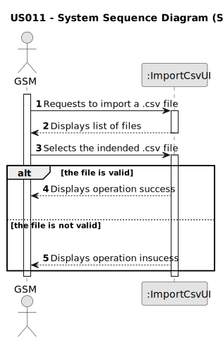

# US011 - Collect data from the user portal

## 1. Requirements Engineering

### 1.1. User Story Description

As a GSM, I want to be able to collect data from the user portal
about the use of the park, so that I may understand the use of the park
by different age groups

### 1.2. Customer Specifications and Clarifications 

**From the specifications document:**

> Therefore, within this US, the aim is to carry out a
> statistical analysis concerning the proportion of users that would recommend the park.

> The ”Inquiry.csv” file provide the necessary data to carry out the
> study. This file have the data from the inquiry.
>
> The data file contains records of the following information: "Age group", "Recommendation", "Visits",
> Consider this data in order to obtain the following outcomes:
>
> - The proportion of recommendations for each age group.
>
> - Boxplot for each age group, showing the proportion of recommendations.

**From the client clarifications:**

> **Question:** The file ”Inquiry.csv” should be given by the user?
>
> **Answer:** Yes

### 1.3. Acceptance Criteria

* **AC1:** The initial file (Inquiry.csv) shouldn't be empty and the data must be formated correctly.

### 1.4. Found out Dependencies

* The system must have access to the "Inquiry.csv" file, which contains the necessary data to carry out the study.

### 1.5 Input and Output Data

**Input Data:**

* Typed data:
    * Inquiry.csv

**Output Data:**
* Type of each variable
* Proportion of recommendations
* Boxplot for each age group

### 1.6. System Sequence Diagram (SSD)

### 1.7 Other Relevant Remarks

* 
