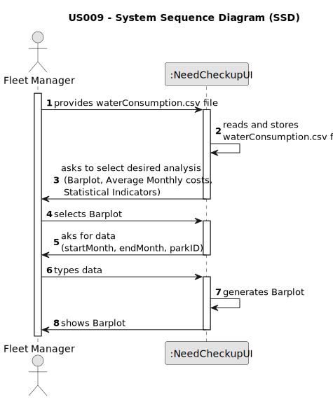
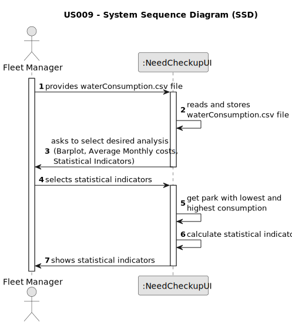

# US009 - List the exact costs referring to water consumption of specific green space so that I may manage these expenses efficiently.

## 1. Requirements Engineering

### 1.1. User Story Description

As a GSM, I want to know the exact costs referring to water consumption of specific green space so that I may manage
these expenses efficiently.

### 1.2. Customer Specifications and Clarifications

**From the specifications document:**

> Therefore, within this US, the aim is to carry out a
> statistical analysis concerning the water consumption costs in all parks.

> The ”WaterUsed.csv” file provide the necessary data to carry out the
> study. This file records daily water consumption (in m3
) since the day
> each park opened.  

>The amount paid for water is 0.7 AC/m3
> , up to a
> consumption of 50 m3
> , with a fee of 15% added for higher consumption
> levels.

> The data file contains records of the following information: ”Park Identification”, ”Year”, ”Month”, ”Day”,
> ”Consumption”. Consider this
> data in order to obtain the following outcomes:
> 
> - Barplot representing monthly water consumption, as a result of
> the following specifications given by the user: time period (StartMonth, EndMonth) and park identification.
> 
> - Average of monthly costs related to water consumption as a result
> of the following specifications given by the user: number of parks
> to be analyzed, and park identification.
>
> - Consider the water consumption of every day that is recorded.
> The aim is to analyze and compare statistical indicators between
> the park with the highest and lowest water consumption. For
> these two parks, perform the following tasks and compare results:
> 
>  - Calculate the mean, median, standard deviation, and the coefficient of skewness;
> 
>  - Build relative and absolute frequency tables (classified data),
> considering 5 classes;
> 
>  - Check if the data has outliers, using the outlier definition as
> values that deviate from the median by more than 1.5 times
> the interquartile range;
> 
>  - Graphically represent data through histograms with 10 classes.

**From the client clarifications:**

> **Question:** The file ”WaterUsed.csv” should be given by the user?
>
> **Answer:** Yes

> **Question:** When the user enters the park identification, should this be by name or through an ID?
> 
> **Answer:** Users will answer the survey but anonymously. (*? I don't know what the client means by this answer.*)

> **Question:** A taxa de 15% quando o consumo excede 50 m^3 é aplicada  a todo o volume de água ou apenas ao volume que foi excedido?
> 
> **Answer:** Ao volume excedido.

> **Question:** O limite de consumo de 50m^3 é calculado por dia ou por mês?
> 
> **Answer:** Por mês.

> **Question:** Regarding the third "task", the park with the highest and the lowest water consumption, does it refer to the total consumption (sum of the consumptions for each park or simply from a day that is recorded) ?
> 
> Vai escolher dois parques. O que teve um dia com um consumo superior a todos os registados (de todos os parques) e outro parque que teve um dia com um consumo menor a todos os registados (de todos os parques).

> **Question:** Also, to calculate the mean, median, standard deviation and coefficient of skewness, is it from the daily data (days that are recorded)?
> 
> **Answer:** Os cálculos são feitos para todos os registos dos parques selecionados.

> **Question:** Como será apresentado a média dos custos mensais do consumo de água? O valor é guardado em algum ficheiro específico ou simplesmente será apresentado ao utilizador?
>
> **Answer:** Será apresentado ao utilizador/cliente.

> **Question:** When the user enters the park identification, should this be by name or through an ID?
>
> **Answer:** Name.

### 1.3. Acceptance Criteria

* **AC1:** The initial file (WaterUsed.csv) shouldn't be empty and the data must be formated correctly.
* **AC2** Barplot generation data shouldn't be empty.
* **AC3:** When generating average monthly costs, the number of parks and the park IDs should be specified.
* **AC4:** The statistical indicators between the park with the highest and lowest water consumption should be calculated correctly.

### 1.4. Found out Dependencies

* no dependencies

### 1.5 Input and Output Data

**Input Data:**

* WaterConsumption.csv file
* Barplot:
    * startMonth
    * endMonth
    * parkID
* Average of monthly costs:
    * number of parks
    * parkID
* Statistical indicators analysis:
    * parkID

**Output Data:**

* Barplot representing monthly water consumption
* Average of monthly costs related to water consumption
* Statistical indicators between the park with the highest and lowest water consumption
* Relative and absolute frequency tables
* Histograms with 10 classes
* Mean, median, standard deviation, and the coefficient of skewness
* Water consumption of every day that is recorded

### 1.6. System Sequence Diagram (SSD)

#### Alternative one

#### Alternative two

#### Alternative three

### 1.7 Other Relevant Remarks

* 
