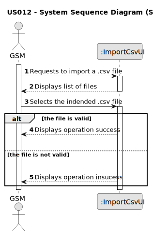

# US012 - Import a .csv file containing lines with Water Point X, Water Point Y and distance

## 1. Requirements Engineering

### 1.1. User Story Description

As a GSM, I want to import a .csv file containing lines with: Water Point X, Water Point Y, Distance into a unique data
structure.

### 1.2. Customer Specifications and Clarifications

**From the specifications document:**

> The set of imported lines describes all possible routes that can be opened to lay pipes between each pair of water
> points, and their respective installation costs (these could simply refer to the length, or to any other cost
> parameter).

> The use of computer systems and namely powerful
> algorithms can save materials like pipes, reduce the time required for the
> planning and installation, and allow to create more efficient irrigation systems.

**From the client clarifications:**

> **Question:**
>
> **Answer:**

### 1.3. Acceptance Criteria

* **AC1:** The GSM must be able to choose a file to import.
* **AC2:** The .csv file must not be empty and the data must be formated correctly.
* **AC3:** The system should only accept CSV files.
* **AC4:** The file content must be validated, showing a message if the file is empty or its content is not in the
  requested format.
* **AC5:** The system stores all possible routes in a data structure.

### 1.4. Found out Dependencies

* The system must have access to the .csv file, which contains the necessary data to carry out the study.

### 1.5 Input and Output Data

**Input Data:**

* .csv file containing lines with:
    * Water Point X
    * Water Point Y
    * Distance

**Output Data:**

* Confirmation message
* Operation sucess of the .csv import

### 1.6. System Sequence Diagram (SSD)

### 1.7 Other Relevant Remarks

* The imported lines from .csv document contains all possible routes that can be opened to lay pipes between each pair
  of water points, and their respective installation costs.
