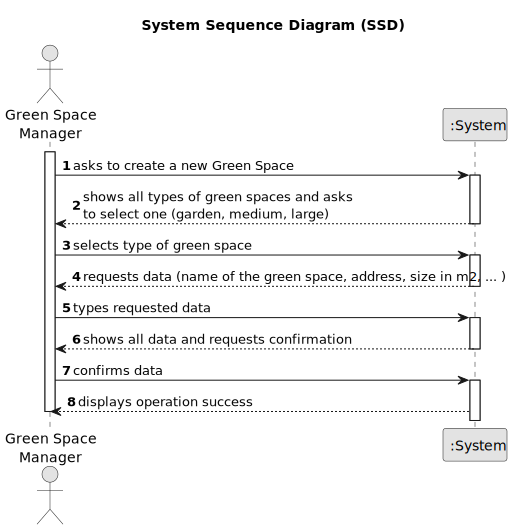

# US020 - Register a greenspace

## 1. Requirements Engineering

### 1.1. User Story Description

As a Green Space Manager (GSM), I want to register a green
space (garden, medium-sized park or large-sized park) and its respective
area.

### 1.2. Customer Specifications and Clarifications 

**From the specifications document:**

> Green spaces for collective use can vary significantly in dimensions and
available amenities. They may range from small landscaped areas, parks
with trees and some amenities like benches or playgrounds, to parks with
multiple hectares (e.g., in Porto, there are the Parque da Cidade - City 
 Park the Parque Oriental - the Oriental Park), wooded areas, lakes, and various
 facilities and installations.

>MusgoSublime (MS) is an organization dedicated to the planning, construction and maintenance of green spaces for collective use in their multiple
  dimensions, namely: plant material (e.g. flowers, shrubs, trees); urban furniture (e.g. benches, tables, gymnastics equipment); irrigation systems and
  drinking fountains; lighting systems and the respective power supply; rainwater conduction and drainage systems.

> The green spaces for collective use managed by MS can significantly vary in
size and installed equipment:  
• Garden - garden space with or without trees with little or no equipment
(may have a basic irrigation system or/and benches); 
• Medium-sized park - green space with a few hundred or thousands of
square meters with a wooded garden area, it includes some infrastructures such as toilets, drinking fountains, irrigation system, lighting,
children’s playground (for example, Quinta do Covelo, Jardim d’Arca
de Agua ´ ); 
• Large-sized park - multi-function space with diverse garden spaces, and
woods, including varied equipment and services (for example, Parque
da Cidade).

**From the client clarifications:**

> **Question:** 
>
> **Answer:** 

> **Question:** 
>
> **Answer:** 

### 1.3. Acceptance Criteria

* **AC1:** All required fields must be filled in.

### 1.4. Found out Dependencies

* There's no found out dependencies for this user story.

### 1.5 Input and Output Data

**Input Data:**

* Typed data:
    * name of the park
    * address of the park
    * area of the park in square meters
    * a list of amenities (e.g., benches, playgrounds, toilets) depending on the park type ?
	
* Selected data:
    * the park type

**Output Data:**

* Success of the operation

### 1.6. System Sequence Diagram (SSD)

**_Other alternatives might exist._**

#### Alternative One

### 1.7 Other Relevant Remarks

* no other relevant remarks for this user story found yet.