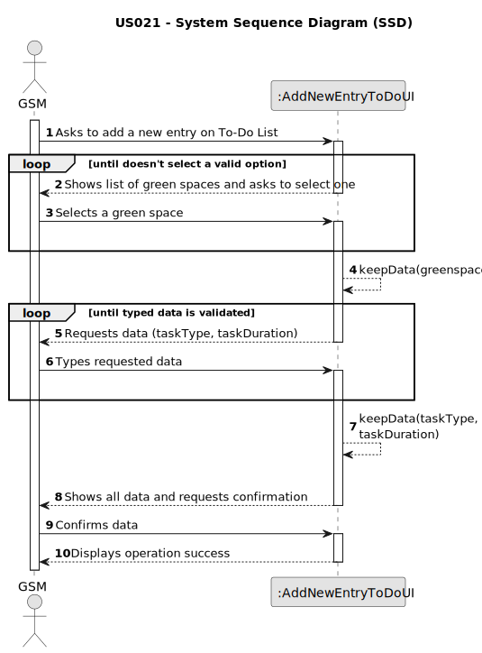

# US021 - Add new entry to the To-Do List

## 1. Requirements Engineering

### 1.1. User Story Description

As a GSM, I want to add a new entry to the To-Do List.

### 1.2. Customer Specifications and Clarifications 

**From the specifications document:**

>	The To-Do List comprises all the tasks required to
be done in order to assure the proper functioning of the parks. These tasks
can be regular (e.g. pruning trees) or occasional (e.g. repairing a broken
equipment). They may also require a multi-disciplinary team and the length
of the task can vary from a few minutes (e.g. replacing a light bulb) to weeks
(e.g. installing an irrigation system).

>	The To-Do List comprises all pending tasks for all parks

**From the client clarifications:**

> **Question:** 
>
> **Answer:** 

> **Question:** 
>
> **Answer:** 
> 
### 1.3. Acceptance Criteria

* **AC1:** All required fields must be filled in.
* **AC2:** The new entry must be associated with a green space managed by the GSM.
* **AC3:** The green space for the new entry should be chosen from a
  list presented to the GSM.

### 1.4. Found out Dependencies

* There is a dependency on "US020 - Register a greenspace" as there must be at least one green space registered to be selected by GSM.

### 1.5 Input and Output Data

**Input Data:**

* Typed data:
    * Task type
    * Task duration
	
* Selected data:
    * a green space

**Output Data:**

* All information for confirmation
* Success of the operation

### 1.6. System Sequence Diagram (SSD)

### 1.7 Other Relevant Remarks

* The created task stays in a "not published" state in order to distinguish from "published" tasks.