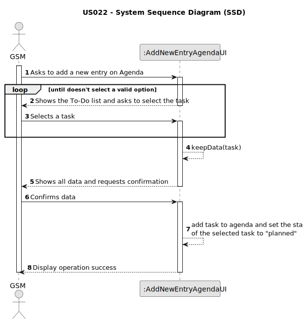

# US022 - Add new entry in the Agenda

## 1. Requirements Engineering

### 1.1. User Story Description

As a GSM, I want to add a new entry in the Agenda.

### 1.2. Customer Specifications and Clarifications 

**From the specifications document:**

>	In the daily management, the GSM uses two essential tools: the Agenda and the Task
List (aka To-Do List). 

>	The Agenda is a crucial mechanism for planning the week’s work. Each entry
in the Agenda defines a task (that was previously included in the to-do list).
> 
**From the client clarifications:**

> **Question:** 
>
> **Answer:** 

> **Question:** 
>
> **Answer:** 
> 
### 1.3. Acceptance Criteria

* **AC1:** All required fields must be filled in.
* **AC2:** The new entry must be associated with a green space managed by the GSM.
* **AC3:** The new entry must exist in the To-Do list.

### 1.4. Found out Dependencies

* There is a dependency on "US021 - Add new entry to the To-Do List" as there must be at least one entry on To-Do list in order to be planned into the Agenda.

### 1.5 Input and Output Data

**Input Data:**

* Typed data:
    * There is no typed data
	
* Selected data:
    * a task from ToDo list

**Output Data:**

* Shows data for confirmation
* Success of the operation

### 1.6. System Sequence Diagram (SSD)

### 1.7 Other Relevant Remarks

* After adding the new entry to Agenda, the task selected will have the status "planned".