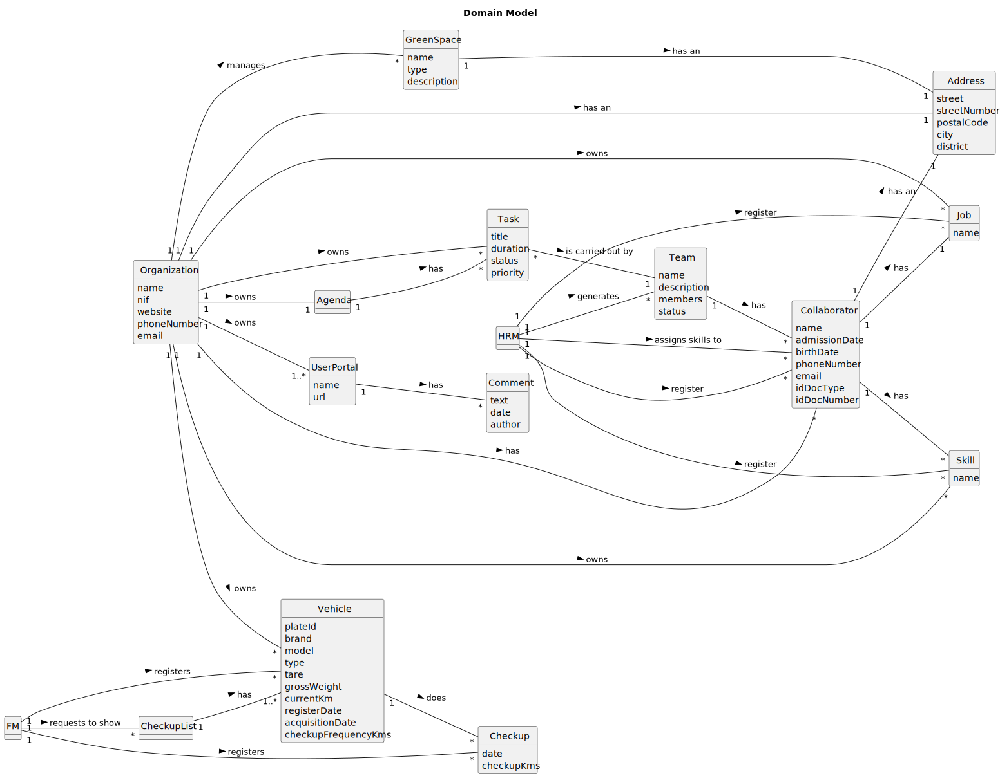

# OO Analysis

The construction process of the domain model is based on the client specifications, especially the nouns (for
_concepts_) and verbs (for _relations_) used.

## Rationale to identify domain conceptual classes

To identify domain conceptual classes, start by making a list of candidate conceptual classes inspired by the list of
categories suggested in the book "Applying UML and Patterns: An Introduction to Object-Oriented Analysis and Design and
Iterative Development".

### _Conceptual Class Category List_

**Business Transactions**

*

---

**Transaction Line Itemss**

*

---

**Product/Service related to a Transaction or Transaction Line Item**

*

---

**Transaction Records**

*

---  

**Roles of People or Organizations**

* Organization
* Employee
* System User
* Collaborator
* Team
* FM
* HRM
* GSU

---

**Places**

* Green Spaces

---

**Noteworthy Events**

* Vehicle Checkup

---

**Physical Objects**

* Vehicle

---

**Descriptions of Things**

* System User

---

**Catalogs**

*

---

**Containers**

* Portal

---

**Elements of Containers**

* Comments

---

**Organizations**

* Organization

---

**Other External/Collaborating Systems**

* GSU

---

**Records of finance, work, contracts, legal matters**

* Agenda
* Team Proposal
* Vehicle Checkup

---

**Financial Instruments**

*

---

**Documents mentioned/used to perform some work/**

* Team Proposal

---

## Rationale to identify associations between conceptual classes

An association is a relationship between instances of objects that indicates a relevant connection and that is worth of
remembering, or it is derivable from the List of Common Associations:

- **_A_** is physically or logically part of **_B_**
- **_A_** is physically or logically contained in/on **_B_**
- **_A_** is a description for **_B_**
- **_A_** known/logged/recorded/reported/captured in **_B_**
- **_A_** uses or manages or owns **_B_**
- **_A_** is related with a transaction (item) of **_B_**
- etc.

| Concept (A) 		 | Association   	 |   Concept (B) |
|----------------|:---------------:|--------------:|
| Organization   |     manages     |   Green Space |
| Organization   |       has       |      Employee |
| GSU            |       is        |   System User |
| Employee       |       is        |   System User |
| FM             |       is        |      Employee |
| HRM            |       is        |      Employee |
| Green Space    |       has       |        Portal |
| Portal         |       has       |       Comment |
| GSU            |    registers    |       Comment |
| FM             |    registers    |       Vehicle |
| FM             |    registers    |       Checkup |
| Checkup        |       has       |       Vehicle |
| HRM            |    registers    |           Job |
| HRM            |    registers    |         Skill |
| HRM            |    registers    |  Collaborator |
| Collaborator   |       has       |         Skill |
| Collaborator   |       has       |           Job |
| HRM            |    registers    | Team Proposal |
| Team Proposal  |    generates    |          Team |
| Team           |       has       |  Collaborator |
| Team           |       has       |          Task |
| Task           |   is part of    |        Agenda |

## Domain Model

**Do NOT forget to identify concept atributes too.**

**Insert below the Domain Model Diagram in a SVG format**

