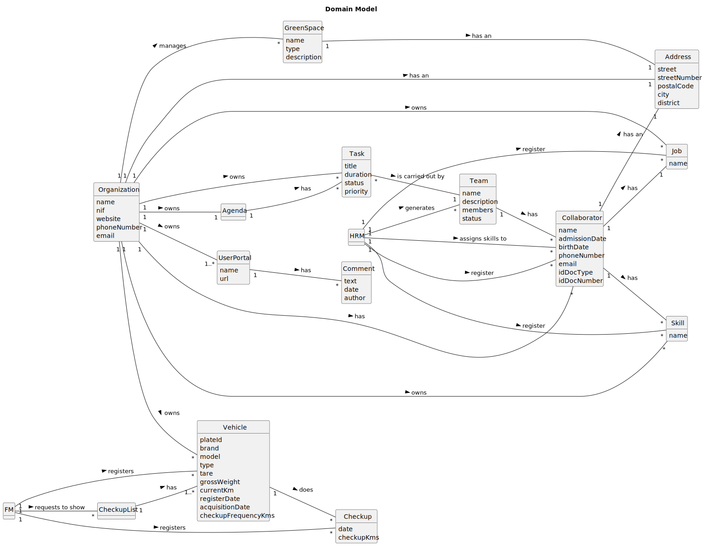

# Green Space Management App

## Instituto Superior de Engenharia do Porto

### Group 34 - CodeFlow

---

## Table of Contents

- [Glossary](#glossary)
- [Introduction](#introduction)
- [System Overview](#system-overview)
- [Features](#features)
- [Troubleshooting](#troubleshooting)
- [Frequently Asked Questions](#frequently-asked-questions)
- [References](#references)

## Glossary

| **_Terms, Expressions and Acronyms_** | **_Description_**                                                                                                                                      |
|:--------------------------------------|:-------------------------------------------------------------------------------------------------------------------------------------------------------|
| **Agenda**                            | Crucial mechanism for planning the week's work.                                                                                                        |
| **Automatically**                     | Something that is done without human intervention.                                                                                                     |
| **Backlog**                           | A list of tasks or items awaiting completion or further action.                                                                                        |
| **CamelCase**                         | CamelCase is a coding convention where compound words are written without spaces, and each word begins with a capital letter except for the first one. |
| **Check-up**                          | The action of subjecting company vehicles to a periodic inspection.                                                                                    |
| **Collaborator**                      | Employee of the organization with specific skills for executing tasks related to green space management.                                               |
| **Doc**                               | Refers to the identification document.                                                                                                                 |
| **Employee**                          | An employee is an individual who works for the company MusgoSublime.                                                                                   |
| **FM**                                | Fleet Manager.                                                                                                                                         |
| **Green Space**                       | Referes to green spaces in public places (e.g. parks and gardens).                                                                                     |
| **Gross Weight**                      | The total weight of a vehicle, including passengers, cargo, and any other load.                                                                        |
| **GSM**                               | Green Spaces Manager.                                                                                                                                  |
| **GSU**                               | Green Spaces User.                                                                                                                                     |
| **HRM**                               | Human Resources Manager.                                                                                                                               |
| **ID Doc**                            | Number of identification document.                                                                                                                     |
| **IDE**                               | Integrated development environment.                                                                                                                    |
| **IntelliJ IDE**                      | Integrated development environment by JetBrains.                                                                                                       |
| **Item**                              | Items colocados por ordem alfabética                                                                                                                   |
| **JaCoCo**                            | Java library that offers information about the code coverage of Java.                                                                                  |
| **Java**                              | Object-oriented programming language.                                                                                                                  |
| **Javadoc**                           | Automatic documentation generator for Java code, using specially formatted comments.                                                                   |
| **JavaFX 11**                         | The framework used to develop the graphical interface of the application.                                                                              |
| **JUnit 5**                           | Testing framework for Java.                                                                                                                            |
| **MS**                                | MS is an acronym for MusgoSublime.                                                                                                                     |
| **MusgoSublime**                      | MusgoSublime is the organization dedicated to the planning, construction, and maintenance of green spaces for collective use.                          |
| **NetBeans**                          | Integrated development environment by Oracle Corporation.                                                                                              |
| **OO**                                | Refers to Object-Oriented.                                                                                                                             |
| **PVM**                               | Minimal Viable Product.                                                                                                                                |
| **SCRUM**                             | Framework for managing and organizing work.                                                                                                            |
| **Skill**                             | A characteristic of an employee and/or a specific ability to perform a task.                                                                           |
| **SPRINT**                            | A short and fixed period of time (usually 2-4 weeks) in which a team works on a set of tasks to deliver a usable product increment.                    |
| **SVG**                               | Scalable Vector Graphics is an image format used for two-dimensional.                                                                                  |
| **Tare**                              | The weight of a vehicle when empty, excluding any passengers or cargo.                                                                                 |
| **Task**                              | Tasks performed by collaborators.                                                                                                                      |
| **TDD**                               | Test-Driven Development.                                                                                                                               |
| **Team**                              | Group of workers who collaborate as a team to accomplish a task.                                                                                       |
| **User**                              | Individual who can use the application.                                                                                                                |
| **User Portal**                       | Platform where users can post comments, report faults and malfunctions of equipment.                                                                   |
| **VFM**                               | Vehicle and Equipment Fleet Manager.                                                                                                                   |

## Introduction

This user manual was designed as a guide to help users navigate and comprehend the functionalities of our application
effectively. Its purpose is to provide step-by-step instructions for users to operate the application in the easiest way and efficiently.

## System Overview

The main objective of this Java-built application is to provide a solution that supports the activities of an
organization responsible for managing green spaces, predominantly in urban contexts.

Through the use of this application, users have at their disposal a set of functionalities that streamline the company's
activities, making management more efficient, facilitating planning and coordination of its activities.

Through a user-friendly interface, the system enables managers to register collaborators, jobs, and skills, which allows
the manager to automatically create a team that will execute tasks of an agenda, ensuring greater efficiency and
coordination in the work.

Furthermore, the application facilitates the fleet management, including vehicles, machinery, and equipment through
functionalities that allow the registration of the organization's vehicles, as well as the management of vehicle
check-ups.

The application will also provide a portal where green space users can access information about green spaces, report
problems and malfunctions or suggest improvements.

To demonstrate more easily how the application works, we have developed a diagram that shows the system's
functionalities and the dependencies that exist between them.

## Features

#### Register a Skill | Human Resources Manager

#### Register a Job | Human Resources Manager

#### Register a Collaborator | Human Resources Manager

#### Assign skills to a Collaborator | Human Resources Manager

#### Generate a team proposal | Human Resources Manager

#### Register a Vehicle | Fleet Manager

#### Register a Vehicle Check-up | Fleet Manager

#### List Vehicles needing a check-up | Fleet Manager

## Troubleshooting

## Frequently Asked Questions

## References