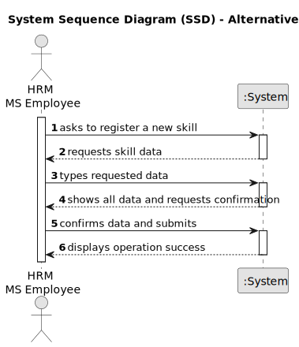

# US001 - Register a skill

## 1. Requirements Engineering

### 1.1. User Story Description

As a Human Resources Manager (HRM), I want to register skills that may
be appointed to a collaborator.

### 1.2. Customer Specifications and Clarifications 

**From the specifications document:**

>	... an employee has a main occupation (job) and a set of skills
that enable him to perform/take on certain tasks/responsibilities, for example, driving
vehicles of different types (e.g. light, or heavy), operating machines such as backhoes
or tractors; tree pruning; application of phytopharmaceuticals. 

>	When creating multipurpose teams, the number of members
and the set of skills that must be covered are crucial. 

**From the client clarifications:**

> **Question:** What criteria are necessary to register a skill?
>
> **Answer:** The name of the skill, for example: pruner, heavy vehicle driver, phytosanitary product applicator.

> **Question:** When a skill that already exists is created, what should the system do?
>
> **Answer:** By definition, it's not possible to have duplicate values in a set. Checking for duplicates isn't a business rule; it's at the technological level.

> **Question:** Which are the skills accepted? Or should we enable the HRM to introduce anything as a skill?
>
> **Answer:** All, it's up to HRM to decide. (special characters or algarisms should not be allowed in the skill name)

> **Question:**  Do I need to add skills  by writing them or can I just give a file with all the skills?
> 
> **Answer:** Both are acceptable since the business the same the crucial difference resides in the UX.

### 1.3. Acceptance Criteria

* **AC1:** All required fields must be filled in.
* **AC2:** Skill description must not contain numbers or special characters, only spaces.

### 1.4. Found out Dependencies

* There is a dependency on "US003 - Create a task category" as there must be at least one task category to classify the task being created.

### 1.5 Input and Output Data

**Input Data:**

* Typed data:
    * Skill name

**Output Data:**

* List of all Skills
* Success of the operation

### 1.6. System Sequence Diagram (SSD)

### 1.7 Other Relevant Remarks
