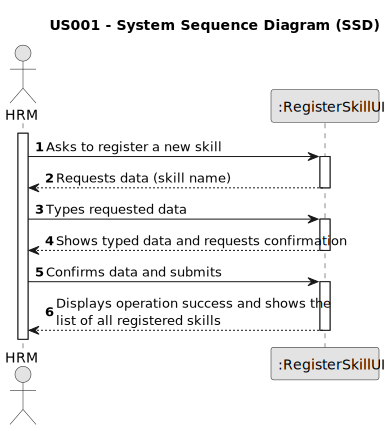

# US001 - Register a skill

## 1. Requirements Engineering

### 1.1. User Story Description

As a Human Resources Manager (HRM), I want to register skills that may
be appointed to a collaborator.

### 1.2. Customer Specifications and Clarifications 

**From the specifications document:**

>	Thus, an employee has a main occupation (job) and
a set of skills that enable him to perform/take on certain tasks/responsibilities, for example, driving vehicles of different types (e.g. light, or heavy), operating machines such
as backhoes or tractors; tree pruning; application of agriculture phytopharmaceuticals. 

>	When creating multipurpose teams, the number of members
and the set of skills that must be covered are crucial. 

**From the client clarifications:**

> **Question:** What criteria are necessary to register a skill?
>
> **Answer:** The name of the skill, for example: pruner, heavy vehicle driver, phytosanitary product applicator.

> **Question:** When a skill that already exists is created, what should the system do?
>
> **Answer:** By definition, it's not possible to have duplicate values in a set. Checking for duplicates isn't a business rule; it's at the technological level.

> **Question:** Which are the skills accepted? Or should we enable the HRM to introduce anything as a skill?
>
> **Answer:** All, it's up to HRM to decide. (special characters or algarisms should not be allowed in the skill name)

> **Question:**  Do I need to add skills  by writing them or can I just give a file with all the skills?
> 
> **Answer:** Both are acceptable since the business the same the crucial difference resides in the UX.

> **Question:** Should the system able the HRM to introduce multiple skills in one interaction before saving all of them?
> 
> **Answer:** It's not required to do so.

> **Question:** Which information is mandatory for creating a new skill?
> 
> **Answer:** The skill name.

> **Question:** The indentificator of the skill will be the name, or the system will generate authomatically and Id when the manager insert the name?
> 
> **Answer:** A skill is just a name, can be a composition of words like "Light Vehicle Driving Licence".

> **Question:**  Does the HRM need to see the confirmation of the sucess of the operation and the skills added or just the sucess of the operation?
>
> **Answer:** It will depend on if you opt to insert one skil or a set of skils in a batch. Maybe some adaptation needed.

> **Question:** Is there any other possible outcome like if the HMR does not put the requested data, do I need to ask the user to register a diferent competence?
> 
> **Answer:** This US is quite simple, at the moment a skill is simply a name.

### 1.3. Acceptance Criteria

* **AC1:** All required fields must be filled in.
* **AC2:** Skill name must not contain numbers and the only special characters allowed are spaces and hyphens.

### 1.4. Found out Dependencies

* There are no dependencies for this user story.

### 1.5 Input and Output Data

**Input Data:**

* Typed data:
    * Skill name

**Output Data:**

* List of all registered skills
* Success of the operation

### 1.6. System Sequence Diagram (SSD)

### 1.7 Other Relevant Remarks

* After registering a new skill and confirm the operation, the program will show the list of all skills registered.
