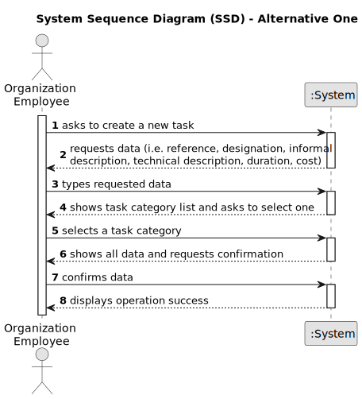

# US002 - Register a Job 

## 1. Requirements Engineering

### 1.1. User Story Description

As an HRM, I want to register a job.

### 1.2. Customer Specifications and Clarifications 

**From the specifications document:**

>	Each task is characterized by having a unique reference per organization, a designation, an informal and a technical description, an estimated duration and cost, as well as a task category. 

>	As long as it is not published, access to the task is exclusive to the employees of the respective organization. 

**From the client clarifications:**

> **Question:** When the user registers a job does he select a job from a list or does he type out a custom job name?
>
> **Answer:** ---

> **Question:** What data is introduced by the user when creating a job?
>
> **Answer:** ---

> **Question:** What happens when the user tries to create a job with an existing reference?
> 
> **Answer:** ---

> **Question:** What are the valid inputs for each field? For example, are there any restrictions on the format or length of the job reference, designation, or descriptions?
> 
> **Answer:** --- 

> **Question:** Are there any default values for any of the fields?
> 
> **Answer:** ---

> **Question:** Is there a limit to the number of jobs that can be registered by a user or within the organization?
> 
> **Answer:** ---

### 1.3. Acceptance Criteria

* **AC1:** All required fields must be filled in.
* **AC2:** The task reference must have at least 5 alphanumeric characters.
* **AC3:** When creating a task with an existing reference, the system must reject such operation and the user must be able to modify the typed reference.

### 1.4. Found out Dependencies

* There is a dependency on "US003 - Create a task category" as there must be at least one task category to classify the task being created.

### 1.5 Input and Output Data

**Input Data:**

* Typed data:
    * a reference
    * a designation 
    * an informal description
    * a technical description
    * an estimated duration
    * an estimated cost
	
* Selected data:
    * a task category 

**Output Data:**

* List of existing task categories
* (In)Success of the operation

### 1.6. System Sequence Diagram (SSD)

**_Other alternatives might exist._**

#### Alternative One

#### Alternative Two

### 1.7 Other Relevant Remarks

* The created task stays in a "not published" state in order to distinguish from "published" tasks.