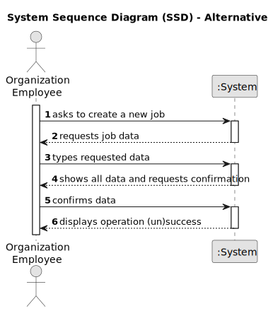

# US002 - Register a Job 

## 1. Requirements Engineering

### 1.1. User Story Description

As an HRM, I want to register a job.

### 1.2. Customer Specifications and Clarifications 

**From the specifications document:**

> MS has a wide range of employees who carry out the most varied tasks in the context
of managing green spaces. Some job examples are designer, estimator, gardener, electrician 
or bricklayer. Thus, an employee has a main occupation (job) and a set of skills
that enable him to perform/take on certain tasks/responsibilities, for example, driving
vehicles of different types (e.g. light, or heavy), operating machines such as backhoes
or tractors; tree pruning; application of phytopharmaceuticals.

**From the client clarifications:**

> **Question:** What data is introduced by the user when creating a job?
>
> **Answer:** The name of the job

> **Question:** What happens when the user tries to create a job with an existing reference?
> 
> **Answer:** By definition a set can´t have duplicates. Assuring no duplicates is not a business rule is a tecnichal issue.

> **Question:** É relevante associar uma área ou setor específico a cada Job? (Por exemplo, "Jardineiro" seria inserido no setor de "Manutenção")
> 
> **Answer:** Não é necessário na medida que não existem US que sugiram que isso possa vir a ser necessário

> **Question:** Deve-se incluir informações como salário, tipo de contratação (full-time ou part-time), e modalidade de trabalho (presencial, remoto ou híbrido) no Job?
> 
> **Answer:** Não é necessário na medida que não existem US que sugiram que isso possa vir a ser necessário

> **Question:** Que outras informações acha necessárias associar ao Job?
> 
> **Answer:** Para já nenhumas.

### 1.3. Acceptance Criteria

* **AC1:** All required fields must be filled in.
* **AC2:** When creating a job that already exists, the system must inform the user that the job already exists.
* **AC3:** The job name can't contain special characters and numbers, only spaces.

### 1.4. Found out Dependencies

* There are no dependencies for this user story.

### 1.5 Input and Output Data

**Input Data:**

* Typed data:
    * job name

**Output Data:**

* (In)Success of the operation

### 1.6. System Sequence Diagram (SSD)

**_Other alternatives might exist._**

#### Alternative One

### 1.7 Other Relevant Remarks

* There are no other relevant remarks for this user story.