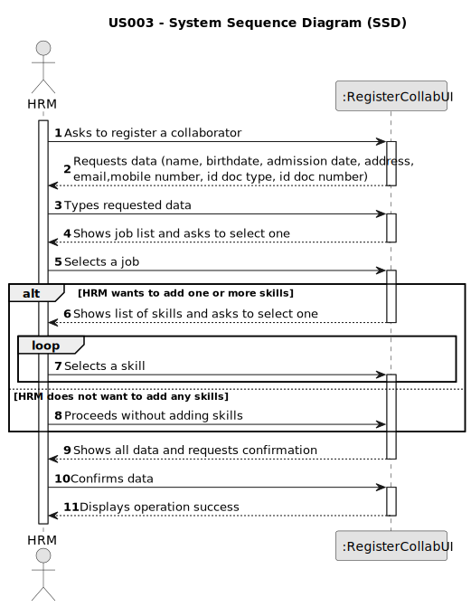

# US003 - Register a collaborator

## 1. Requirements Engineering

### 1.1. User Story Description

As an HRM, I want to register a collaborator with a job and fundamental characteristics

### 1.2. Customer Specifications and Clarifications

**From the specifications document:**

> MS has a wide range of employees who carry out the most varied tasks in the context
of designing and managing green spaces.

> An employee has a main occupation (job) and
a set of skills that enable him to perform/take on certain tasks/responsibilities

> Collaborator – A person who is an employee of the organization and carries out
design, construction and/or maintenance tasks for green areas, depending on their
skills.

**From the client clarifications:**

> **Question:** When creating a collaborator with an existing name ... What does the system do?
>
> **Answer:** It's not common and most improbable to have different individuals with same name in the same context,
however it’s ID documentation number should be unique for sure.

> **Question:** What are the fundamental characteristics of the employee?
>
> **Answer:** Name, date of birth, date of admission, address, contact (telephone and email), identification document
and its number

> **Question:** Does the HRM select the job from a list that we display?
>
> **Answer:** Displaying or not, It's a matter of UX, the dev team should decide about it, but the valid jobs are the
ones created within the US02.

> **Question:** Should the system able the HRM to insert multiple collaborators in one interaction before saving them?
> 
> **Answer:** It's not required to do so.

### 1.3. Acceptance Criteria

* **AC1:** All required fields must be filled in.
* **AC2:** ID documentation number must be unique.
* **AC3:** ID documentation number must only contain numbers.
* **AC4:** The system must ensure that the birthdate corresponds to a minimum of 18 years old.
* **AC5:** Date of admission must not be earlier than birthdate.
* **AC6:** Mobile number must contain 9 numeric digits.
* **AC7:** Name must contain only alphabetic characters.
* **AC8:** Employee name must have at least 2 names (first and last).
* **AC9:** Email must contain only one "@".

### 1.4. Found out Dependencies

* There is a dependency on "US001 - Register a skill" as if the collaborator has at least one skill, it has to exist
  before
* There is a dependency on "US002 - Create a job" as the jobs need to exist to be assigned to the collaborator

### 1.5 Input and Output Data

**Input Data:**

* Typed data:
    * Name
    * Birthdate
    * Admission date
    * Address
    * Email
    * Mobile number
    * ID doc type
    * ID doc number

* Selected data:
    * A Job
    * Skills (optional)

**Output Data:**

* All data is shown for confirmation.
* Success of the operation

### 1.6. System Sequence Diagram (SSD)

### 1.7 Other Relevant Remarks

* If the date of admission exceeds the current date, a warning must appear
* In this scenario, the HR Manager (HRM) has the option to register a collaborator either with one or more skills, or alternatively, without any skills.