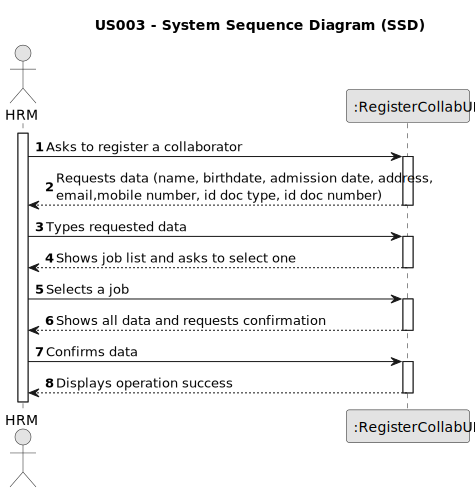
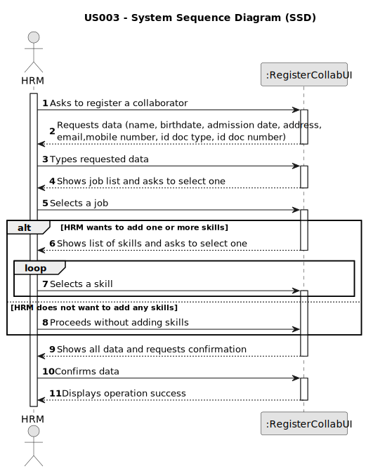

# US003 - Register a collaborator

## 1. Requirements Engineering

### 1.1. User Story Description

As an HRM, I want to register a collaborator with a job and fundamental characteristics

### 1.2. Customer Specifications and Clarifications

**From the specifications document:**

> MS has a wide range of employees who carry out the most varied tasks in the context
of designing and managing green spaces.

> An employee has a main occupation (job) and
a set of skills that enable him to perform/take on certain tasks/responsibilities

> Collaborator – A person who is an employee of the organization and carries out
design, construction and/or maintenance tasks for green areas, depending on their
skills.

**From the client clarifications:**

> **Question:** When creating a collaborator with an existing name ... What does the system do?
>
> **Answer:** It's not common and most improbable to have different individuals with same name in the same context,
however it’s ID documentation number should be unique for sure.

> **Question:** What are the fundamental characteristics of the employee?
>
> **Answer:** Name, date of birth, date of admission, address, contact (telephone and email), identification document
and its number

> **Question:** Does the HRM select the job from a list that we display?
>
> **Answer:** Displaying or not, It's a matter of UX, the dev team should decide about it, but the valid jobs are the
ones created within the US02.

> **Question:** Should the system able the HRM to insert multiple collaborators in one interaction before saving them?
> 
> **Answer:** It's not required to do so.

> **Question:** What should be the accepted format for the emails? Should only specific email services be accepted?
> 
> **Answer:** A valid email address consists of an email prefix and an email domain, both in acceptable formats.
The prefix appears to the left of the @ symbol. The domain appears to the right of the @ symbol.
For example, in the address example@mail.com, "example" is the email prefix, and "mail.com" is the email domain.

> **Question:** Is there any limitation regarding the length of the name of the collaborator?
> 
> **Answer:** According to the Portuguese law a name should contain at maximum six words;

> **Question:** Should we consider valid only the birthdates in which the collaborator has more than 18 years?
> 
> **Answer:** Yes.

> **Question:** What should be the format for the phone number? 9 numbers?
> 
> **Answer:** Validating 9 digits will be acceptable; validating with international format would be excelent;

> **Question:** What is the format for the numbers from the id doc types?
> 
> **Answer:** Each doc type has specific formats like taxpayer number, Citizen Card ou passport.

### 1.3. Acceptance Criteria

* **AC1:** The name of the Collaborator can only contain alphabetic characters, spaces and hyphens.
* **AC2:** The Collaborator must have two names (first and last).
* **AC3:** The Collaborator must be at least 18 years old (Current date - birthdate >= 18).
* **AC4:** The birthdate and admission date must follow the format DD/MM/YYYY.
* **AC5:** The birthdate must be within a reasonable range (not in the future and not earlier than 1900).
* **AC6:** The admission date must not be earlier than the birthdate nor the organization's creation date.
* **AC7:** Email must contain an email prefix, an email domain and the symbol "@".
The prefix must appear to the left of the @ symbol. The domain must appear to the right of the @ symbol.
* **AC8:** The mobile number must contain 9 numeric digits.
* **AC9:** The ID documentation type must be one of the following: CC, BI or Passport.
* **AC10:** If the doc type is "Passport", the ID number must have 2 letters followed by 6 numeric digits.
* **AC11:** If the doc type is "BI" or "CC", the ID number must contain 9 numeric digits.
* **AC12:** The ID documentation number must be unique.
* **AC13:** There must be at least one job selected from the job list.
* **AC14:** The name of the Collaborator can only contain a maximum of six words.

### 1.4. Found out Dependencies

* There is a dependency on "US001 - Register a skill" as if the collaborator has at least one skill, it has to exist
  before
* There is a dependency on "US002 - Create a job" as the jobs need to exist to be assigned to the collaborator

### 1.5 Input and Output Data

**Input Data:**

* Typed data:
    * Name
    * Birthdate
    * Admission date
    * Address
    * Email
    * Mobile number
    * ID doc type
    * ID doc number

* Selected data:
    * A skill (optional)
    * A Job

**Output Data:**

* All data is shown for confirmation.
* Success of the operation

### 1.6. System Sequence Diagram (SSD)

#### Alternative one

#### Alternative two

### 1.7 Other Relevant Remarks

* If the date of admission exceeds the current date, a warning must appear
* In this scenario, the HR Manager (HRM) has the option to register a collaborator either with one or more skills, or alternatively, without any skills.