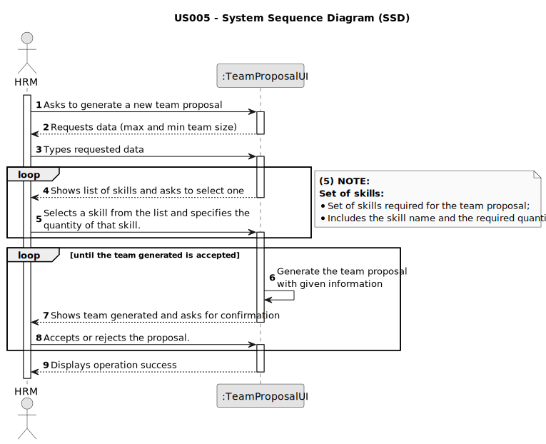

# US005 - Generate team proposal

## 1. Requirements Engineering

### 1.1. User Story Description

As a HRM, I want to generate a team proposal automatically.

### 1.2. Customer Specifications and Clarifications 

**From the specifications document:**

>	Tasks are carried out on an occasional or regular basis in one or more green spaces,
for example: tree pruning; installation of an irrigation system; installation of a lighting
system.
 
>   Teams are temporary associations of employees who will carry out a set of tasks in
one or more green spaces. When creating multipurpose teams, the number of members
and the set of skills that must be covered are crucial.

**From the client clarifications:**

> **Question:** What information will the customer provide?
>
> **Answer:** The customer provide the max size of the team and a set of skills.

> **Question:** I would also like to know if a collaborator can be in more than one team at the same time?
>
> **Answer:** No.

> **Question:** Are the skills(input) typed or selected
>
> **Answer:** the ux/ui is up to the dev team.

> **Question:** I would like to ask if, in this US, there should be any more information in the team generated beyond the collaborators in which it consists?
>
> **Answer:** The information should contain each of team members and the skills.

> **Question:** I would to know which business rules apply for the input data to generate a team proposal.
>
> **Answer:** max and min team size, and a list of skills needed. (For instance: min: 3, max: 4 )

> **Question:** How does it generate the team if there are not enough employees?
> 
> **Answer:** The system should provide information why it can't generate a team.

> **Question:** What should the output of the automation be? (should it just store the team proposal or show it to the customer?)  Will the team proposal be a document about all the instructions of each team member/worker?
>
> **Answer:** The systems provide team proposals and HRM can accept of refuse the proposals. In the future (not in this sprint) HRM may decide to edit the team.

### 1.3. Acceptance Criteria

* **AC1:** The maximum and minimum team size and the set of skills need to be supplied by the HRM.
* **AC2:** All required fields must be filled in.
* **AC3:** Maximum team size must be greater than 0.
* **AC4:** There must be at least one skill selected before submitting.
* **AC5:** A collaborator cannot be in two different teams at the same time.
* **AC6:** The HRM must be able to accept or refuse the proposed team.
* **AC7:** The required quantity of a specific skill cannot exceed the maximum team size.

### 1.4. Found out Dependencies

* There is a dependency on "US001 - Register a skill" as there must be at least one skill registered in the system in order to generate a team proposal.
* There is a dependency on "US003 - Register a collaborator" as there must be collaborators registered in the system in order to generate a team proposal.

### 1.5 Input and Output Data

**Input Data:**

* Typed data:
    * Minimum team size
    * Maximum team size
	
* Selected data:
    * Set of skills 

**Output Data:**
  * Team generated (Containing each team members and the set of skills).
  * Success of the operation

### 1.6. System Sequence Diagram (SSD)

### 1.7 Other Relevant Remarks

* If there are no skills in the system and the user is unable to create a team proposal, the system should provide information why it can't generate a team.