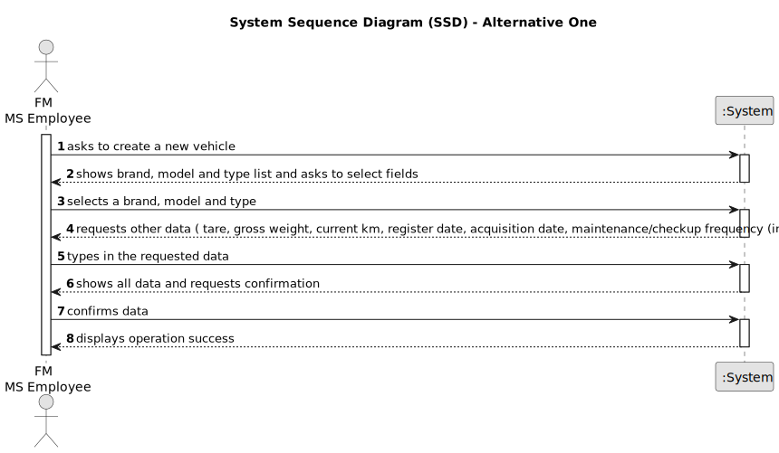

# US006 - Register a Vehicle 

## 1. Requirements Engineering

### 1.1. User Story Description

As an FM, I wish to register a vehicle including Brand, Model, Type, Tare,
Gross Weight, Current Km, Register Date, Acquisition Date, Maintenance/Checkup Frequency (in Kms)

### 1.2. Customer Specifications and Clarifications 

**From the specifications document:**

>	Vehicles are needed to carry out the tasks assigned to the teams as well as to transport
machines and equipment. This type of vehicle can be only for passengers or mixed,
light or heavy, open box or closed vans or trucks.

**From the client clarifications:**

> **Question:** What is the purpose of the "Maintenance/Checkup Frequency" field?
>
> **Answer:** ---

### 1.3. Acceptance Criteria

* **AC1:** All required fields must be filled in.

### 1.4. Found out Dependencies

* There is a dependency on "US003 - Create a task category" as there must be at least one task category to classify the task being created.

### 1.5 Input and Output Data

**Input Data:**

* Typed data:
    * vehicle reference
    * tare
    * gross weight
    * current km
    * register date
    * acquisition date
    * maintenance/checkup frequency (in kms)
	
* Selected data:
    * brand
    * model
    * type

**Output Data:**

* (In)Success of the operation

### 1.6. System Sequence Diagram (SSD)

**_Other alternatives might exist._**

#### Alternative One

#### Alternative Two

### 1.7 Other Relevant Remarks

* The created task stays in a "not published" state in order to distinguish from "published" tasks.