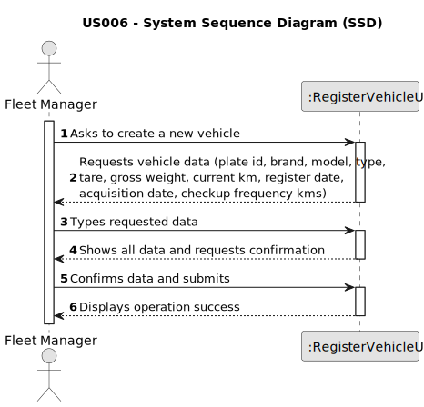

# US006 - Register a Vehicle 

## 1. Requirements Engineering

### 1.1. User Story Description

As an FM, I wish to register a vehicle including Brand, Model, Type, Tare,
Gross Weight, Current Km, Register Date, Acquisition Date, Maintenance/Checkup Frequency (in Kms)

### 1.2. Customer Specifications and Clarifications 

**From the specifications document:**

> Vehicles are needed to carry out the tasks assigned to the teams as well as to transport
machines and equipment. This type of vehicle can be only for passengers or mixed,
light or heavy, open box or closed vans or trucks.

**From the client clarifications:**

> **Question:** For the application to work does the FM need to fill all the attributes of the vehicle?
>
> **Answer:** Yes, besides the vehicle plate that by mistake doesn't appear on the text.

> **Question:** Should the application identify a registered vehicle by a serial number or other attribute?
>
> **Answer:** By plate id.

> **Question:** Should the application a group the vehicles by their brand, serial number or other attribute?
>
> **Answer:** No requirements were set concerning groups of vehicles.

> **Question:** If the Fm inserts the same vehicle by mistake, should it inform the user of the mistake and give him the option to add another vehicle?
>
> **Answer:** Duplication of data is not a business rule is technical one, since by definition in a set you cant have duplicates.

> **Question:** Is Brand, Model and Type a list of options or a free text?
> 
> **Answer:** Free text

> **Question:** When a vehicle is registered, are there specific requirements for accepting the brand? For example, does the system need to check if the brand is on a predetermined list? Does this also apply to the model or any other characteristics?
> 
> **Answer:** No. One can consider a list of brands and a list of models previsously inserted in the system, no need to go through validations.
 
### 1.3. Acceptance Criteria

* **AC1:** All required fields must be filled in.
* **AC2:** The system must not allow the registration of two vehicles with the same plate.
* **AC3:** Brand, Model, Type and Plate ID can't contain special characters.
* **AC4:** Tare, Gross Weight and Checkup Frequency Kms must be positive numbers.
* **AC5:** Current kilometers must be a non-negative number.
* **AC6:** Register Date and Acquisition Date must be valid dates.
* **AC7:** Register date and acquisition date must not be a future date.
* **AC8:** Acquisition date must not be earlier than the register date.
* **AC9:** Tare must be less than the Gross Weight.

### 1.4. Found out Dependencies

* There is no dependencies for this user story.

### 1.5 Input and Output Data

**Input Data:**

* Typed data:
    * Plate id
    * Brand
    * Model
    * Type
    * Tare
    * Gross weight
    * Current km
    * Register date
    * Acquisition date
    * Checkup frequency kms

**Output Data:**

* Vehicle data for confirmation
* Success of the operation

### 1.6. System Sequence Diagram (SSD)

### 1.7 Other Relevant Remarks

* The FM must be able to register a vehicle, but the system must not allow the registration of two vehicles with the same plate.