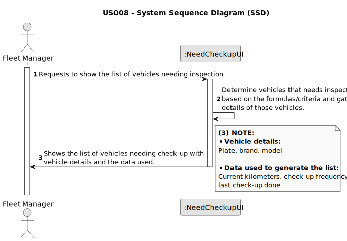

# US008 - List of vehicles needing the check-up

## 1. Requirements Engineering

### 1.1. User Story Description

As an FM, I want to list the vehicles needing the check-up.

### 1.2. Customer Specifications and Clarifications 

**From the specifications document:**

>	As for machines, MS has tractors, backhoe loaders and rotating machines, lawnmowers, among others. 

>	This type of vehicle can be only for passengers or mixed, light or heavy, open box or closed vans or trucks. 

**From the client clarifications:**

> **Question:** Can the vehicles get placed automatically on a list or the one listing has to be the FM?
>
> **Answer:** 

> **Question:** What are the requests/ input data to list the vehicles needing the check-up?
>
> **Answer:** Current Km and Maintenance/Check-up Frequency (in Kms) are sufficient.

> **Question:** Are there acceptance criteria when asking for the list?
> 
> **Answer:** For example:
a vehicle that made the checkup at 23500 and has a checkup frequency of 10000km.
a) If it currently has 33600 (exceeded) or
b) 33480 (there is a difference minor than 5% of the number of kms of the checkup frequency).

> **Question:** Can the vehicles get placed automatically on a list or the one listing has to be the FM?
> 
> **Answer:** The list of vehicles is automatically created but the creation is triggered by the FM.

> **Question:** What information will appear on the final list regarding the vehicle,besides the needing for check-up?
> 
> **Answer:** Data that allow to identify the vehicle like Plate, brand and model, as well as, the data that allowed to select/insert te vehicle in the list, number of kms, frequency of checkup and the last checkup.

>**Question** By what percentage of the checkup frequency should the vehicle appear in need of a checkup?
> 
> **Answer:** Consider 5%.
> 
### 1.3. Acceptance Criteria

* **AC1:** The list must contain all vehicles that already exceeded the number of kilometers required for the inspection.
  * Current vehicle kms > last check-up kms + check-up frequency kms.
* **AC2:** The list must contain all vehicles whose current kilometers is within a 5% margin of the next inspection (5% of the check-up frequency).
    * Current vehicle kms ≥ last check-up kms + (0.95×check-up frequency kms)
* **AC3:** Vehicle's current kilometers, check-up frequency (in kms) and last check done is the necessary data in order to calculate the vehicles to appear on the list.
* **AC4:** The list must clearly identify the vehicles through: plate number, brand, model and the reason that justified the checkup need.

### 1.4. Found out Dependencies

* There is a dependency on "US006 - Regiter a vehicle" as there must be at least one vehicle registed in the system to appear on the list. 
* There is a dependency on "US007 - Register a vehicle’s check-up" as we need information about the last vehicle check-up.

### 1.5 Input and Output Data

**Input Data:**

* Data required to produce the list:
    * Current kilometers
    * Check-up frequency (in kms)
    * Last check-up done (in kms)

**Output Data:**

* List the vehicles needing the check-up (with vehicle/data details)

### 1.6. System Sequence Diagram (SSD)

### 1.7 Other Relevant Remarks
