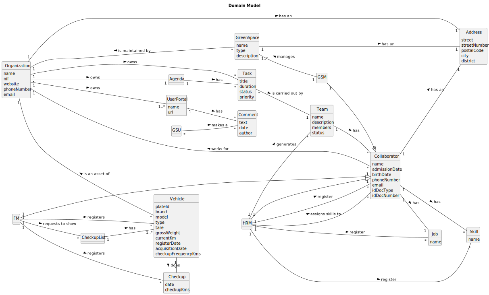

# OO Analysis

The construction process of the domain model is based on the client specifications, especially the nouns (for
_concepts_) and verbs (for _relations_) used.

## Rationale to identify domain conceptual classes

To identify domain conceptual classes, start by making a list of candidate conceptual classes inspired by the list of
categories suggested in the book "Applying UML and Patterns: An Introduction to Object-Oriented Analysis and Design and
Iterative Development".

### _Conceptual Class Category List_

**Business Transactions**

* Planning, construction and maintenance of green spaces
* Task

---

**Transaction Line Itemss**

*

---

**Product/Service related to a Transaction or Transaction Line Item**

*

---

**Transaction Records**

*

---  

**Roles of People or Organizations**

* Organization
* Collaborator
* Team
* FM
* HRM

---

**Places**

* Green Spaces
* Garden
* Park

---

**Noteworthy Events**

* Registering new skill
* Assign skills to collaborator
* Registering new job
* Registering new collaborator
* Register a vehicle
* Register a vehicle's check-up
* List of the vehicles needing the check-up
* Generate team proposal automatically

---

**Physical Objects**

* Vehicle
    * Passengers
    * Mixed
    * Light
    * Heavy
    * Open Box
    * Closed Vans
    * Trucks
* Machine
    * Tractors
    * Backhoe loaders
    * Rotating machines
    * Lawnmowers
* Equipment
    * Sprayers
    * Lifting Platforms
    * Chainsaws
    * Brush cutters
    * Blowers
    * Ladders
    * Cisterns
    * Disc harrows
    * Weeders
    * Aerotors
    * Scarifiers

---

**Descriptions of Things**

*

---

**Catalogs**

*

---

**Containers**

* User Portal

---

**Elements of Containers**

* Comments

---

**Organizations**

* Organization

---

**Other External/Collaborating Systems**

*

---

**Records of finance, work, contracts, legal matters**

* Agenda
* Vehicle Checkup

---

**Financial Instruments**

*

---

**Documents mentioned/used to perform some work/**

*

---

## Rationale to identify associations between conceptual classes

An association is a relationship between instances of objects that indicates a relevant connection and that is worth of
remembering, or it is derivable from the List of Common Associations:

- **_A_** is physically or logically part of **_B_**
- **_A_** is physically or logically contained in/on **_B_**
- **_A_** is a description for **_B_**
- **_A_** known/logged/recorded/reported/captured in **_B_**
- **_A_** uses or manages or owns **_B_**
- **_A_** is related with a transaction (item) of **_B_**
- etc.

| Concept (A) 		 |  Association   	  |  Concept (B) |
|----------------|:-----------------:|-------------:|
| Organization   |       owns        |         Task |
| Organization   |       owns        |       Agenda |
| Organization   |      has an       |      Address |
| Organization   |       owns        |   UserPortal |
| Collaborator   |        has        |        Skill |
| Collaborator   |      has an       |      Address |
| Collaborator   |        has        |          Job |
| HRM            |     works for     | Organization |
| HRM            |       is a        | Collaborator |
| HRM            |     register      |        Skill |
| HRM            |     register      |          Job |
| HRM            |     register      | Collaborator |
| HRM            | assigns skills to | Collaborator |
| HRM            |     generates     |         Team |
| FM             |       is a        | Collaborator |
| FM             |     registers     |      Vehicle |
| FM             |     registers     |      Checkup |
| FM             | requests to show  |  CheckupList |
| UserPortal     |        has        |      Comment |
| Agenda         |        has        |         Task |
| Task           | is carried out by |         Team |
| GreenSpace     |      has an       |      Address |
| GreenSpace     | is maintained by  | Organization |
| Team           |        has        | Collaborator |
| Vehicle        |       does        |      Checkup |
| Vehicle        |  is an asset of   | Organization |
| CheckupList    |        has        |      Vehicle |
| GSM            |       is a        | Collaborator |
| GSM            |      manages      |   GreenSpace |

## Domain Model

**Do NOT forget to identify concept atributes too.**

**Insert below the Domain Model Diagram in a SVG format**

