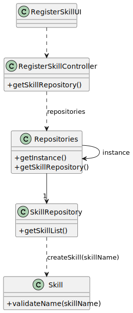

# US001 - Register a skill

## 3. Design - User Story Realization 

### 3.1. Rationale

_**Note that SSD - US001 is adopted.**_

| Interaction ID                                         | Question: Which class is responsible for...                           | Answer                | Justification (with patterns)                                                                                 |
|:-------------------------------------------------------|:----------------------------------------------------------------------|:----------------------|:--------------------------------------------------------------------------------------------------------------|
| Step 1: Asks to register a new skill		                 | ... interacting with the actor?                                       | Register Skill UI     | Pure Fabrication: there is no reason to assign this responsibility to any existing class in the Domain Model. |
| 			  		                                                | ... coordinating the US?                                              | CreateSkillController | Controller                                                                                                    |
| Step 2: Request data (skill name)  		                  |		                                                                     | RegisterSkillUI       | Pure Fabrication: User will insert data on the User Interface.                                                |
| Step 3: Types requested data  		                       | 	...validating input data?                                            | RegisterSkillUI       | IE: object created in step 1 has its own data.                                                                |
|                                                        | ...temporarily keeping input data?                                    | RegisterSkillUI       | Pure Fabrication                                                                                              |
| Step 4: Shows typed data and requests confirmation  		 | ... displaying all the information before confirmation?						         | RegisterSkillUI       | Pure Fabrication                                                                                              |              
| Step 5: Confirms data and submits  		                  | 	... creating the Skill object                                        | SkillRepository       | Creator (Rule 1): Repository manage the created items                                                         | 
| 			  		                                                | 	... validating the data locally (mandatory data)?                    | Skill                 | Information Expert: Skill constructor validates the data                                                      | 
| 			  		                                                | 	... adding to a collection and globally validating duplicate records? | Skill Repository      | Information Expert: Skill repository validates data                                                           | 
| Step 6: Displays operation success  		                 | 	... informing operation success?                                     | CreateSkillUI         | Pure Fabrication                                                                                              | 

### Systematization ##

According to the taken rationale, the conceptual classes promoted to software classes are: 

* Organization
* HRM
* Skill

Other software classes (i.e. Pure Fabrication) identified: 

* CreateSkillUI  
* CreateSkillController

## 3.2. Sequence Diagram (SD)

### Full Diagram

This diagram shows the full sequence of interactions between the classes involved in the realization of this user story.

## 3.3. Class Diagram (CD)

