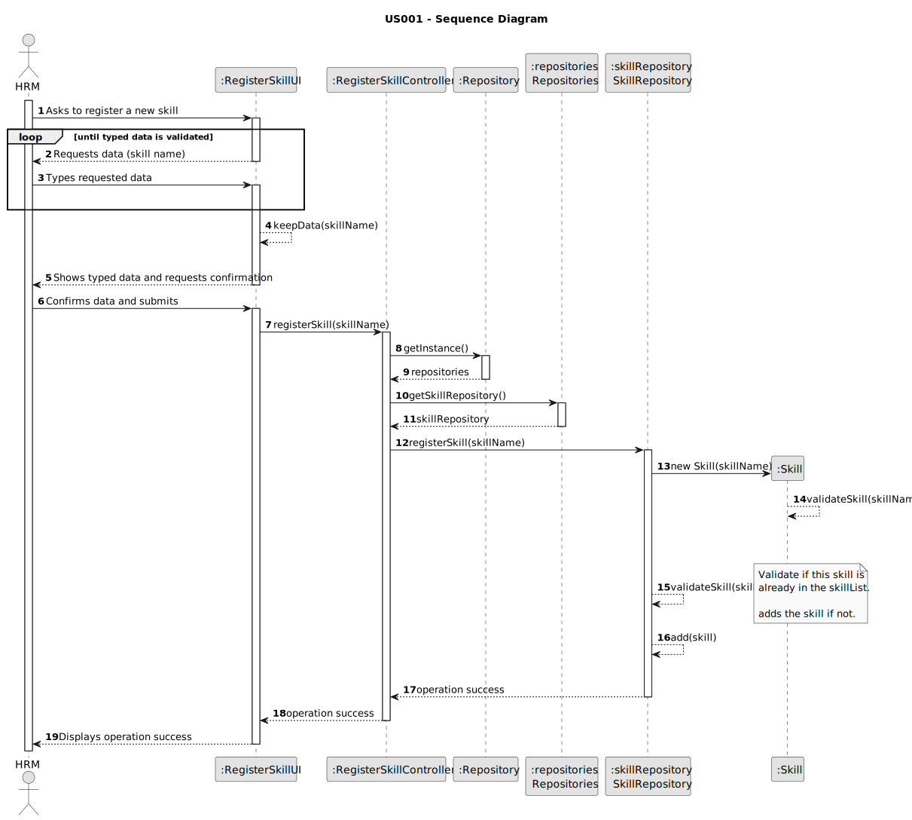

# US001 - Register a skill

## 3. Design - User Story Realization 

### 3.1. Rationale

_**Note that SSD - US001 is adopted.**_

| Interaction ID                                       | Question: Which class is responsible for...                            | Answer                | Justification (with patterns)                                                                                 |
|:-----------------------------------------------------|:-----------------------------------------------------------------------|:----------------------|:--------------------------------------------------------------------------------------------------------------|
| Step 1: Asks to register a new skill		               | ... interacting with the actor?                                        | Register Skill UI     | Pure Fabrication: there is no reason to assign this responsibility to any existing class in the Domain Model. |
| 			  		                                              | ... coordinating the US?                                               | CreateSkillController | Controller                                                                                                    |
| Step 2: Request data (skill name)  		                | 							                                                                | RegisterSkillUI       | Pure Fabrication: User will insert data on the User Interface.                                                |
| Step 3: Types requested data  		                     | 	...validating input data?                                             | RegisterSkillUI       | IE: object created in step 1 has its own data.                                                                |
|                                                      | ...temporarily keeping input data?                                     | RegisterSkillUI       | Pure Fabrication                                                                                              |
| Step 4: Shows all data and requests confirmation  		 | ... displaying all the information before confirmation?						          | RegisterSkillUI       | Pure Fabrication                                                                                              |              
| Step 5: Confirms data  		                            | 	... creating the Skill object                                         | SkillRepository       | Creator (Rule 1): Repository manage the created items                                                         | 
| 			  		                                              | 	... validating the data locally (mandatory data)?                     |                       | Information Expert:                                                                                           | 
| 			  		                                              | 	... adding to a collection and globally validating duplicate records? |                       | Information Expert:                                                                                           | 
| Step 6: Displays operation success  		               | 	... informing operation success?                                      | CreateSkillUI         | Pure Fabrication                                                                                              | 

### Systematization ##

According to the taken rationale, the conceptual classes promoted to software classes are: 

* Organization
* HRM
* Skill

Other software classes (i.e. Pure Fabrication) identified: 

* CreateSkillUI  
* CreateSkillController

## 3.2. Sequence Diagram (SD)

### Full Diagram

This diagram shows the full sequence of interactions between the classes involved in the realization of this user story.

### Split Diagrams

The following diagram shows the same sequence of interactions between the classes involved in the realization of this user story, but it is split in partial diagrams to better illustrate the interactions between the classes.

It uses Interaction Occurrence (a.k.a. Interaction Use).

**Get Task Category List Partial SD**

**Get Task Category Object**

**Get Employee**

**Create Task**

## 3.3. Class Diagram (CD)

