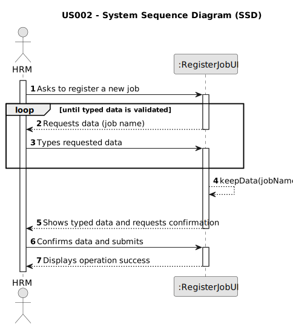

# US002 - Register a Job 

## 1. Requirements Engineering

### 1.1. User Story Description

As an HRM, I want to register a job.

### 1.2. Customer Specifications and Clarifications 

**From the specifications document:**

> MS has a wide range of employees who carry out the most varied tasks in the context
of managing green spaces. Some job examples are designer, estimator, gardener, electrician 
or bricklayer. Thus, an employee has a main occupation (job) and a set of skills
that enable him to perform/take on certain tasks/responsibilities, for example, driving
vehicles of different types (e.g. light, or heavy), operating machines such as backhoes
or tractors; tree pruning; application of phytopharmaceuticals.

**From the client clarifications:**

> **Question:** What data is introduced by the user when creating a job?
>
> **Answer:** The name of the job.

> **Question:** What happens when the user tries to create a job with an existing reference?
> 
> **Answer:** By definition a set can´t have duplicates. Assuring no duplicates is not a business rule is a tecnichal issue.

> **Question:** Is it relevant to associate a specific area or sector with each job? (For example, would "Gardener" be placed in the "Maintenance" sector?)
> 
> **Answer:** It's not necessary as there are no User Stories suggesting that this might become necessary.

> **Question:** Should information such as salary, type of employment (full-time or part-time), and mode of work (on-site, remote, or hybrid) be included in the job?
> 
> **Answer:** It's not necessary as there are no User Stories suggesting that this might become necessary.

> **Question:** What other information do you think is necessary to associate with the Job?
> 
> **Answer:** For now, none.

> **Question:** Is there any Job category : for classifying jobs like gardening, drivers, administration employees , etc?
> 
> **Answer:** There is no job category.

> **Question:** Is there Job Skills: for assigning qualified employee/collaborator in future (having same qualities and skills)?
> 
> **Answer:** There is the concept of skill but not directly related (atm) with job.

> **Question:** Can special characters and numbers be entered when registering a job?
> 
> **Answer:** No.

> **Question:** I assume that a job name cannot be empty. Is that right?
> 
> **Answer:** That's right.

> **Question:** What do you want to see as an output?
> 
> **Answer:** The UX/UI is to be decided by dev team.

 

### 1.3. Acceptance Criteria

* **AC1:** All required fields must be filled in.
* **AC2:** Job name must not contain numbers and the only special characters allowed are spaces and hyphens.

### 1.4. Found out Dependencies

* There are no dependencies for this user story.

### 1.5 Input and Output Data

**Input Data:**

* Typed data:
    * Job name

**Output Data:**

* Success of the operation.

### 1.6. System Sequence Diagram (SSD)

### 1.7 Other Relevant Remarks

* There are no other relevant remarks for this user story.