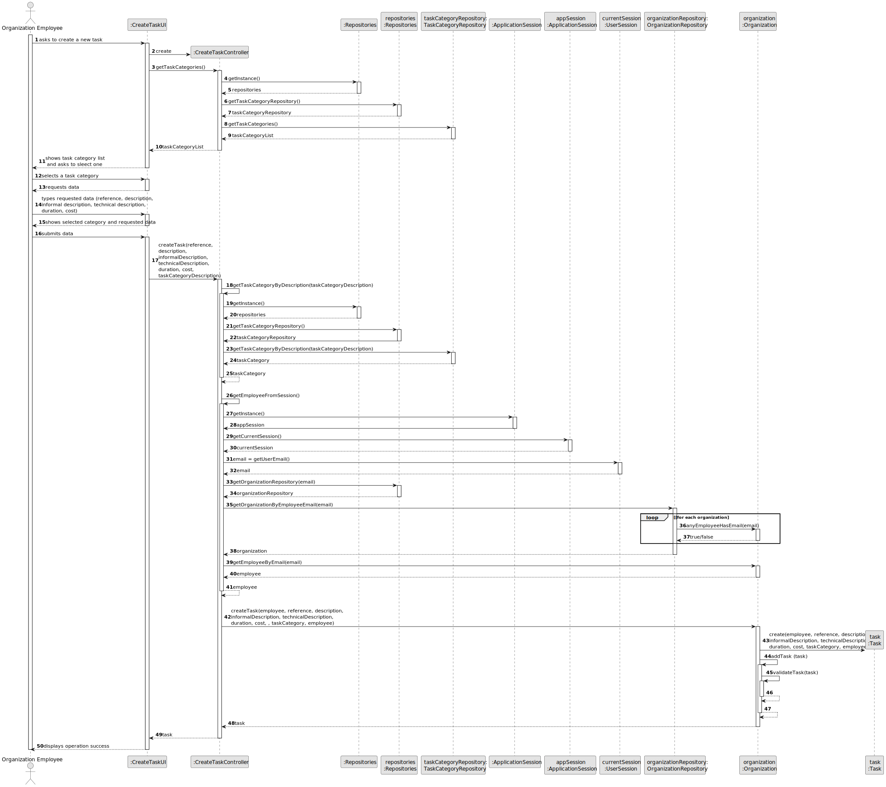
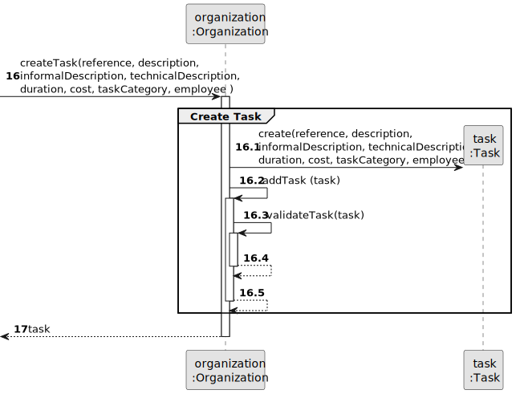

# US003 - Register a Collaborator

## 3. Design - User Story Realization

### 3.1. Rationale

_**Note that SSD - Alternative One is adopted.**_

| Interaction ID                                                                                                          | Question: Which class is responsible for...                           | Answer                         | Justification (with patterns)                                                                                 |
|:------------------------------------------------------------------------------------------------------------------------|:----------------------------------------------------------------------|:-------------------------------|:--------------------------------------------------------------------------------------------------------------|
| Step 1: Asks to register a collaborator 		                                                                              | 	... interacting with the actor?                                      | RegisterCollaboratorUI         | Pure Fabrication: there is no reason to assign this responsibility to any existing class in the Domain Model. |
| 			  		                                                                                                                 | 	... coordinating the US?                                             | RegisterCollaboratorController | Controller                                                                                                    |
| 			  		                                                                                                                 | ... knowing the user using the system?                                | UserSession                    | IE: cf. A&A component documentation.                                                                          |
| Step 2: Requests data (name, birthdate, admission date, address, \nemail,mobile number, id doc type, id doc number)  		 | 	... displaying the form for the actor to input data?						           | RegisterCollaboratorUI         | Pure Fabrication: User will insert data on the User Interface.                                                |
| Step 3: Types requested data  		                                                                                        | 	... validating input data?                                           | RegisterCollaboratorUI         | Pure Fabrication                                                                                              |
|                                                                                                                         | ... temporarily keeping input data?                                   | RegisterCollaboratorUI         | Pure Fabrication                                                                                              |
| Step 4: Shows job list and asks to select one  		                                                                       | 	... obtaining the list of jobs?                                      | Organization                   | Information Expert: Organization knows/has its own jobs.                                                      |
|                                                                                                                         | ... displaying the list of jobs?                                      | RegisterCollaboratorUI         | Pure Fabrication                                                                                              |
| Step 5: Selects a job  		                                                                                               | 	... validating the selected data?                                    | RegisterCollaboratorUI         | Pure Fabrication                                                                                              |
|                                                                                                                         | ... temporarily keeping the selected job?                             | RegisterCollaboratorUI         | Pure Fabrication                                                                                              |
| Step 6: Shows all data and requests confirmation  		                                                                    | ... displaying all the information before confirmation?							        | RegisterCollaboratorUI         | PureFabrication                                                                                               |              
| Step 7: Confirms data  		                                                                                               | 	... creating the Collaborator object?                                | Organization                   | Creator (Rule 1): in the DM Organization has Collaborators.                                                   | 
| 			  		                                                                                                                 | 	... validating the data locally (mandatory data)?                    | Collaborator                   | Information Expert: Collaborator has its own data                                                             |                                                                                    | 
|                                                                                                                         | ... adding to a collection and globally validating duplicate records? | Organization                   | Information Expert: Organization knows all its Collaborator instances.                                        |
| Step 8: Displays operation success  		                                                                                  | 	... informing operation success?                                     | RegisterCollaboratorUI         | Pure Fabrication                                                                                              | 

### Systematization ##

According to the taken rationale, the conceptual classes promoted to software classes are:

* Organization
* Job
* Collaborator

Other software classes (i.e. Pure Fabrication) identified:

* RegisterCollaboratorUI
* RegisterCollaboratorController

## 3.2. Sequence Diagram (SD)

_**Note that SSD - Alternative Two is adopted.**_

### Full Diagram

This diagram shows the full sequence of interactions between the classes involved in the realization of this user story.

### Split Diagrams

The following diagram shows the same sequence of interactions between the classes involved in the realization of this
user story, but it is split in partial diagrams to better illustrate the interactions between the classes.

It uses Interaction Occurrence (a.k.a. Interaction Use).

**Get Task Category List Partial SD**

**Get Task Category Object**

**Get Employee**

**Create Task**

## 3.3. Class Diagram (CD)

