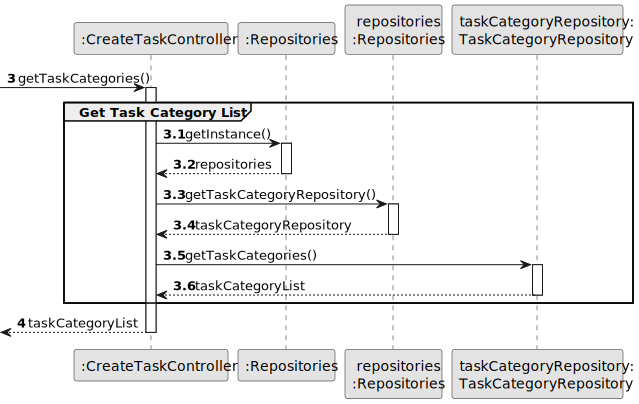

# US005 - Generate team proposal

## 3. Design - User Story Realization

### 3.1. Rationale

_**Note that SSD - Alternative One is adopted.**_

| Interaction ID                                                                     | Question: Which class is responsible for...           | Answer                 | Justification (with patterns)                                                                                 |
|:-----------------------------------------------------------------------------------|:------------------------------------------------------|:-----------------------|:--------------------------------------------------------------------------------------------------------------|
| Step 1: Asks to generate a new team proposal  		                                   | 	... interacting with the actor?                      | TeamProposalUI         | Pure Fabrication: there is no reason to assign this responsibility to any existing class in the Domain Model. |
| 			  		                                                                            | 	... coordinating the US?                             | TeamProposalController | Controller                                                                                                    |
| Step 2: Request data(max and min team size) 		                                     | 							                                               | TeamProposalUI         | Pure Fabrication: User will insert data on the User Interface.                                                |
| Step 3: Type requested data  		                                                    | 	...validating input data?                            | TeamProposalUI         | IE: object created in step 1 has its own data.                                                                |
|                                                                                    | ...temporarily keeping input data?                    | TeamProposalUI         | Pure Fabrication                                                                                              |
| Step 4: Shows list of skills and asks to select one  		                            | 	...obtaining the list of skills                      | SkillRepository        | Information Expert: Skill repository manage skills                                                            |
|                                                                                    | ...displaying the list of skills?                     | TeamProposalUI         | Pure Fabrication                                                                                              |
| Step 5: Selects a skill from the list and specifies the quantity of that skill  		 | 	... validating the selected data?                    | TeamProposalUI         | Pure Fabrication                                                                                              |
|                                                                                    | ... temporarily keeping the selected skill?           | TeamProposalUI         | Pure Fabrication                                                                                              |
| Step 6: Generate the team proposal and asks for confirmation 		                    | 							                                               |                        |                                                                                                               |              
| Step 7: Shows team generated and asks for confirmation  		                         | 	... display all the information before confirmation? | TeamProposalUI         | IE: owns its data.                                                                                            |
| Step 8: Accepts or rejects the proposal  		                                        | 	... creating the team proposal                       | TeamProposalRepository | IE: in the DM Team proposal repository manage teams                                                           |
|                                                                                    | ... validating the data locally?                      |                        |                                                                                                               |
|                                                                                    | ...adding to a collection?                            |                        | Information Expert:                                                                                           |
| Step 9: Displays operation success                                                 | ... informing Operation success                       | TeamProposalUI         | Pure Fabrication                                                                                              |

### Systematization ##

According to the taken rationale, the conceptual classes promoted to software classes are:

* HRM
* 

Other software classes (i.e. Pure Fabrication) identified:

* TeamProposalUI
* TeamProposalController

## 3.2. Sequence Diagram (SD)

_**Note that SSD - Alternative Two is adopted.**_

### Full Diagram

This diagram shows the full sequence of interactions between the classes involved in the realization of this user story.

### Split Diagrams

The following diagram shows the same sequence of interactions between the classes involved in the realization of this
user story, but it is split in partial diagrams to better illustrate the interactions between the classes.

It uses Interaction Occurrence (a.k.a. Interaction Use).

**Get Task Category List Partial SD**

**Get Task Category Object**

**Get Employee**

**Create Task**

## 3.3. Class Diagram (CD)

