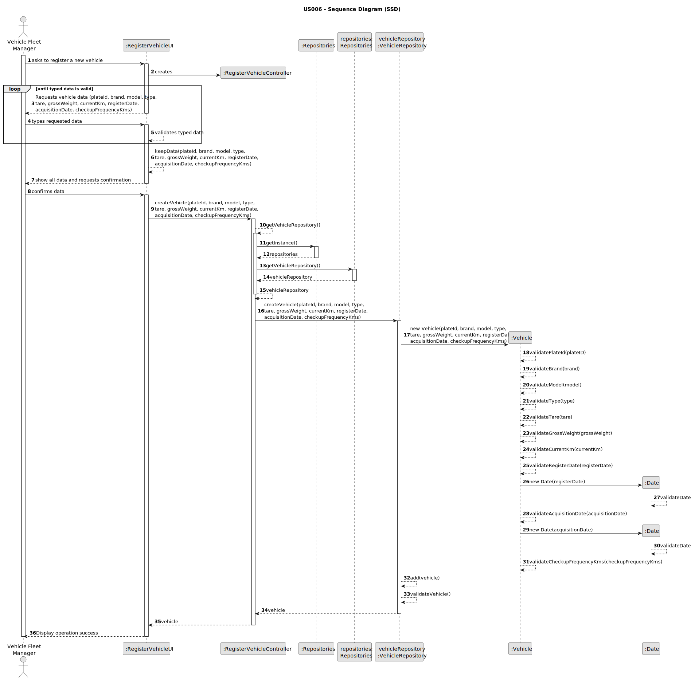
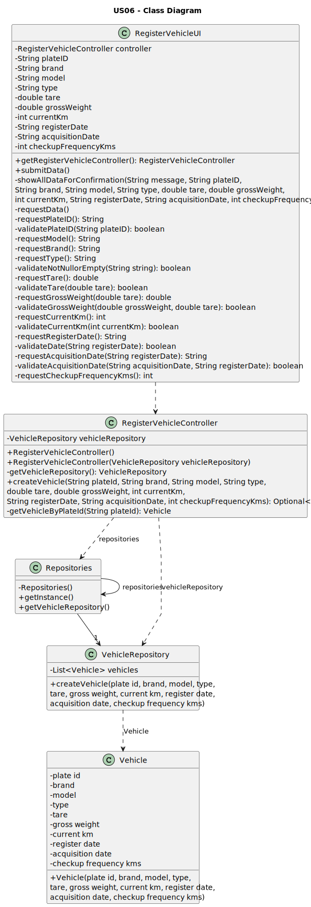

# US006 - Register a Vehicle

## 6. Design - User Story Realization

### 6.1. Rationale

_**Note that SSD - Alternative One is adopted.**_

| Interaction ID                                                                                                                                         | Question: Which class is responsible for...   | Answer                    | Justification (with patterns) |
|:-------------------------------------------------------------------------------------------------------------------------------------------------------|:----------------------------------------------|:--------------------------|:------------------------------|
| Step 1: Asks to create a new vehicle	                                                                                                                  | 	... interacting with the actor?              | RegisterVehicleUI         | Pure Fabrication              |
| 			  		                                                                                                                                                | 	... coordinating the US?                     | RegisterVehicleController | Controller                    |
| Step 2: Requests vehicle data (plate id, brand, model, type,\ntare, gross weight, current km, register date,\nacquisition date, checkup frequency kms) | 	... instantiating a new Vehicle?             | VehicleRepository         | Creator                       |
| Step 3: Types requested data	                                                                                                                          | 	...saving the inputted data?                 | RegisterVehicleUI         | Information Expert            |
| Step 4: Confirms data and submits    	                                                                                                                 | 	... validating all data (local validation)?  | RegisterVehicleController | Information Expert            | 
| 			  		                                                                                                                                                | 	... validating all data (global validation)? | Vehicle                   | Information Expert            | 
| Step 5: Keep data	  		                                                                                                                                 | 	... saving the created Vehicle?              | VehicleRepository         | Information Expert            | 
| Step 6: Displays operation success  		                                                                                                                 | 	... informing operation success?             | RegisterVehicleUI         | Information Expert            | 

### Systematization ##

According to the taken rationale, the conceptual classes promoted to software classes are:

* Vehicle

Other software classes (i.e. Pure Fabrication) identified:

* RegisterVehicleUI
* RegisterVehicleController
* VehicleRepository

## 6.2. Sequence Diagram (SD)

_**Note that SSD - Alternative Two is adopted.**_

### Full Diagram

This diagram shows the full sequence of interactions between the classes involved in the realization of this user story.

## 3.3. Class Diagram (CD)

