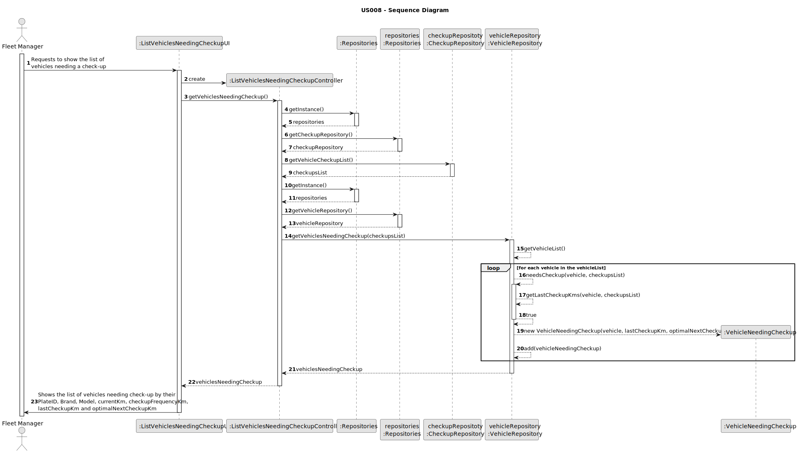
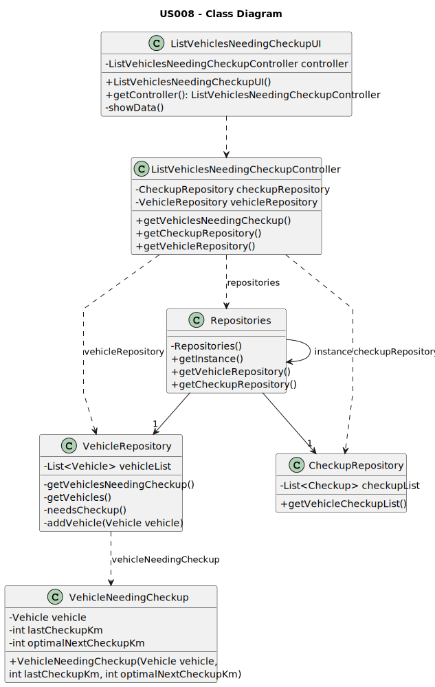

# US008 - List of vehicles needing the check-up

## 3. Design - User Story Realization

### 3.1. Rationale

_**Note that SSD - Alternative One is adopted.**_

| Interaction ID                                                                              | Question: Which class is responsible for...      | Answer                              | Justification (with patterns)                        |
|:--------------------------------------------------------------------------------------------|:-------------------------------------------------|:------------------------------------|:-----------------------------------------------------|
| Step 1: Requests to show the list of vehicles needing inspection                            | ...instantiating the class that handles the UI ? | ListVehiclesNeedingCheckupUI        | Pure Fabrication                                     |
|                                                                                             | ... obtaining the vehicles that need checkup?    | ListVehicleNeedingCheckupController | Information Expert (knows all the vehicle instances) |
|                                                                                             | ... ensuring the vehicle needs checkup?          | Vehicle Repository                  | Information Expert                                   |
| Step 2: Shows the list of vehicles needing check-up with vehicle details and the data used. | ... displaying the vehicles that need checkup?   | ListVehiclesNeedingCheckupUI        | Pure Fabrication                                     |

### Systematization ##

According to the taken rationale, the conceptual classes promoted to software classes are:

* none

Other software classes (i.e. Pure Fabrication) identified:

* ListVehiclesNeedingCheckupUI
* ListVehicleNeedingCheckupController
* VehicleRepository

## 3.2. Sequence Diagram (SD)

_**Note that SSD - Alternative Two is adopted.**_

### Full Diagram

This diagram shows the full sequence of interactions between the classes involved in the realization of this user story.

## 3.3. Class Diagram (CD)

