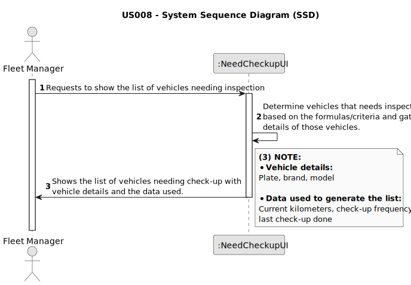

# US009 - List the exact costs referring to water consumption of specific green space so that I may manage these expenses efficiently.

## 1. Requirements Engineering

### 1.1. User Story Description

As a GSM, I want to know the exact costs referring to water consumption of specific green space so that I may manage
these expenses efficiently.

### 1.2. Customer Specifications and Clarifications

**From the specifications document:**

> Therefore, within this US, the aim is to carry out a
> statistical analysis concerning the water consumption costs in all parks.

> The ”WaterUsed.csv” file provide the necessary data to carry out the
> study. This file records daily water consumption (in m3
) since the day
> each park opened.  

>The amount paid for water is 0.7 AC/m3
> , up to a
> consumption of 50 m3
> , with a fee of 15% added for higher consumption
> levels.

> The data file contains records of the following information: ”Park Identification”, ”Year”, ”Month”, ”Day”,
> ”Consumption”. Consider this
> data in order to obtain the following outcomes:
> 
> - Barplot representing monthly water consumption, as a result of
> the following specifications given by the user: time period (StartMonth, EndMonth) and park identification.
> 
> - Average of monthly costs related to water consumption as a result
> of the following specifications given by the user: number of parks
> to be analyzed, and park identification.
>
> - Consider the water consumption of every day that is recorded.
> The aim is to analyze and compare statistical indicators between
> the park with the highest and lowest water consumption. For
> these two parks, perform the following tasks and compare results:
> 
>  - Calculate the mean, median, standard deviation, and the coefficient of skewness;
> 
>  - Build relative and absolute frequency tables (classified data),
> considering 5 classes;
> 
>  - Check if the data has outliers, using the outlier definition as
> values that deviate from the median by more than 1.5 times
> the interquartile range;
> 
>  - Graphically represent data through histograms with 10 classes.

**From the client clarifications:**

> **Question:** What is the expected output of this US? 
>
> **Answer:** 

 
### 1.3. Acceptance Criteria

* **AC1:** The initial file (WaterUsed.csv) shouldn't be empty and the data must be formated correctly.

### 1.4. Found out Dependencies

* The system must have access to the "WaterUsed.csv" file, which contains the necessary data to carry out the study.

### 1.5 Input and Output Data

**Input Data:**

* Time period (StartMonth, EndMonth)
* Park identification

**Output Data:**

* Barplot representing monthly water consumption
* Average of monthly costs related to water consumption
* Statistical indicators between the park with the highest and lowest water consumption
* Relative and absolute frequency tables
* Histograms with 10 classes
* Mean, median, standard deviation, and the coefficient of skewness
* Water consumption of every day that is recorded

### 1.6. System Sequence Diagram (SSD)

### 1.7 Other Relevant Remarks

* 
