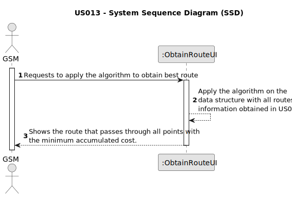

# US013 - Obtain the routes to be opened and pipes needed to be laid with a minimum accumulated cost, ensuring that all points are adequately supplied.

## 1. Requirements Engineering

### 1.1. User Story Description

As a GSM, I want to apply an algorithm that returns the routes to be opened and pipes needed to be laid with a minimum
accumulated cost, ensuring that all points are adequately supplied.

### 1.2. Customer Specifications and Clarifications

**From the specifications document:**

> Planning and building irrigation systems in green parks are expensive and time-consuming tasks. The use of computer
> systems and namely powerful algorithms can save materials like pipes, reduce the time required for the planning and
> installation, and allow to create more efficient irrigation systems. This becomes even more relevant when considering
> the installation of irrigation systems in parks that are already in operation, because periods of construction prevent
> their normal operation.

**From the client clarifications:**

> **Question:**
>
> **Answer:**

### 1.3. Acceptance Criteria

* **AC1:** All implemented procedures must only use primitive operations, and not existing functions in JAVA libraries.
* **AC2:** All points must be supplied on the choosen route while minimizing the accumulated cost.

### 1.4. Found out Dependencies

* There is a dependency on "US012 - Import a .csv file containing lines with Water Point X, Water Point Y and distance"
  since it's necessary to data structure with the routes to apply the algorithm.

### 1.5 Input and Output Data

**Input Data:**

* Data structure containing all possible routes including:
    * Water points and their respective installation costs.

**Output Data:**

* The best route to be opened with a minimum accumulated cost.

### 1.6. System Sequence Diagram (SSD)

### 1.7 Other Relevant Remarks

* The algorithm should return the optimal routes to be opened for laying pipes between each pair of water supply points.
  These route must ensure that all points are adequately supplied while minimizing the accumulated cost.
