# User Manual

# Green Spaces Management App

### Instituto Superior de Engenharia do Porto

#### Laboratory/Project II - LEI

#### 1DC - GROUP 034 – CODEFLOW

- PEDRO COSTA (1221790)
- RUI SANTIAGO (1221402)
- FRANCISCO TROCADO (1230608)

#### Sprint 3

#### **Date:** June 8th, 2024

---

## Table of Contents

- [Glossary](#glossary)
- [Introduction](#introduction)
- [System Requirements](#system-requirements)
- [System Overview](#system-overview)
- [Features](#features)
    - [Register a Skill | Human Resources Manager](#1-register-a-skill--human-resources-manager)
    - [Register a Job | Human Resources Manager](#2-register-a-job--human-resources-manager)
    - [Register a Collaborator | Human Resources Manager](#3-register-a-collaborator--human-resources-manager)
    - [Assign skills to a Collaborator | Human Resources Manager](#4-assign-skills-to-a-collaborator--human-resources-manager)
    - [Generate a team proposal | Human Resources Manager](#5-generate-a-team-proposal--human-resources-manager)
    - [Register a Vehicle | Fleet Manager](#6-register-a-vehicle--fleet-manager)
    - [Register a Vehicle's Check-up | Fleet Manager](#7-register-a-vehicles-check-up--fleet-manager)
    - [Register a Green Space | Green Space Manager](#8-list-vehicles-needing-check-up--fleet-manager)
    - [Add new entry to the To-Do list | Green Space Manager](#8-list-vehicles-needing-check-up--fleet-manager)
    - [Add new entry in the Agenda | Green Space Manager](#8-list-vehicles-needing-check-up--fleet-manager)
    - [Assign team to an entry in the Agenda | Green Space Manager](#8-list-vehicles-needing-check-up--fleet-manager)
    - [Postpone an entry in the Agenda | Green Space Manager](#8-list-vehicles-needing-check-up--fleet-manager)
    - [Cancel an entry in the Agenda | Green Space Manager](#8-list-vehicles-needing-check-up--fleet-manager)
    - [Assign one or more vehicles to and entry in the Agenda | Green Space Manager](#8-list-vehicles-needing-check-up--fleet-manager)
    - [List all green spaces managed by me | Green Space Manager](#8-list-vehicles-needing-check-up--fleet-manager)
    - [Consult the tasks assigned to me between two dates | Collaborator](#8-list-vehicles-needing-check-up--fleet-manager)
    - [Record the completion of a task | Collaborator](#8-list-vehicles-needing-check-up--fleet-manager)
    - [Update vehicle Kilometers | Collaborator](#8-list-vehicles-needing-check-up--fleet-manager)
    - [Import routes from csv file | Green Space Manager](#8-list-vehicles-needing-check-up--fleet-manager)
    - [Obtain routes to be opened | Green Space Manager](#8-list-vehicles-needing-check-up--fleet-manager)
    - [Run tests for inputs of variable size | Quality Assessment Team Manager](#8-list-vehicles-needing-check-up--fleet-manager)
    - [Place signs to evacuate to an Assembly point | Green Space Manager](#8-list-vehicles-needing-check-up--fleet-manager)
    - [Place signs to evacuate to one of the several Assembly points | Green Space Manager](#8-list-vehicles-needing-check-up--fleet-manager)

- [Troubleshooting](#troubleshooting)
- [Frequently Asked Questions](#frequently-asked-questions)
- [References](#references)

---

## Glossary

| **_TEA_**                 | **_Description_**                                                                                                                                                |
|:--------------------------|:-----------------------------------------------------------------------------------------------------------------------------------------------------------------|
| **Address**               | Refers to the residential location of the collaborator/organization (with a street, a street number, a postal code, city and district).                          |
| **Agenda**                | Crucial mechanism for planning the week's work.                                                                                                                  |
| **AP**                    | Refer to the Assembly Point.                                                                                                                                     |
| **Assembly Point**        | A location predetermined and known where people must meet in the event of an evacuation or emergency.                                                            |
| **Automatically**         | Something that is done without human intervention.                                                                                                               |
| **Backlog**               | A list of tasks or items awaiting completion or further action.                                                                                                  |
| **Barplot**               | Type of chart that represents categorical data with rectangular bars.                                                                                            |
| **BI**                    | Refers to Portuguese identity card.                                                                                                                              |
| **Boxplot**               | Type of graphical representation that displays the distribution of a dataset.                                                                                    |
| **CamelCase**             | CamelCase is a coding convention where compound words are written without spaces, and each word begins with a capital letter except for the first one.           |
| **CC**                    | Refers to Portuguese citizen card.                                                                                                                               | 
| **Check-up**              | The action of subjecting company vehicles to a periodic inspection.                                                                                              |
| **Check-up frequency**    | The frequency, in kilometers, at which the vehicle requires inspection.                                                                                          |
| **Collaborator**          | Employee of the organization with specific skills for executing tasks related to green space management.                                                         |
| **Configuration File**    | File used to store parameters and settings that configure the operation of a program or system.                                                                  |
| **CSV**                   | Comma-Separated Values file.                                                                                                                                     |
| **Current km**            | The mileage (km) that the vehicle has at the current date.                                                                                                       |
| **Dijkstra**              | Algorithm used in Graph Theory to find the shortest path between a source vertex and all other vertices.                                                         |
| **Doc**                   | Refers to the identification document.                                                                                                                           |
| **Email**                 | Email address of an collaborator.                                                                                                                                |
| **Employee**              | Same as collaborator.                                                                                                                                            |
| **Equipment**             | Organization's tools used by collaborators in task execution.                                                                                                    |
| **Evacuation Route**      | The path that users must follow from multiple locations in the park to an Assembly Point in the event of an emergency.                                           |
| **FM**                    | Fleet Manager.                                                                                                                                                   |
| **Gnuplot**               | Open-source plotting program that enables users to create 2D and 3D plots of data sets.                                                                          |
| **GraphStream**           | Java library for modeling, analyzing, and visualizing dynamic graphs and networks.                                                                               |
| **Graphviz**              | Software to create and visualize graphs and networks.                                                                                                            |
| **Green Space**           | Refers to green spaces in public places (e.g. parks and gardens).                                                                                                |
| **Gross Weight**          | The total weight of a vehicle, including passengers, cargo, and any other load.                                                                                  |
| **GSM**                   | Green Spaces Manager.                                                                                                                                            |
| **GSU**                   | Green Spaces User.                                                                                                                                               |
| **HRM**                   | Human Resources Manager.                                                                                                                                         |
| **ID Doc**                | Number of identification document.                                                                                                                               |
| **IDE**                   | Integrated development environment.                                                                                                                              |
| **IntelliJ IDE**          | Integrated development environment by JetBrains.                                                                                                                 |
| **Item**                  | Individual element of a collection/list.                                                                                                                         |
| **JaCoCo**                | Java library that offers information about the code coverage of Java.                                                                                            |
| **Java**                  | Object-oriented programming language.                                                                                                                            |
| **Javadoc**               | Automatic documentation generator for Java code, using specially formatted comments.                                                                             |
| **JavaFX 11**             | The framework used to develop the graphical interface of the application.                                                                                        |
| **Job**                   | Profession/Role performed by a collaborator.                                                                                                                     |
| **JUnit 5**               | Testing framework for Java.                                                                                                                                      |
| **Jupyter Notebook**      | Open-source web application that allows to create and share documents.                                                                                           |
| **km**                    | Kilometer, a unit of distance measurement.                                                                                                                       |
| **KPI**                   | Stands for Key Performance Indicator.                                                                                                                            |
| **Kruskal**               | Algorithm used in Graph Theory to find the Minimum Spanning Tree.                                                                                                |
| **LaTeX**                 | Typesetting system commonly used for creating scientific and technical documents.                                                                                |
| **Linear Regression**     | A statistical method used to model the relationship between two variables where one variable is continuous and the other is independent.                         |
| **MS**                    | MS is an acronym for MusgoSublime.                                                                                                                               |
| **MusgoSublime**          | Organization dedicated to the planning, construction, and maintenance of green spaces for collective use.                                                        |
| **NetBeans**              | Integrated development environment by Oracle Corporation.                                                                                                        |
| **Object Serialization**  | Process of converting an object's state into a format that can be stored or transmitted and later reconstructed to create a new instance with the same state.    |
| **OO**                    | Refers to Object-Oriented.                                                                                                                                       |
| **Park**                  | Parks subject to management and maintenance by the organization.                                                                                                 |
| **PlantUML**              | Tool to create diagrams using simple text.                                                                                                                       |
| **Plate**                 | License plate of a vehicle.                                                                                                                                      |
| **Polynomial Regression** | A form of regression analysis in which the relationship between the independent variable x and the dependent variable y is modelled as an nth degree polynomial. |
| **PVM**                   | Minimal Viable Product.                                                                                                                                          |
| **Python**                | Programming language.                                                                                                                                            |
| **QAM**                   | Software Quality Assessment Team Manager.                                                                                                                        |
| **SCRUM**                 | Framework for managing and organizing work.                                                                                                                      |
| **Skill**                 | A characteristic of an employee and/or a specific ability to perform a task.                                                                                     |
| **SPRINT**                | A short and fixed period of time (usually 2-4 weeks) in which a team works on a set of tasks to deliver a usable product increment.                              |
| **SVG**                   | Scalable Vector Graphics is an image format used for two-dimensional.                                                                                            |
| **Tare**                  | The weight of a vehicle when empty, excluding any passengers or cargo.                                                                                           |
| **Task**                  | Tasks performed by collaborators.                                                                                                                                |
| **TDD**                   | Test-Driven Development.                                                                                                                                         |
| **Team**                  | Group of workers who collaborate as a team to accomplish a task.                                                                                                 |
| **To-Do**                 | A list of tasks that need to be planned into the Agenda.                                                                                                         |
| **Topographic Survey**    | A survey that measures the elevation of points on a particular piece of land and presents them as contour lines on a plot.                                       |
| **UI**                    | User Interface.                                                                                                                                                  |
| **User**                  | Individual who can use the application.                                                                                                                          |
| **User Portal**           | Platform where users can post comments, report faults and malfunctions of equipment.                                                                             |
| **UX**                    | User Experience.                                                                                                                                                 |
| **VFM**                   | Vehicle and Equipment Fleet Manager.                                                                                                                             |

---

## Introduction

Green spaces are important for enhancing the quality of life for residents and even visitors. Effectively managing these
areas requires an efficient application that focuses on each of the topics inherent in their management.

This user manual was designed as a guide to help users navigate and comprehend the functionalities of our application
effectively. Its purpose is to provide step-by-step instructions for users to operate the application in the easiest way
and efficiently.

The application provides a set of functionalities which are intuitive and easy-to-use for managing public parks and
gardens in urban spaces.

The User Manual is divided into several parts, each one addressing a specific aspect of the application.

The User Manual is divided into several parts, each one addressing a specific aspect of the application. The sections
for this sprint are as listed:

- **Glossary**, which contains a list of terms, expressions and acronyms used throughout the project followed by its
  description.

- **System requirements** which define the minimum requirements for the safe and stable use of the application.

- **System Overview**, which describes the main functionalities of the application. It includes an overall description
  of the product, including the objectives of the application, its structure, the reference to the main features, the
  representation of the diagram (Domain Model) that shows the system’s functionalities and the dependencies that exist
  between them. The system overview also includes a table with all the program's features and which users have access to
  each of them.

- **System Features**, listing the main features of the application. Each feature in this user manual corresponds to a
  user story in software development terminology, it means one “action” the user may perform on the application. For
  each feature, we provide guidance on how to utilize it effectively, including potential errors and how to address them
  for an improved user experience.

- **Troubleshooting** to identify and resolve issues/failures that may arise in the application's operation.

- **Frequently asked questions** to provide answers to the most common questions that users of the application may have.

This user manual aims to clarify user doubts and assist them in navigating the application swiftly and efficiently. The
goal is for users to fully take advantage of the application's features to enhance their daily work experience within
the company, providing a more streamlined and efficient green space management experience.

---

## System Requirements

Since the application is not very large and does not require high processing power, the system requirements are not very
specific. Nonetheless, to ensure that the program runs and operates smoothly, please make sure that the computer running
the program meets the following minimum requirements:

### Hardware Requirements:

- **Processor:** Intel Core i3 or equivalent (very low CPU usage);
- **Memory (RAM):** 4GB or higher.
- **Storage:** 500MB;
- **Screen Resolution:** 1366 x 768 pixels.

### Software Requirements:

- **Operating System:** Ideally, Windows.
- **Other required software:** Java Runtime Environment (JRE) 8 or higher and GraphStream Software for the graph
  visualization.

### Network Requirements:

- No internet connection is required to run the application.

To install the application, access must be granted by a developer of the application. Once you have access, simply open
the folder and run the application.

---

## System Overview

The main objective of this Java-built application is to provide a solution that supports the activities of an
organization responsible for managing green spaces, predominantly in urban contexts.

While using this application, users have at their disposal a set of functionalities that streamline the company's
activities, making management more efficient, facilitating planning and coordination of the activities.

Through a user-friendly interface, the system enables managers to register collaborators, jobs, and skills, which allows
the manager to automatically create a team that will execute tasks of an agenda, ensuring greater efficiency and
coordination in the work. Furthermore, the application also facilitates the fleet management, including vehicles,
machinery, and equipment through functionalities that allow the registration of the organization's vehicles, as well as
the management of vehicle check-ups.

For the green space managers, there is a set of features that allow for the management of green spaces, task management,
and planning for their execution.

Collaborators can use the program to search for tasks assigned to them and have a set of options for filtering and
marking tasks as completed and update vehicle kilometers.

To demonstrate more easily how the application works, we have developed a diagram (Domain model) that shows the system's
functionalities and the dependencies that exist between them

The application is structured with various roles, each having access to different system features and functionalities.
The table below illustrates the features and responsibilities assigned to each user role, with an "X" indicating the
roles that can access a particular feature. HRM stands for Human Resources Manager, VFM stands for Vehicle and fleet
Manager, GSM stands for Green Space Manager and QAM stands for Software Quality Assessment Team Manager.

Note that, for the features involving mathematics (mdisc and matcp) the user does not need to be logged in the system to
use the feature.

| **Feature**                   | **Admin** | **HRM** | **VFM** | **GSM** | **QAM** | **Collaborator** |
|:------------------------------|:----------|:--------|:--------|:--------|:--------|:-----------------|
| Login                         |           |         |         |         |         |                  |
| Register job                  |           |         |         |         |         |                  |
| Register skill                |           |         |         |         |         |                  |
| Register collaborator         |           |         |         |         |         |                  |
| Assign skills                 |           |         |         |         |         |                  |
| Register vehicle              |           |         |         |         |         |                  |
| Register vehicle checkup      |           |         |         |         |         |                  |
| List vehicles needing checkup |           |         |         |         |         |                  |
| Generate team proposal        |           |         |         |         |         |                  |
|                               |           |         |         |         |         |                  |
|                               |           |         |         |         |         |                  |
|                               |           |         |         |         |         |                  |
|                               |           |         |         |         |         |                  |
|                               |           |         |         |         |         |                  |
|                               |           |         |         |         |         |                  |
|                               |           |         |         |         |         |                  |
|                               |           |         |         |         |         |                  |
|                               |           |         |         |         |         |                  |
|                               |           |         |         |         |         |                  |
|                               |           |         |         |         |         |                  |
|                               |           |         |         |         |         |                  |
|                               |           |         |         |         |         |                  |

---

## Features

Firstly, upon opening the application, a menu will be presented where the user can choose one of the 3 options:

The option 0 (Cancel) is used to quit the application.

The option 2 (Know the Development Team) display information about the individuals who contributed to the development of
the application.

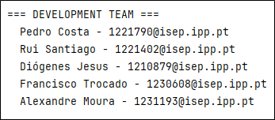

Then, if the user decides to login (option 1), he will be taken to another interface where he must enter the email and
password to authenticate.

The login screen will give the user three tries to login if he can’t enter after three tries, he will be sent back to
the main menu.

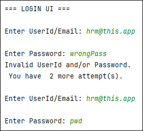

Now that the user is logged in, we can access features of the role that his account contains through the designed menu
for that role, specifically, contents related to the Human Resources Manager (HRM) and the Vehicle Fleet Manager (VFM).

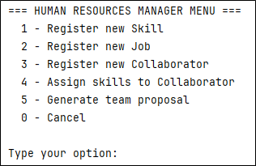

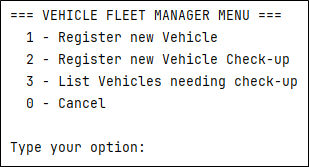

### 1. Register a Skill | Human Resources Manager

After selecting option 1 in HRM’s menu (Register new skill), the user will be redirected to an interface where he will
need to enter the name of the skill he wishes to register. After introducing the skill name, the system will ask for
user confirmation before saving.

After confirming the operation, the new skill will be saved, and the system will show a message of success. If the HRM
tries to register a skill that already exists in the system, a notification will be displayed indicating that “This
Skill is already registered!”.

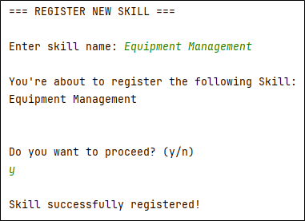

There are additional controls considering the inputs that are entered, such as checking if its field is empty, if it
contains not allowed characters, or even numbers.

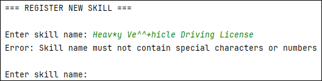

### 2. Register a Job | Human Resources Manager

Very similar to the register a new skill, after selecting option 2 in HRM’s menu (Register new job), the user will be
redirected to an interface where he will need to enter the name of the job he wishes to register. After introducing the
job name, the system will ask for user confirmation before saving.

After confirming the operation, the new skill will be saved, and the system will show a message of success. If the HRM
tries to register a job that already exists in the system, a notification will be displayed indicating that “This job is
already registered!”.

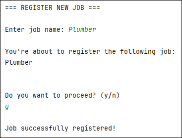

There are also additional controls considering the inputs that are entered, such as checking if its field is empty, if
it contains not allowed characters, or even numbers.

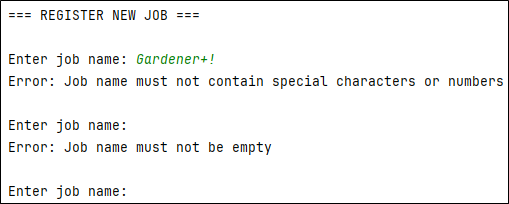

### 3. Register a Collaborator | Human Resources Manager

This feature is used to add new collaborators to the system. Upon choosing option 3 of HRM’s menu (Register new
collaborator), the user will be asked to fill all the collaborator’s attributes.

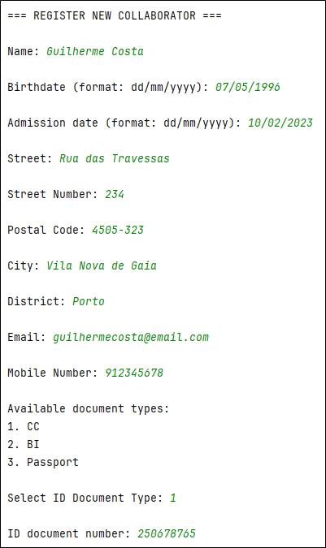

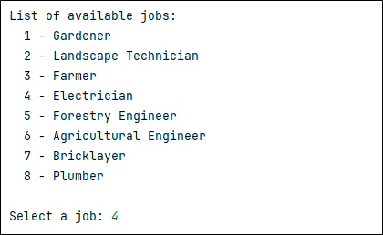

When registering a new employee, all personal information must be filled in before submission. Additionally, all fields
have input control, generating a specific error message indicating the error of the specific field.

Some error messages that can be displayed when inputs are incorrect are:

* “Name must not contain special characters”.
* “Birthdate cannot be in the future.”
* “Collaborator must be 18 years old.”
* “Street number must be a positive integer!”
* “Postal code must follow the format XXXX-XXX”.
* “Email format must follow the pattern prefix domain”.
* “Mobile Number is not in a correct format”.
* “NIF in wrong format. Must be 9 numeric digits”.
* “Passport in wrong format. Must be two letters + 6 numeric digits (Example: AB222222)”

Among other specific errors that may show when input data is not valid.

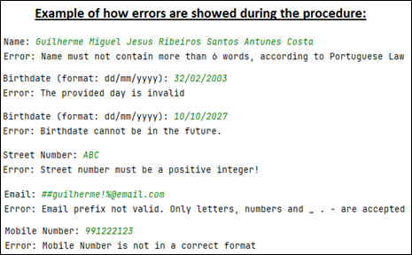

After correctly inputting all necessary information, the filled data will be showed for confirmation. Upon confirmation,
the new collaborator will be saved, and a success message will be sent.

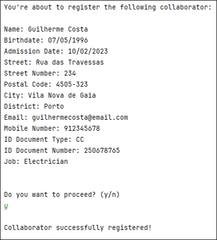

After confirmation/submitting the data, if the employee already exists in the system, an error message will be displayed
indicating that “This collaborator is already in the system!”

### 4. Assign skills to a Collaborator | Human Resources Manager

The option 4 (Assign skills to collaborator) from the HRM’s menu, will bring the interface for Assigning skills to a
Collaborator. In this interface, the list of available collaborators in the system will be displayed and the user must
select which collaborator want to assign new skills to.

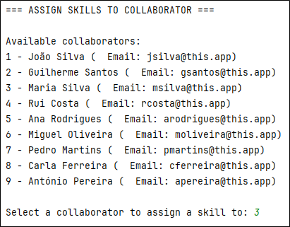

After selecting the collaborator, the list of available skills will appear, and the user can select one or more skills
to assign to the collaborator.

After selecting a skill, the application will ask the user if he wants to submit or choose more skills before
submitting.

When the user no longer wishes to select additional skills, the selected information is displayed for confirmation
before being saved.

If the user selects a skill that has already been chosen before, an error message will be displayed saying “This skill
has already been chosen, please select a different one.”

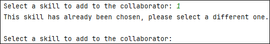

### 5. Generate a team proposal | Human Resources Manager

Generate team proposal is the last option of HRM’s menu (option 5). To use this feature, the user needs to type the
desired team size, including both the minimum and maximum team size.

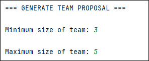

Next, user must select the necessary skills the team members may have and the quantity of collaborators with that
specific skill.

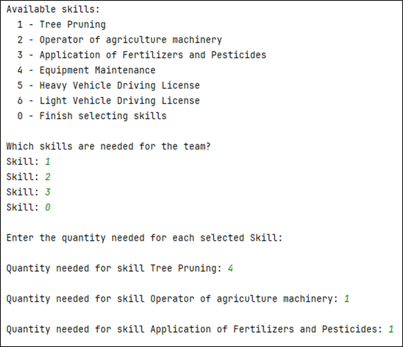

Upon submission of the information, the system generates all possible teams based on the input and displays the most
efficient team first.

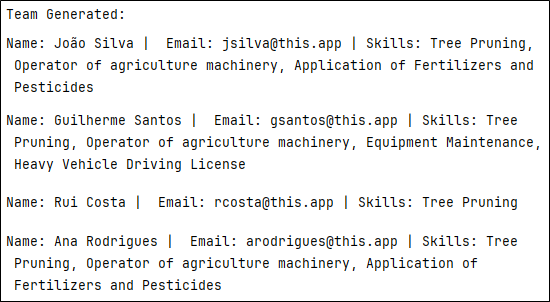

The user can either accept or reject the proposed team. If accepted, the team will be saved in the system. If the user
rejects the displayed team, the next most efficient team (if available) will be shown.

In case the user views all possible teams without selecting any, the program will prompt whether he wants to cancel the
process or view the teams again.

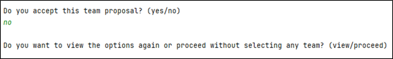

If, based on the provided information, it was not possible to generate any team, an error message will be displayed
indicating the error.

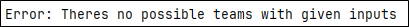

### 6. Register a Vehicle | Fleet Manager

When choosing option 1 in the VFM’s menu (Register new vehicle), the system will display the user interface for
registering a new vehicle where the user needs to fill in all the vehicle-related data before submitting.

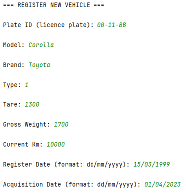

Like the other interfaces, there are input controls that display errors if the entered information does not meet the
acceptance criteria, some of the errors that user may encounter are:

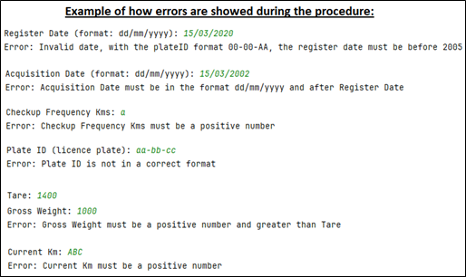

After submission, the data will be shown to the user for confirmation and will be saved, displaying a success message.
If the vehicle is already in the system, a message will be displayed, indicating the error.

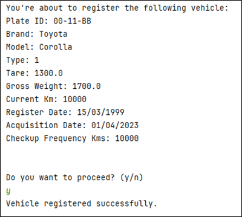

### 7. Register a Vehicle's Check-up | Fleet Manager

The option 4 of VFM’s menu (Register new vehicle’s check-up), allows the registration of a new vehicle’s check-up. To
use this feature, first the user must select a vehicle from the list.

For the chosen vehicle, the user now needs to type the check-up data, which is the check-up date and the kilometers. In
the end of process, all data will be displayed for confirmation and the user may proceed or not.

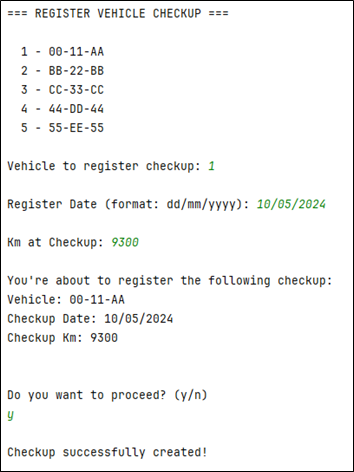

The check-up kilometers cannot be less than zero or superior to the current kilometers of the vehicle, otherwise an
error will be showed.

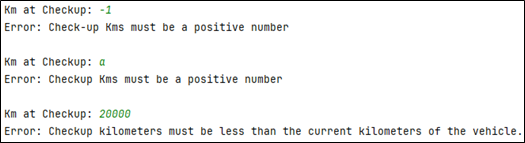

### 8. List Vehicles needing check-up | Fleet Manager

This menu generates a list of the vehicles needing check-up. After selecting the option 3 on VFM’s menu, the list will
be displayed with all vehicles needing check-up.

If there are no vehicles needing check-up, the list will be empty.

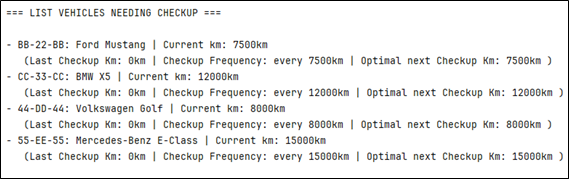

## Troubleshooting

> ### Issue 1: 
>
> If when starting the application, an error occurs related to repository loading/serialization, delete the data.dat file from the root. A new file will be generated after.

> ### Issue 2: 
>
> If the graph image doesn’t save immediately after calculating the best routes to open, wait a few seconds, it means the graph is extensive and may require a few extra seconds. 

> ### Issue 3: 
>
> If while logging in, you see the error “Invalid username or password” make you inserted the right email and password and try again. 

> ### Issue 4: 
>
> If, as a collaborator, you cannot register the completion of a task because it is already in the 'Done' state, it means that it has already been updated by another member of the same team. 

> ### Issue 5: 
>
> If you receive any message indicating the impossibility of registering/changing attributes in the system, you should correct the errors highlighted in red before submission. 

> ### Issue 6: 
>
> If experiencing slowness in the application, check if other programs are consuming a lot of system resources. Closing unnecessary programs can help improve performance. Remember to check the minimum requirements section for using the application in this user manual. 

> ### Issue 7: 
>
> If encountering formatting or layout issues in the application, verify if the screen resolution and zoom settings are appropriate for the interface size. Remember to check the minimum requirements section for using the application in this user manual. 

> ### Issue 8:
>
>If the system doesn’t allow you to postpone a task from the agenda to a specific date, you must choose another date, as the team and vehicles associated with the task might be occupied during that time. 

> ### Issue 9: 
>
> If, when loading the file to analyse the routes to be opened, an error occurs, check if the file has the .csv extension and try again.

## Frequently Asked Questions

> **Q.1:** Can I assign multiple skills to a collaborator at once?
> 
> **A.1:** Yes, in the "Assign Skill" menu, you can select an existing collaborator and choose which skills you want to assign to him from the available list.

> **Q.2:** Can I cancel a task that has already been marked as completed?
>
> **A.2:** No, once a task is marked as completed, it cannot be cancelled.

> **Q.3:** How do I log in to the system?
>
> **A.3:** To log in to the system, you need to access the login menu and enter your user credentials, such as email and password.

> **Q.4:** How do I log out of the system?
>
> **A.4:** To log out of the system, simply click on the logout button, located in the top right corner of the page. This will end your session, and you will be logged out of the system.

> **Q.5:** Does the system save the new changes?
>
> **A.5:** Yes, the system has a persistence mechanism that automatically saves changes even after closing the application.

> **Q.6:** How do roles work in the system and what are their main functionalities?
>
> **A.6:** In the system, roles play a crucial role in assigning permissions and defining available functionalities for each type of user. Each role has access to different parts of the system and can perform specific operations based on those permissions.

> **Q.7:** Is the app available for personal download?
>
> **A.7:** No, the application is not available for personal download and is still only accessible for MusgoSublime.

> **Q.8:** Can a Green Space Manager modify a task from another manager?
>
> **A.8:** No, each manager has their own tasks that only they can plan, manage and modify.

> **Q.9:** As a Green Space Manager, can I create a task for a green space managed by another manager?
>
> **A.9:** No, the created task must be for a green space managed by the manager logged into the system.

> **Q.10:** Can I assign teams and vehicles to a task in the To-Do list?
>
> **A.10:** No, only tasks that are in the agenda (planned) are subject to modifications.

> **Q.11:** Is there a limit to the number of skills I can assign to a collaborator?
>
> **A.11:** There is no specific limit to the number of skills you can assign to a collaborator. However, it is important to consider the relevance and the collaborator's capacity to acquire and develop those skills.

> **Q.12:** Can I generate team proposals with only one collaborator?
>
> **A.12:** Yes, the program allows the generation of teams with just one collaborator.

> **Q.13:** Can a team and vehicles be assigned to more than one task?
>
> **A.13:** Yes, as long as the timeframes of the different tasks do not overlap.

> **Q.14:** At what percentage will a vehicle appear in the list of vehicles needing check-up?
>
> **A.14:** The vehicle will appear in the list when it is within a margin of 5% of the check-up frequency.

> **Q.15:** Can a collaborator have more than one job?
>
> **A.15:** No, a collaborator can only have one job but can have a list of different skills.

> **Q.16:** Can I run the application on an old computer? 
>
> **A.16:** Probably yes, the application isn’t very resource intensive, but be sure check the system requirements.

> **Q.17:** What is the difference between a task with the status "pending," "processed," and "planned"?
>
> **A. 17:** A task with the status "pending" means it has been entered into the To-Do list and has not yet been planned in the agenda, lacking a specific date and time for execution. When a task is planned from the To-Do list to the agenda, the date and time of execution are set, and it will have the status "processed" in the To-Do list and "planned" in the Agenda.

> **Q.18:** Can I access the generated graphs, as well as the generated .csv file containing the routes to be opened after closing the application?
>
> **A. 18:** Yes, both are saved in the folder for future use, as you can verify in points 4.21 and 4.22 of this user manual.

## References