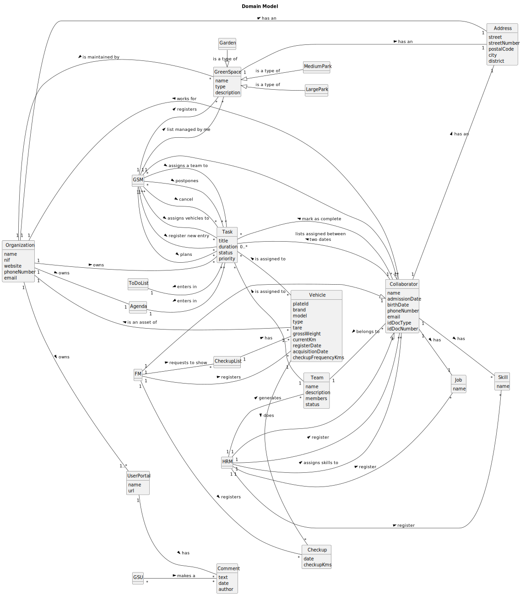

# User Manual

# Green Spaces Management App

### Instituto Superior de Engenharia do Porto

#### Laboratory/Project II - LEI
#### 1DCDD - GROUP 034 – CODEFLOW

- PEDRO COSTA (1221790)
- RUI SANTIAGO (1221402)
- DIÓGENES DE JESUS (1210879)
- ALEXANDRE MOURA (1231193)
- FRANCISCO TROCADO (1230608)

#### Sprint 2
#### **Date:** May 12th, 2024

---

## Table of Contents

- [Glossary](#glossary)
- [Introduction](#introduction)
- [System Requirements](#system-requirements)
- [System Overview](#system-overview)
- [Features](#features)
  - [Register a Skill | Human Resources Manager](#1-register-a-skill--human-resources-manager)
  - [Register a Job | Human Resources Manager](#2-register-a-job--human-resources-manager)
  - [Register a Collaborator | Human Resources Manager](#3-register-a-collaborator--human-resources-manager)
  - [Assign skills to a Collaborator | Human Resources Manager](#4-assign-skills-to-a-collaborator--human-resources-manager)
  - [Generate a team proposal | Human Resources Manager](#5-generate-a-team-proposal--human-resources-manager)
  - [Register a Vehicle | Fleet Manager](#6-register-a-vehicle--fleet-manager)
  - [Register a Vehicle's Check-up | Fleet Manager](#7-register-a-vehicles-check-up--fleet-manager)
  - [List Vehicles needing check-up | Fleet Manager](#8-list-vehicles-needing-check-up--fleet-manager)
- [Troubleshooting](#troubleshooting)
- [Frequently Asked Questions](#frequently-asked-questions)
- [References](#references)

---

## Glossary

| **_TEA_**              | **_Description_**                                                                                                                                      |
|:-----------------------|:-------------------------------------------------------------------------------------------------------------------------------------------------------|
| **Address**            | Refers to the residential location of the collaborator/organization (with a street, a street number, a postal code, city and district).                |
| **Agenda**             | Crucial mechanism for planning the week's work.                                                                                                        |
| **Automatically**      | Something that is done without human intervention.                                                                                                     |
| **Backlog**            | A list of tasks or items awaiting completion or further action.                                                                                        |
| **Barplot**            | Type of chart that represents categorical data with rectangular bars.                                                                                  |
| **BI**                 | Refers to Portuguese identity card.                                                                                                                    |
| **Boxplot**            | Type of graphical representation that displays the distribution of a dataset.                                                                          |
| **CamelCase**          | CamelCase is a coding convention where compound words are written without spaces, and each word begins with a capital letter except for the first one. |
| **CC**                 | Refers to Portuguese citizen card.                                                                                                                     | 
| **Check-up**           | The action of subjecting company vehicles to a periodic inspection.                                                                                    |
| **Check-up frequency** | The frequency, in kilometers, at which the vehicle requires inspection.                                                                                |
| **Collaborator**       | Employee of the organization with specific skills for executing tasks related to green space management.                                               |
| **Current km**         | The mileage (km) that the vehicle has at the current date.                                                                                             |
| **Doc**                | Refers to the identification document.                                                                                                                 |
| **Email**              | Email address of an collaborator.                                                                                                                      |
| **Employee**           | Same as collaborator.                                                                                                                                  |
| **Equipment**          | Organization's tools used by collaborators in task execution.                                                                                          |
| **FM**                 | Fleet Manager.                                                                                                                                         |
| **Gnuplot**            | Open-source plotting program that enables users to create 2D and 3D plots of data sets.                                                                |
| **GraphStream**        | Java library for modeling, analyzing, and visualizing dynamic graphs and networks.                                                                     |
| **Graphviz**           | Software to create and visualize graphs and networks.                                                                                                  |
| **Green Space**        | Refers to green spaces in public places (e.g. parks and gardens).                                                                                      |
| **Gross Weight**       | The total weight of a vehicle, including passengers, cargo, and any other load.                                                                        |
| **GSM**                | Green Spaces Manager.                                                                                                                                  |
| **GSU**                | Green Spaces User.                                                                                                                                     |
| **HRM**                | Human Resources Manager.                                                                                                                               |
| **ID Doc**             | Number of identification document.                                                                                                                     |
| **IDE**                | Integrated development environment.                                                                                                                    |
| **IntelliJ IDE**       | Integrated development environment by JetBrains.                                                                                                       |
| **Item**               | Individual element of a collection/list                                                                                                                |
| **JaCoCo**             | Java library that offers information about the code coverage of Java.                                                                                  |
| **Java**               | Object-oriented programming language.                                                                                                                  |
| **Javadoc**            | Automatic documentation generator for Java code, using specially formatted comments.                                                                   |
| **JavaFX 11**          | The framework used to develop the graphical interface of the application.                                                                              |
| **Job**                | Profession/Role performed by a collaborator.                                                                                                           |
| **JUnit 5**            | Testing framework for Java.                                                                                                                            |
| **Jupyter Notebook**   | Open-source web application that allows to create and share documents.                                                                                 |
| **km**                 | Kilometer, a unit of distance measurement.                                                                                                             |
| **KPI**                | Stands for Key Performance Indicator.                                                                                                                  |
| **LaTeX**              | Typesetting system commonly used for creating scientific and technical documents.                                                                      |
| **MS**                 | MS is an acronym for MusgoSublime.                                                                                                                     |
| **MusgoSublime**       | Organization dedicated to the planning, construction, and maintenance of green spaces for collective use.                                              |
| **NetBeans**           | Integrated development environment by Oracle Corporation.                                                                                              |
| **OO**                 | Refers to Object-Oriented.                                                                                                                             |
| **Park**               | Parks subject to management and maintenance by the organization.                                                                                       |
| **PlantUML**           | Tool to create diagrams using simple text.                                                                                                             |
| **Plate**              | License plate of a vehicle.                                                                                                                            |
| **PVM**                | Minimal Viable Product.                                                                                                                                |
| **Python**             | Programming language.                                                                                                                                  |
| **QAM**                | Software Quality Assessment Team Manager.                                                                                                              |
| **SCRUM**              | Framework for managing and organizing work.                                                                                                            |
| **Skill**              | A characteristic of an employee and/or a specific ability to perform a task.                                                                           |
| **SPRINT**             | A short and fixed period of time (usually 2-4 weeks) in which a team works on a set of tasks to deliver a usable product increment.                    |
| **SVG**                | Scalable Vector Graphics is an image format used for two-dimensional.                                                                                  |
| **Tare**               | The weight of a vehicle when empty, excluding any passengers or cargo.                                                                                 |
| **Task**               | Tasks performed by collaborators.                                                                                                                      |
| **TDD**                | Test-Driven Development.                                                                                                                               |
| **Team**               | Group of workers who collaborate as a team to accomplish a task.                                                                                       |
| **UI**                 | User Interface.                                                                                                                                        |
| **User**               | Individual who can use the application.                                                                                                                |
| **User Portal**        | Platform where users can post comments, report faults and malfunctions of equipment.                                                                   |
| **UX**                 | User Experience.                                                                                                                                       |
| **VFM**                | Vehicle and Equipment Fleet Manager.                                                                                                                   |

---

## Introduction

Green spaces are really important for enhancing the quality of life for residents and even visitors. Effectively
managing these areas requires an efficient application that focuses on each of the topics inherent in their management.

This user manual was designed as a guide to help users navigate and comprehend the functionalities of our application
effectively. Its purpose is to provide step-by-step instructions for users to operate the application in the easiest way
and efficiently.

The application is still in its implementation phase, however, it aims to provide a set of functionalities which are
intuitive and easy-to-use for managing public parks and gardens in urban spaces.

The User Manual is divided into several parts, each one addressing a specific aspect of the application. The sections
for this sprint are as listed:

- **Glossary**, which contains a list of terms, expressions and acronyms used throughout the project followed by its
  description.

- **System Overview**, which describes the main functionalities of the application. It includes an overall description of
  the product, including the objectives of the application, its structure, the reference to the main features and the
  representation of the diagram.

- **System Features**, listing the main features of the application. Each feature in this user manual corresponds to a user
  story in software development terminology, it means one “action” the user may perform on the application.

---
## System Requirements

---

## System Overview

The main objective of this Java-built application is to provide a solution that supports the activities of an
organization responsible for managing green spaces, predominantly in urban contexts.

While using this application, users have at their disposal a set of functionalities that streamline the company's
activities, making management more efficient, facilitating planning and coordination of the activities.

Through a user-friendly interface, the system enables managers to register collaborators, jobs, and skills, which allows
the manager to automatically create a team that will execute tasks of an agenda, ensuring greater efficiency and
coordination in the work. Furthermore, the application also facilitates the fleet management, including vehicles,
machinery, and equipment through functionalities that allow the registration of the organization's vehicles, as well as
the management of vehicle check-ups.

The application will also provide a portal where green space users can access information about the green spaces, report
problems and malfunctions or suggest improvements.

To demonstrate more easily how the application works, we have developed a diagram that shows the system's
functionalities and the dependencies that exist between them.

---

## Features

Firstly, upon opening the application, a menu will be presented where the user can choose one of the 3 options:

The option 0 (Cancel) is used to quit the application.

The option 2 (Know the Development Team) display information about the individuals who contributed to the development of the application.

Then, if the user decides to login (option 1), he will be taken to another interface where he must enter the email and password to authenticate.

The login screen will give the user three tries to login if he can’t enter after three tries, he will be sent back to the main menu.

Now that the user is logged in, we can access features of the role that his account contains through the designed menu for that role, specifically, contents related to the Human Resources Manager (HRM) and the Vehicle Fleet Manager (VFM).

### 1. Register a Skill | Human Resources Manager

After selecting option 1 in HRM’s menu (Register new skill), the user will be redirected to an interface where he will need to enter the name of the skill he wishes to register. After introducing the skill name, the system will ask for user confirmation before saving.

After confirming the operation, the new skill will be saved, and the system will show a message of success. If the HRM tries to register a skill that already exists in the system, a notification will be displayed indicating that “This Skill is already registered!”.

There are additional controls considering the inputs that are entered, such as checking if its field is empty, if it contains not allowed characters, or even numbers.

### 2. Register a Job | Human Resources Manager

Very similar to the register a new skill, after selecting option 2 in HRM’s menu (Register new job), the user will be redirected to an interface where he will need to enter the name of the job he wishes to register. After introducing the job name, the system will ask for user confirmation before saving.

After confirming the operation, the new skill will be saved, and the system will show a message of success. If the HRM tries to register a job that already exists in the system, a notification will be displayed indicating that “This job is already registered!”.

There are also additional controls considering the inputs that are entered, such as checking if its field is empty, if it contains not allowed characters, or even numbers.

### 3. Register a Collaborator | Human Resources Manager

This feature is used to add new collaborators to the system. Upon choosing option 3 of HRM’s menu (Register new collaborator), the user will be asked to fill all the collaborator’s attributes.

When registering a new employee, all personal information must be filled in before submission. Additionally, all fields have input control, generating a specific error message indicating the error of the specific field.

Some error messages that can be displayed when inputs are incorrect are:

* “Name must not contain special characters”.
* “Birthdate cannot be in the future.”
* “Collaborator must be 18 years old.”
* “Street number must be a positive integer!”
* “Postal code must follow the format XXXX-XXX”.
* “Email format must follow the pattern prefix domain”.
* “Mobile Number is not in a correct format”.
* “NIF in wrong format. Must be 9 numeric digits”.
* “Passport in wrong format. Must be two letters + 6 numeric digits (Example: AB222222)”

Among other specific errors that may show when input data is not valid.

After correctly inputting all necessary information, the filled data will be showed for confirmation. Upon confirmation, the new collaborator will be saved, and a success message will be sent.

After confirmation/submitting the data, if the employee already exists in the system, an error message will be displayed indicating that “This collaborator is already in the system!”

### 4. Assign skills to a Collaborator | Human Resources Manager

The option 4 (Assign skills to collaborator) from the HRM’s menu, will bring the interface for Assigning skills to a Collaborator. In this interface, the list of available collaborators in the system will be displayed and the user must select which collaborator want to assign new skills to.

After selecting the collaborator, the list of available skills will appear, and the user can select one or more skills to assign to the collaborator.

After selecting a skill, the application will ask the user if he wants to submit or choose more skills before submitting.

When the user no longer wishes to select additional skills, the selected information is displayed for confirmation before being saved.

If the user selects a skill that has already been chosen before, an error message will be displayed saying “This skill has already been chosen, please select a different one.”

### 5. Generate a team proposal | Human Resources Manager

Generate team proposal is the last option of HRM’s menu (option 5). To use this feature, the user needs to type the desired team size, including both the minimum and maximum team size.

Next, user must select the necessary skills the team members may have and the quantity of collaborators with that specific skill.

Upon submission of the information, the system generates all possible teams based on the input and displays the most efficient team first.

The user can either accept or reject the proposed team. If accepted, the team will be saved in the system. If the user rejects the displayed team, the next most efficient team (if available) will be shown.

In case the user views all possible teams without selecting any, the program will prompt whether he wants to cancel the process or view the teams again.

If, based on the provided information, it was not possible to generate any team, an error message will be displayed indicating the error.

### 6. Register a Vehicle | Fleet Manager

When choosing option 1 in the VFM’s menu (Register new vehicle), the system will display the user interface for registering a new vehicle where the user needs to fill in all the vehicle-related data before submitting.

Like the other interfaces, there are input controls that display errors if the entered information does not meet the acceptance criteria, some of the errors that user may encounter are:

After submission, the data will be shown to the user for confirmation and will be saved, displaying a success message. If the vehicle is already in the system, a message will be displayed, indicating the error.

### 7. Register a Vehicle's Check-up | Fleet Manager

The option 4 of VFM’s menu (Register new vehicle’s check-up), allows the registration of a new vehicle’s check-up. To use this feature, first the user must select a vehicle from the list.

For the chosen vehicle, the user now needs to type the check-up data, which is the check-up date and the kilometers. In the end of process, all data will be displayed for confirmation and the user may proceed or not.

The check-up kilometers cannot be less than zero or superior to the current kilometers of the vehicle, otherwise an error will be showed.

### 8. List Vehicles needing check-up | Fleet Manager

This menu generates a list of the vehicles needing check-up. After selecting the option 3 on VFM’s menu, the list will be displayed with all vehicles needing check-up.

If there are no vehicles needing check-up, the list will be empty.

## Troubleshooting

## Frequently Asked Questions

## References