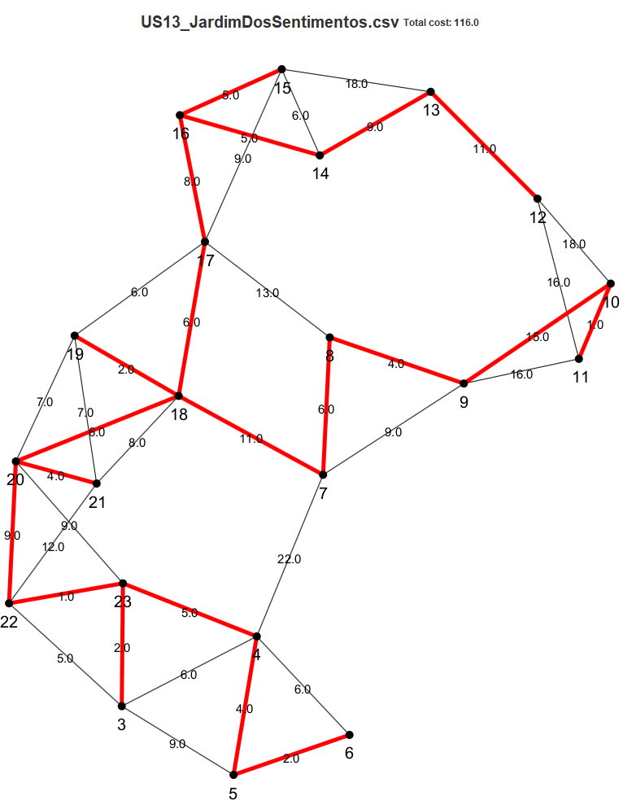
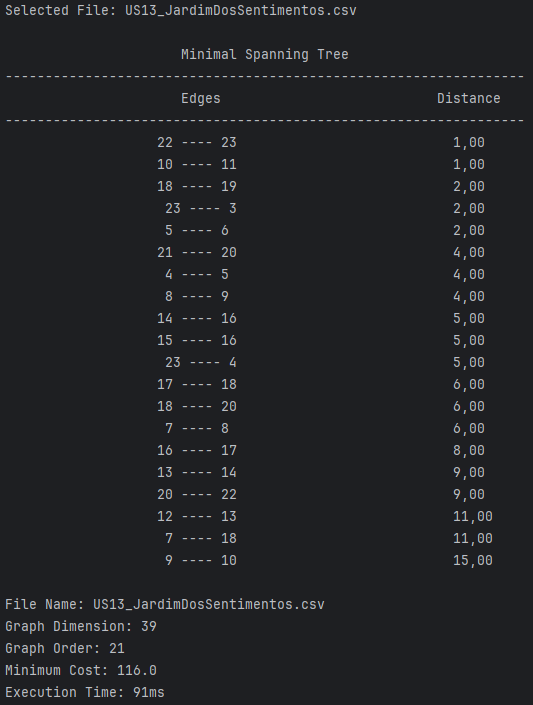
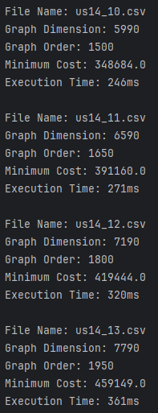

# User Manual

# Green Spaces Management App

### Instituto Superior de Engenharia do Porto

#### Laboratory/Project II - LEI

#### 1DC - GROUP 034 – CODEFLOW

- PEDRO COSTA (1221790)
- RUI SANTIAGO (1221402)
- FRANCISCO TROCADO (1230608)

#### Sprint 3

#### **Date:** June 8th, 2024

---

## Table of Contents

- [Glossary](#glossary)
- [Introduction](#introduction)
- [System Requirements](#system-requirements)
- [System Overview](#system-overview)
- [Features](#features)
    - [Register a Skill | Human Resources Manager](#register-a-skill--human-resources-manager)
    - [Register a Job | Human Resources Manager](#register-a-job--human-resources-manager)
    - [Register a Collaborator | Human Resources Manager](#register-a-collaborator--human-resources-manager)
    - [Assign skills to a Collaborator | Human Resources Manager](#assign-skills-to-a-collaborator--human-resources-manager)
    - [Generate a team proposal | Human Resources Manager](#generate-a-team-proposal--human-resources-manager)
    - [Register a Vehicle | Fleet Manager](#register-a-vehicle--fleet-manager)
    - [Register a Vehicle's Check-up | Fleet Manager](#register-a-vehicles-check-up--fleet-manager)
    - [List Vehicles needing check-up | Fleet Manager](#list-vehicles-needing-check-up--fleet-manager)
    - [Register a Green Space | Green Space Manager](#register-a-green-space--green-space-manager)
    - [Add new entry to the To-Do list | Green Space Manager](#add-new-entry-to-the-to-do-list--green-space-manager)
    - [Add new entry in the Agenda | Green Space Manager](#add-new-entry-in-the-agenda--green-space-manager)
    - [Assign team to an entry in the Agenda | Green Space Manager](#assign-team-to-an-entry-in-the-agenda--green-space-manager)
    - [Postpone an entry in the Agenda | Green Space Manager](#postpone-an-entry-in-the-agenda--green-space-manager)
    - [Cancel an entry in the Agenda | Green Space Manager](#cancel-an-entry-in-the-agenda--green-space-manager)
    - [Assign one or more vehicles to and entry in the Agenda | Green Space Manager](#assign-one-or-more-vehicles-to-an-entry-in-the-agenda--green-space-manager)
    - [List all green spaces managed by me | Green Space Manager](#list-all-green-spaces-managed-by-me--green-space-manager)
    - [Consult the tasks assigned to me between two dates | Collaborator](#consult-the-tasks-assigned-to-me-between-two-dates--collaborator)
    - [Record the completion of a task | Collaborator](#record-the-completion-of-a-task--collaborator)
    - [Update vehicle Kilometers | Collaborator](#update-vehicle-kilometers--collaborator)
    - [Import routes from csv file | Green Space Manager](#import-routes-from-a-csv-file--green-space-manager)
    - [Obtain routes to be opened | Green Space Manager](#obtain-routes-to-be-opened--green-space-manager)
    - [Run tests for inputs of variable size | Quality Assessment Team Manager](#run-tests-for-inputs-of-variable-size-quality-assessment-team-manager)
    - [Place signs to evacuate to an Assembly point | Green Space Manager](#place-signs-to-evacuate-to-an-assembly-points--green-space-manager)
    - [Place signs to evacuate to one of the several Assembly points | Green Space Manager](#place-signs-to-evacuate-to-one-of-the-several-assembly-points-green-space-manager)

- [Troubleshooting](#troubleshooting)
- [Frequently Asked Questions](#frequently-asked-questions)

---

## Glossary

| **_TEA_**                 | **_Description_**                                                                                                                                                |
|:--------------------------|:-----------------------------------------------------------------------------------------------------------------------------------------------------------------|
| **Address**               | Refers to the residential location of the collaborator/organization (with a street, a street number, a postal code, city and district).                          |
| **Agenda**                | Crucial mechanism for planning the week's work.                                                                                                                  |
| **AP**                    | Refer to the Assembly Point.                                                                                                                                     |
| **Assembly Point**        | A location predetermined and known where people must meet in the event of an evacuation or emergency.                                                            |
| **Automatically**         | Something that is done without human intervention.                                                                                                               |
| **Backlog**               | A list of tasks or items awaiting completion or further action.                                                                                                  |
| **Barplot**               | Type of chart that represents categorical data with rectangular bars.                                                                                            |
| **BI**                    | Refers to Portuguese identity card.                                                                                                                              |
| **Boxplot**               | Type of graphical representation that displays the distribution of a dataset.                                                                                    |
| **CamelCase**             | CamelCase is a coding convention where compound words are written without spaces, and each word begins with a capital letter except for the first one.           |
| **CC**                    | Refers to Portuguese citizen card.                                                                                                                               | 
| **Check-up**              | The action of subjecting company vehicles to a periodic inspection.                                                                                              |
| **Check-up frequency**    | The frequency, in kilometers, at which the vehicle requires inspection.                                                                                          |
| **Collaborator**          | Employee of the organization with specific skills for executing tasks related to green space management.                                                         |
| **Configuration File**    | File used to store parameters and settings that configure the operation of a program or system.                                                                  |
| **CSV**                   | Comma-Separated Values file.                                                                                                                                     |
| **Current km**            | The mileage (km) that the vehicle has at the current date.                                                                                                       |
| **Dijkstra**              | Algorithm used in Graph Theory to find the shortest path between a source vertex and all other vertices.                                                         |
| **Doc**                   | Refers to the identification document.                                                                                                                           |
| **Email**                 | Email address of an collaborator.                                                                                                                                |
| **Employee**              | Same as collaborator.                                                                                                                                            |
| **Equipment**             | Organization's tools used by collaborators in task execution.                                                                                                    |
| **Evacuation Route**      | The path that users must follow from multiple locations in the park to an Assembly Point in the event of an emergency.                                           |
| **FM**                    | Fleet Manager.                                                                                                                                                   |
| **Gnuplot**               | Open-source plotting program that enables users to create 2D and 3D plots of data sets.                                                                          |
| **GraphStream**           | Java library for modeling, analyzing, and visualizing dynamic graphs and networks.                                                                               |
| **Graphviz**              | Software to create and visualize graphs and networks.                                                                                                            |
| **Green Space**           | Refers to green spaces in public places (e.g. parks and gardens).                                                                                                |
| **Gross Weight**          | The total weight of a vehicle, including passengers, cargo, and any other load.                                                                                  |
| **GSM**                   | Green Spaces Manager.                                                                                                                                            |
| **GSU**                   | Green Spaces User.                                                                                                                                               |
| **HRM**                   | Human Resources Manager.                                                                                                                                         |
| **ID Doc**                | Number of identification document.                                                                                                                               |
| **IDE**                   | Integrated development environment.                                                                                                                              |
| **IntelliJ IDE**          | Integrated development environment by JetBrains.                                                                                                                 |
| **Item**                  | Individual element of a collection/list.                                                                                                                         |
| **JaCoCo**                | Java library that offers information about the code coverage of Java.                                                                                            |
| **Java**                  | Object-oriented programming language.                                                                                                                            |
| **Javadoc**               | Automatic documentation generator for Java code, using specially formatted comments.                                                                             |
| **JavaFX 11**             | The framework used to develop the graphical interface of the application.                                                                                        |
| **Job**                   | Profession/Role performed by a collaborator.                                                                                                                     |
| **JUnit 5**               | Testing framework for Java.                                                                                                                                      |
| **Jupyter Notebook**      | Open-source web application that allows to create and share documents.                                                                                           |
| **km**                    | Kilometer, a unit of distance measurement.                                                                                                                       |
| **KPI**                   | Stands for Key Performance Indicator.                                                                                                                            |
| **Kruskal**               | Algorithm used in Graph Theory to find the Minimum Spanning Tree.                                                                                                |
| **LaTeX**                 | Typesetting system commonly used for creating scientific and technical documents.                                                                                |
| **Linear Regression**     | A statistical method used to model the relationship between two variables where one variable is continuous and the other is independent.                         |
| **MS**                    | MS is an acronym for MusgoSublime.                                                                                                                               |
| **MusgoSublime**          | Organization dedicated to the planning, construction, and maintenance of green spaces for collective use.                                                        |
| **NetBeans**              | Integrated development environment by Oracle Corporation.                                                                                                        |
| **Object Serialization**  | Process of converting an object's state into a format that can be stored or transmitted and later reconstructed to create a new instance with the same state.    |
| **OO**                    | Refers to Object-Oriented.                                                                                                                                       |
| **Park**                  | Parks subject to management and maintenance by the organization.                                                                                                 |
| **PlantUML**              | Tool to create diagrams using simple text.                                                                                                                       |
| **Plate**                 | License plate of a vehicle.                                                                                                                                      |
| **Polynomial Regression** | A form of regression analysis in which the relationship between the independent variable x and the dependent variable y is modelled as an nth degree polynomial. |
| **PVM**                   | Minimal Viable Product.                                                                                                                                          |
| **Python**                | Programming language.                                                                                                                                            |
| **QAM**                   | Software Quality Assessment Team Manager.                                                                                                                        |
| **SCRUM**                 | Framework for managing and organizing work.                                                                                                                      |
| **Skill**                 | A characteristic of an employee and/or a specific ability to perform a task.                                                                                     |
| **SPRINT**                | A short and fixed period of time (usually 2-4 weeks) in which a team works on a set of tasks to deliver a usable product increment.                              |
| **SVG**                   | Scalable Vector Graphics is an image format used for two-dimensional.                                                                                            |
| **Tare**                  | The weight of a vehicle when empty, excluding any passengers or cargo.                                                                                           |
| **Task**                  | Tasks performed by collaborators.                                                                                                                                |
| **TDD**                   | Test-Driven Development.                                                                                                                                         |
| **Team**                  | Group of workers who collaborate as a team to accomplish a task.                                                                                                 |
| **To-Do**                 | A list of tasks that need to be planned into the Agenda.                                                                                                         |
| **Topographic Survey**    | A survey that measures the elevation of points on a particular piece of land and presents them as contour lines on a plot.                                       |
| **UI**                    | User Interface.                                                                                                                                                  |
| **User**                  | Individual who can use the application.                                                                                                                          |
| **User Portal**           | Platform where users can post comments, report faults and malfunctions of equipment.                                                                             |
| **UX**                    | User Experience.                                                                                                                                                 |
| **VFM**                   | Vehicle and Equipment Fleet Manager.                                                                                                                             |

---

## Introduction

Green spaces are important for enhancing the quality of life for residents and even visitors. Effectively managing these
areas requires an efficient application that focuses on each of the topics inherent in their management.

This user manual was designed as a guide to help users navigate and comprehend the functionalities of our application
effectively. Its purpose is to provide step-by-step instructions for users to operate the application in the easiest way
and efficiently.

The application provides a set of functionalities which are intuitive and easy-to-use for managing public parks and
gardens in urban spaces.

The User Manual is divided into several parts, each one addressing a specific aspect of the application.

The User Manual is divided into several parts, each one addressing a specific aspect of the application. The sections
for this sprint are as listed:

- **Glossary**, which contains a list of terms, expressions and acronyms used throughout the project followed by its
  description.

- **System requirements** which define the minimum requirements for the safe and stable use of the application.

- **System Overview**, which describes the main functionalities of the application. It includes an overall description
  of the product, including the objectives of the application, its structure, the reference to the main features, the
  representation of the diagram (Domain Model) that shows the system’s functionalities and the dependencies that exist
  between them. The system overview also includes a table with all the program's features and which users have access to
  each of them.

- **System Features**, listing the main features of the application. Each feature in this user manual corresponds to a
  user story in software development terminology, it means one “action” the user may perform on the application. For
  each feature, we provide guidance on how to utilize it effectively, including potential errors and how to address them
  for an improved user experience.

- **Troubleshooting** to identify and resolve issues/failures that may arise in the application's operation.

- **Frequently asked questions** to provide answers to the most common questions that users of the application may have.

This user manual aims to clarify user doubts and assist them in navigating the application swiftly and efficiently. The
goal is for users to fully take advantage of the application's features to enhance their daily work experience within
the company, providing a more streamlined and efficient green space management experience.

---

## System Requirements

Since the application is not very large and does not require high processing power, the system requirements are not very
specific. Nonetheless, to ensure that the program runs and operates smoothly, please make sure that the computer running
the program meets the following minimum requirements:

### Hardware Requirements:

- **Processor:** Intel Core i3 or equivalent (very low CPU usage);
- **Memory (RAM):** 4GB or higher.
- **Storage:** 500MB;
- **Screen Resolution:** 1366 x 768 pixels.

### Software Requirements:

- **Operating System:** Ideally, Windows.
- **Other required software:** Java Runtime Environment (JRE) 8 or higher and GraphStream Software for the graph
  visualization.

### Network Requirements:

- No internet connection is required to run the application.

To install the application, access must be granted by a developer of the application. Once you have access, simply open
the folder and run the application.

---

## System Overview

The main objective of this Java-built application is to provide a solution that supports the activities of an
organization responsible for managing green spaces, predominantly in urban contexts.

While using this application, users have at their disposal a set of functionalities that streamline the company's
activities, making management more efficient, facilitating planning and coordination of the activities.

Through a user-friendly interface, the system enables managers to register collaborators, jobs, and skills, which allows
the manager to automatically create a team that will execute tasks of an agenda, ensuring greater efficiency and
coordination in the work. Furthermore, the application also facilitates the fleet management, including vehicles,
machinery, and equipment through functionalities that allow the registration of the organization's vehicles, as well as
the management of vehicle check-ups.

For the green space managers, there is a set of features that allow for the management of green spaces, task management,
and planning for their execution.

Collaborators can use the program to search for tasks assigned to them and have a set of options for filtering and
marking tasks as completed and update vehicle kilometers.

To demonstrate more easily how the application works, we have developed a diagram (Domain model) that shows the system's
functionalities and the dependencies that exist between them

The application is structured with various roles, each having access to different system features and functionalities.
The table below illustrates the features and responsibilities assigned to each user role, with an "X" indicating the
roles that can access a particular feature. HRM stands for Human Resources Manager, VFM stands for Vehicle and fleet
Manager, GSM stands for Green Space Manager and QAM stands for Software Quality Assessment Team Manager.

Note that, for the features involving mathematics (mdisc and matcp) the user does not need to be logged in the system to
use the feature.

| **Feature**                                                   | **Admin** | **HRM** | **VFM** | **GSM** | **QAM** | **Collaborator** |
|:--------------------------------------------------------------|:----------|:--------|:--------|:--------|:--------|:-----------------|
| Login                                                         | x         | x       | x       | x       |         | x                |
| Register job                                                  | x         | x       |         |         |         |                  |
| Register skill                                                | x         | x       |         |         |         |                  |
| Register collaborator                                         | x         | x       |         |         |         |                  |
| Assign skills                                                 | x         | x       |         |         |         |                  |
| Register vehicle                                              | x         |         | x       |         |         |                  |
| Register vehicle checkup                                      | x         |         | x       |         |         |                  |
| List vehicles needing checkup                                 | x         |         | x       |         |         |                  |
| Generate team proposal                                        | x         | x       |         |         |         |                  |
| Register green space                                          | x         |         |         | x       |         |                  |
| List green spaces                                             | x         |         |         | x       |         |                  |
| Add new entry To-Do                                           | x         |         |         | x       |         |                  |
| Consult entries in the To-Do list                             | x         |         |         | x       |         |                  |
| Add new entry in the agenda                                   | x         |         |         | x       |         |                  |
| Assign team to an entry in the agenda                         | x         |         |         | x       |         |                  |
| Postpone an entry in the agenda                               | x         |         |         | x       |         |                  |
| Cancel an entry in the agenda                                 | x         |         |         | x       |         |                  |
| Assign vehicles to an entry in the agenda                     | x         |         |         | x       |         |                  |
| Consult entries in the agenda                                 | x         |         |         | x       |         |                  |
| Consult tasks assigned to Collaborator                        |           |         |         |         |         | x                |
| Record the completion of a task                               |           |         |         |         |         | x                |
| Update Vehicle Kilometers                                     |           |         |         |         |         | x                |
| Import routes from csv file                                   |           |         |         | x       | x       |                  |
| Obtain routes to be opened                                    |           |         |         | x       |         |                  |
| Run tests for inputs of variable size                         |           |         |         |         | x       |                  |
| Place signs to evacuate to an Assembly Point                  |           |         |         | x       |         |                  |
| Place signs to evacuate to one of the several Assembly Points |           |         |         | x       |         |                  |

---

## Features

Firstly, upon opening the application, a menu will be presented to log in to the application.

The application allows the authentication of different types of users, each with different roles. For example, the "
Admin" role has access to almost all the application's content, while the roles "Human Resources Manager," "Green Space
Manager," "Vehicle and Fleet Manager," and "Collaborator" each have different menus according to their system
permissions.

Admin role menu:

HRM role have access to the menus for jobs, skills, collaborators, and teams.

With this role, the user can manage everything related to collaborators and teams. Specifically, he can add jobs, add
skills, add new collaborators to the system, assign skills to existing collaborators, and automatically generate work
teams based on inputs provided to the program.

VFM role have access to the vehicles menu and can register new vehicles in the system, record new vehicle checkups and
ask for a list of the vehicles that need to go for inspection.

GSM role have access to the menu for managing green spaces and tasks.
With this role, the user can register a new green space and list the green spaces managed by himself. User can also
create new entries in the To-Do list and manage them, which includes planning them to the agenda and subsequently
assigning teams to tasks, assigning vehicles, postponing an entry, or even cancelling an entry from the Agenda. He may
also analyse csv to understand routes to be open and best routes to assembly points.

Finally, the Collaborator role, which allows access to a specific Agenda, called “My Agenda”, with the tasks assigned to
the collaborator using the system and also the ability to update the kilometres of an existing vehicle.

At any time, the user may wish to end the session by using the logout button. All changes made throughout the program
will be saved using a persistence mechanism, ensuring that no data is lost.

### Register a Skill | Human Resources Manager

After selecting menu “Register Skill”, the user will be redirected to an interface where he will need to enter the name
of the skill to register. After introducing the skill name, the system will ask for user confirmation before saving.

After confirming the operation, the new skill will be saved, and the system will show a message of success. If the user
tries to register a skill that already exists in the system, a notification will be displayed indicating that the Skill
is already registered.

There are additional controls considering the inputs that are entered, such as checking if the field is empty, if it
contains not allowed characters, or even numbers.

### Register a Job | Human Resources Manager

Very similar to the register a new skill, after selecting menu “Register job”, the user will be redirected to an
interface where he will need to enter the name of the job to register. After introducing the job name, the system will
ask for user confirmation before saving.

After confirming the operation, the new job will be saved, and the system will show a message of success. If the user
tries to register a job that already exists in the system, a notification will be displayed indicating that the job is
already registered.

There are also additional controls considering the inputs that are entered, such as checking if its field is empty, if
it contains not allowed characters, or even numbers.

### Register a Collaborator | Human Resources Manager

This feature is used to add new collaborators to the system. Upon choosing menu “Register Collaborator”, the user will
be asked to fill all the collaborator’s attributes.

When registering a new employee, all personal information must be filled in before submission. Additionally, all fields
have input control, generating a specific error message indicating the error of the specific field.

Some error messages that can be displayed when inputs are incorrect are:

Among other specific errors that may show when input data is not valid.

After correctly inputting all necessary information, the filled data will be showed for confirmation and a success
message will be sent.

After confirmation/submitting the data, if the employee already exists in the system, an error message will be displayed
indicating that the collaborator is already in the system, which means that there is a collaborator in the system with
the same id number or email.

### Assign skills to a Collaborator | Human Resources Manager

The menu “Assign Skill” will bring the interface for Assigning skills to a collaborator.

In this interface, the user must select a collaborator existing in the system and choose, from the list of available
skills, the skills to be assigned to the selected collaborator.

On the left side, upon selecting a collaborator, it will display the current skills that the selected collaborator has,
updating the list based on the selected collaborator

On the right side, there is a list of available skills to assign to the collaborator, where the user can select one or
more.

If the collaborator already possesses one of the selected skills, it will be underlined in red, otherwise, if it's a
possible assignment, it will assume green. Only the green-highlighted skills can be assigned to the collaborator (the
ones the collaborator doesn’t have yet).

Upon clicking the button to assign skills, a message will be displayed showing all the selected data so that the user
can confirm the action.

### Generate a team proposal | Human Resources Manager

The "Generate Team Proposal" menu allows for the automatic generation of multiple teams based on the inputs and
selections made by the user, including the minimum and maximum team size and the required skill set (which skills are
necessary within the team and in what quantity).

After entering the minimum and maximum team sizes, the user needs to select the desired skill then specify the quantity
of that skill and click the "Add" button. Once all necessary skills are selected, click on the "Generate all team
proposals" button and the generated teams will appear on the right side of the screen.

The generated teams will be displayed based on their efficiency, which means that the first team that appears on the
screen is the one with the fewest number of collaborators to meet the required skills. The user can either accept the
first team shown or request to see the next generated team as an alternative.

If it's not possible to create any team with the entered data, a message will be displayed indicating why was not
possible to generate any team.

### Register a Vehicle | Fleet Manager

When choosing menu “Register Vehicle”, the system will display the user interface for registering a new vehicle where
the user needs to fill in all the vehicle-related data before submitting.

Like the other interfaces, there are input controls that display errors if the entered information does not meet the
acceptance criteria. Some of the errors that user may encounter are:

Upon clicking the button to register a new vehicle, a message containing all the entered information will be displayed
to the user for confirmation.

After submission, a message of success will be displayed. If the vehicle is already registered in the system, an error
message will be displayed.

### Register a Vehicle's Check-up | Fleet Manager

“Register vehicle check-up” menu, allows the registration of a new vehicle’s check-up.

To use this feature, first the user must select a vehicle from the list. For the chosen vehicle, the user now needs to
type the check-up data, which is the check-up date and the kilometers.

In the end of the process, all data will be displayed for confirmation and the user may proceed or not.

The check-up kilometers cannot be less than zero or superior to the current kilometers of the vehicle, otherwise an
error will be showed.

### List Vehicles needing check-up | Fleet Manager

This menu generates a list of the vehicles needing check-up. After selecting this menu, the list will be displayed
automatically with all vehicles needing check-up.

If there are no vehicles needing check-up, the list will be empty.

### Register a Green Space | Green Space Manager

In the "Register Green Space" menu, the user needs to fill in all the fields with the information related to the new
green space before submission.

All fields have input control, generating a specific error message indicating the error of the specific field.
Some error messages that can be displayed when inputs are incorrect are:

After submitting the data, a message containing all the information will be displayed for the user to confirm.

The user can either accept or cancel the operation. A success message will be displayed if the registration is
successful. In case the green space already exists in the system, an error message will be shown indicating the error.

### Add new entry to the To-Do list | Green Space Manager

When choosing the "Add Task" menu, the user needs to fill in all the information regarding the task, such as the title,
description, expected duration, select the green space where the task will be executed, specify the urgency, and select
the type.

All fields have input control, generating a specific error message indicating the error of the specific field.
Some error messages that can be displayed when inputs are incorrect are:

After all fields are correctly filled out and without errors, upon submission, a message containing all the information
will be displayed for confirmation.
A new entry in the To-Do list always has its status set to "pending" since it has not yet been processed to the agenda.

A success or error message will be displayed upon confirmation if the specific task already exists in the system with
the same parameters and is still with status “pending”.

### Add new entry in the Agenda | Green Space Manager

In the "Add Task to Agenda" menu, all tasks created by the logged-in manager in the To-Do list will be shown, whether
they are in the "pending" state or already "processed" (meaning they have previously entered the Agenda).

After selecting the desired task, the user needs to click on the "Add" button, and a popup will appear for the user to
enter the date and time when that task will be executed.

This interface allows the user to double-click on a specific task to open a window with all the information about the
task.

If the task is already processed or if there is already an identical task in the Agenda for the same green space that is
still not completed, an error message will be displayed, otherwise, a success message will appear.

### Assign team to an entry in the Agenda | Green Space Manager

Upon entering the agenda menu, the logged-in manager will see his own tasks. After selecting the desired task, the
manager can click on the "Assign team" button, which will open a popup with all the teams for him to choose one.

Since this operation is still on the Agenda menu, the user can still double-click on a specific task and/or team to open
a window with all the information about the selected task/team.

If the selected task is already completed or, alternatively, has been cancelled, an error message indicating the issue
will be displayed.

When choosing the team, the system automatically checks if the team is available during the timeframe of that task. If
it is available, the action is completed successfully, otherwise, an error message will be displayed indicating that the
team is not available at that time.

\

### Postpone an entry in the Agenda | Green Space Manager

In the agenda menu, the logged-in manager will see his own tasks. After selecting the desired task, the manager can
click on the "Postpone Task" button, which will open a popup for the user to specify the new execution date and hour.

This interface allows the user to double-click on a specific task to open a window with all the information about the
selected task.

If the task being postponed has teams and vehicles assigned, the system will check if it's possible to postpone to the
new date by verifying the availability of the team and vehicles for the new intended date. If it's not possible to
postpone to the chosen date, an error message will be displayed, otherwise, the selected task's status changes to "
postponed" and a new task is created for the new date with status “planned”.

### Cancel an entry in the Agenda | Green Space Manager

Very similar to the last option inside the agenda menu, the user can select one of his tasks from the agenda and click
the "Cancel Task" button to proceed with its cancellation.

This interface allows the user to double-click on a specific task to open a window with all the information about the
selected task.
After cancelling the task, the task's status will change to "cancelled" and any teams and/or vehicles associated with
that time period (if any) will become available.

### Assign one or more vehicles to an entry in the Agenda | Green Space Manager

In the agenda menu, the logged-in manager can view all his tasks and, to assign one or more vehicles to a task, he must
select a task and click the "Assign Vehicle" button.

After clicking the "Assign Vehicle" button, a popup will appear with all the vehicles in the system, and the manager can
select one or more.

This interface allows the user to double-click on a specific task to open a window with all the information about the
selected task.

### List all green spaces managed by me | Green Space Manager

This option is very user-friendly because all you must do is select the "List Green Spaces" menu, and a list will appear
with all the green spaces managed by the currently logged-in manager in the system.

### Consult the tasks assigned to me between two dates | Collaborator

As a collaborator, upon entering the system, you will have access to the "My Agenda" menu, where the list of tasks
assigned to the collaborator currently logged into the system will appear.

By default, the list of assigned tasks will be shown sorted by date. The collaborator can filter the agenda by the
task's status in the top right corner or, alternatively, filter the agenda tasks between two dates.

This interface allows the user to double-click on a specific task to open a window with all the information about the
selected task.

### Record the completion of a task | Collaborator

Upon entering the "My Agenda" menu, the collaborator will have access to all tasks assigned to him. To mark a task as
completed, simply select the task and click the "Set Completed" button.

If the selected task is already completed, the action is not permitted. Otherwise, a success message will be sent.

### Update Vehicle Kilometers | Collaborator

This menu is intended for the collaborator, as they use the vehicles daily for task execution. It allows the user to
update the mileage of a specific vehicle, thereby facilitating fleet management to determine if a vehicle is approaching
its inspection date.
To use this feature, the user needs to access the menu “Update Km” and the list of all vehicles will be displayed.
Simply select the vehicle to be updated and type the current kilometers of the vehicle.

If the kilometers entered by the collaborator is lower than the current kilometers recorded in the system, an error
message will be displayed, preventing the completion of the operation.

### Import routes from a csv file | Green Space Manager

This feature is used to read all possible routes that can be opened. The data structure read will be used to calculate
routes to be opened and pipes needed to be laid with a minimum accumulated cost, ensuring that all points are adequately
supplied.
This functionality is used in functionalities 4.21 and 4.22 and does not require a login. To understand how it works,
check sections 4.21 and 4.22 of this user manual.

### Obtain routes to be opened | Green Space Manager

This functionality can be used in two different ways, either using the console or through the graphical application, in
the Green Space Manager menu.
To use this feature in the main application, login as Green Space Manager and select the “Routes to Open” menu:

After selecting the csv file, the program will automatically calculate the best routes to be opened with the minimum
cost and show on the table all routes and the cost.

Additionally, the program provides a real-time graphical demonstration of all possible paths, with the optimal route to
be opened shown in red.

**To use this feature in the console, follow these steps:**
> Run MainUS13 application in the src folder: (src/matdisc/MATDISC_class_resolution/MainUS13.java).
> Through feature Import routes to be opened, which allows reading a .csv file, a file chooser will appear when starting
> the program and the user must select which .csv file want to analyse

After choosing the file, the routes to be opened will be displayed, along with the associated total cost.

In both applications, the generated graph and CSV file with the optimal route are automatically saved in the
“MATDISC_GRAPH_IMAGES” folder at the project root.

### Run tests for inputs of variable size| Quality Assessment Team Manager

* To access this feature, the user needs to initialize the MainUS14 application located in the src folder (
  src/matdisc/MATDISC_class_resolution/MainUS14.java).
* First, the user needs to place all the files that need to be analysed in the _US14_DataSet folder located in the same
  execution directory of the application.
* Once all the csv files are in the folder, simply run the application and the files will be read one by one.
* For each file, the program displays a message with the file information and the algorithm execution time.

When the reading and execution of all files in the folder are finished, the program will generate a real-time graph
showing the asymptotic behaviour of the execution time of the algorithm.

After the execution of the program, the graph image and the CSV file containing the data for each CSV file will be
automatically saved in the “MATDISC_GRAPH_IMAGES” folder at the project root.

### Place signs to evacuate to an Assembly Points | Green Space Manager

* This feature helps the user to know where to place signs to evacuate (in case of emergency) park users to an Assembly
  Point. These signs give a shortest route from these different points (where the signs will be placed) to the Assembly
  Point.
* To access this feature, the user needs to initialize the Main application located in the src folder (src/
  MDISC/Main.java).
* After running this application, all points will be displayed, and the user must choose the desired point. User must
  select the option “y” to start the application or “n” to close.
* The program automatically runs the algorithm and shows the user the shortest route from the selected point to the
  assembly point, including the path cost.

The generated graph and csv (with the route and cost) will be automatically saved in the “output” folder located in the
same directory as the execution file.

### Place signs to evacuate to one of the several Assembly Points| Green Space Manager

* This feature helps the user to know where to place signs to evacuate (in case of emergency) park users to one of the
  several Assembly Points. These signs give the shortest routes to the closest Assembly Point.
* To access this feature, the user needs to initialize the Main application located in the src folder (src/
  MDISC/Main.java).
* After running this application, all points will be displayed, and the user must choose the desired point. User must
  select the option “y” to start the application or “n” to close.
* The program automatically runs the algorithm and shows the user the shortest route from the selected point to the
  closest assembly point found, including the path cost.

In the background, the application will generate several images that represents the shortest path from each point to the
nearest assembly point (one image for each point).

The generated graph images and csv can be found in the “output” folder located in the same directory as the execution
file.

## Troubleshooting

> ### Issue 1:
>
> If when starting the application, an error occurs related to repository loading/serialization, delete the data.dat
> file from the root. A new file will be generated after.

> ### Issue 2:
>
> If the graph image doesn’t save immediately after calculating the best routes to open, wait a few seconds, it means
> the graph is extensive and may require a few extra seconds.

> ### Issue 3:
>
> If while logging in, you see the error “Invalid username or password” make sure you inserted the right email and
> password try again.

> ### Issue 4:
>
> If, as a collaborator, you cannot register the completion of a task because it is already in the 'Done' state, it
> means that it has already been updated by another member of the same team.

> ### Issue 5:
>
> If you receive any message indicating the impossibility of registering/changing attributes in the system, you should
> correct the errors highlighted in red before submission.

> ### Issue 6:
>
> If experiencing slowness in the application, check if other programs are consuming a lot of system resources. Closing
> unnecessary programs can help improve performance. Remember to check the minimum requirements section for using the
> application in this user manual.

> ### Issue 7:
>
> If encountering formatting or layout issues in the application, verify if the screen resolution and zoom settings are
> appropriate for the interface size. Remember to check the minimum requirements section for using the application in
> this
> user manual.

> ### Issue 8:
>
>If the system doesn’t allow you to postpone a task from the agenda to a specific date, you must choose another date, as
> the team and vehicles associated with the task might be occupied during that time.

> ### Issue 9:
>
> If, when loading the file to analyse the routes to be opened, an error occurs, check if the file has the .csv
> extension and try again.

## Frequently Asked Questions

> **Q.1:** Can I assign multiple skills to a collaborator at once?
>
> **A.1:** Yes, in the "Assign Skill" menu, you can select an existing collaborator and choose which skills you want to
> assign to him from the available list.

> **Q.2:** Can I cancel a task that has already been marked as completed?
>
> **A.2:** No, once a task is marked as completed, it cannot be cancelled.

> **Q.3:** How do I log in to the system?
>
> **A.3:** To log in to the system, you need to access the login menu and enter your user credentials, such as email and
> password.

> **Q.4:** How do I log out of the system?
>
> **A.4:** To log out of the system, simply click on the logout button, located in the top right corner of the page.
> This will end your session, and you will be logged out of the system.

> **Q.5:** Does the system save the new changes?
>
> **A.5:** Yes, the system has a persistence mechanism that automatically saves changes even after closing the
> application.

> **Q.6:** How do roles work in the system and what are their main functionalities?
>
> **A.6:** In the system, roles play a crucial role in assigning permissions and defining available functionalities for
> each type of user. Each role has access to different parts of the system and can perform specific operations based on
> those permissions.

> **Q.7:** Is the app available for personal download?
>
> **A.7:** No, the application is not available for personal download and is still only accessible for MusgoSublime.

> **Q.8:** Can a Green Space Manager modify a task from another manager?
>
> **A.8:** No, each manager has their own tasks that only they can plan, manage and modify.

> **Q.9:** As a Green Space Manager, can I create a task for a green space managed by another manager?
>
> **A.9:** No, the created task must be for a green space managed by the manager logged into the system.

> **Q.10:** Can I assign teams and vehicles to a task in the To-Do list?
>
> **A.10:** No, only tasks that are in the agenda (planned) are subject to modifications.

> **Q.11:** Is there a limit to the number of skills I can assign to a collaborator?
>
> **A.11:** There is no specific limit to the number of skills you can assign to a collaborator. However, it is
> important to consider the relevance and the collaborator's capacity to acquire and develop those skills.

> **Q.12:** Can I generate team proposals with only one collaborator?
>
> **A.12:** Yes, the program allows the generation of teams with just one collaborator.

> **Q.13:** Can a team and vehicles be assigned to more than one task?
>
> **A.13:** Yes, as long as the timeframes of the different tasks do not overlap.

> **Q.14:** At what percentage will a vehicle appear in the list of vehicles needing check-up?
>
> **A.14:** The vehicle will appear in the list when it is within a margin of 5% of the check-up frequency.

> **Q.15:** Can a collaborator have more than one job?
>
> **A.15:** No, a collaborator can only have one job but can have a list of different skills.

> **Q.16:** Can I run the application on an old computer?
>
> **A.16:** Probably yes, the application isn’t very resource intensive, but be sure check the system requirements.

> **Q.17:** What is the difference between a task with the status "pending," "processed," and "planned"?
>
> **A. 17:** A task with the status "pending" means it has been entered into the To-Do list and has not yet been planned
> in the agenda, lacking a specific date and time for execution. When a task is planned from the To-Do list to the
> agenda,
> the date and time of execution are set, and it will have the status "processed" in the To-Do list and "planned" in the
> Agenda.

> **Q.18:** Can I access the generated graphs, as well as the generated .csv file containing the routes to be opened
> after closing the application?
>
> **A. 18:** Yes, both are saved in the folder for future use, as you can verify in points 4.21 and 4.22 of this user
> manual.
