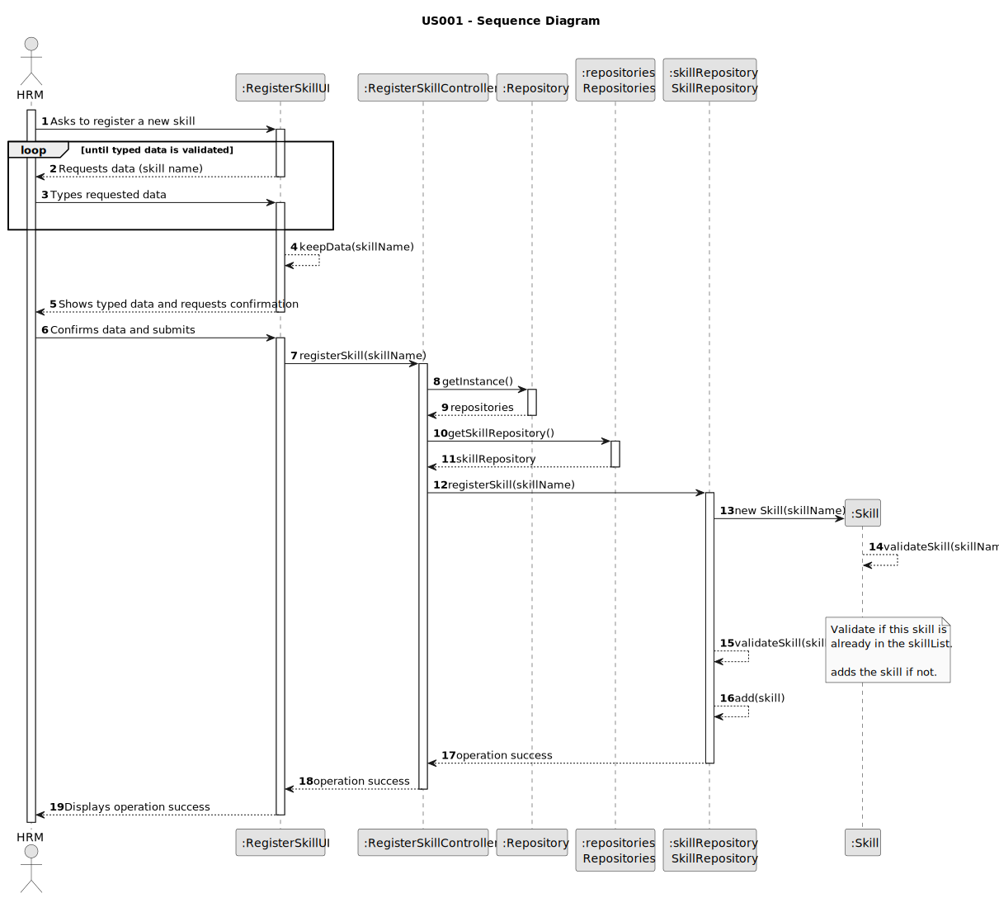
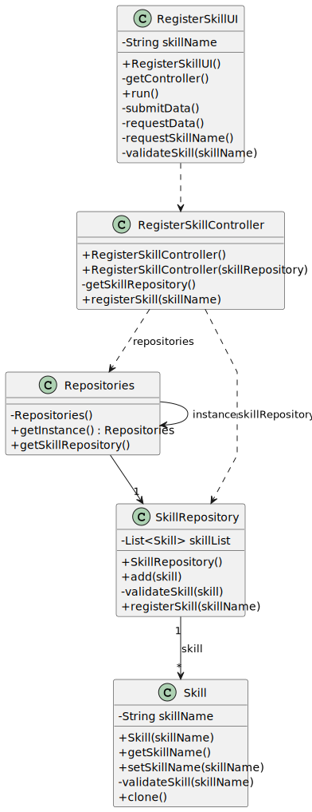

# US001 - Register a skill

## 3. Design - User Story Realization

### 3.1. Rationale

_**Note that SSD - US001 is adopted.**_

| Interaction ID                                         | Question: Which class is responsible for...                            | Answer                  | Justification (with patterns)                                                                                              |
|:-------------------------------------------------------|:-----------------------------------------------------------------------|:------------------------|:---------------------------------------------------------------------------------------------------------------------------|
| Step 1: Asks to register a new skill		                 | ... interacting with the actor?                                        | RegisterSkillUI         | Pure Fabrication: there is no reason to assign this responsibility to any existing class in the Domain Model.              |
| 			  		                                                | ... coordinating the US?                                               | RegisterSkillController | Controller                                                                                                                 |
| Step 2: Request data (skill name)  		                  | 		... displaying the form for the actor to input data?                 | RegisterSkillUI         | Pure Fabrication: User will insert data on the User Interface.                                                             |
| Step 3: Types requested data  		                       | 	...validating input data?                                             | RegisterSkillUI         | Pure Fabrication                                                                                                           |
|                                                        | ...temporarily keeping input data?                                     | RegisterSkillUI         | Pure Fabrication                                                                                                           |
| Step 4: Shows typed data and requests confirmation  		 | ... displaying all the information before confirmation?						          | RegisterSkillUI         | Pure Fabrication                                                                                                           |              
| Step 5: Confirms data and submits  		                  | 	... creating the Skill object                                         | SkillRepository         | Information Expert/Pure Fabrication - SkillRepository contains instances of Skill                                          | 
| 			  		                                                | 	... validating the data locally (mandatory data)?                     | Skill                   | Information Expert: Skill constructor validates the data                                                                   | 
| 			  		                                                | 	... adding to a collection and globally validating duplicate records? | SkillRepository         | Information Expert/Pure Fabrication: SkillRepository validates aggregates Skill instances and validates duplicate records. | 
| Step 6: Displays operation success  		                 | 	... informing operation success?                                      | RegisterSkillUI         | Pure Fabrication                                                                                                           | 

### Systematization ##

According to the taken rationale, the conceptual classes promoted to software classes are:

* Skill

Other software classes (i.e. Pure Fabrication) identified:

* RegisterSkillUI
* RegisterSkillController
* SkillRepository

## 3.2. Sequence Diagram (SD)

### Full Diagram

This diagram shows the full sequence of interactions between the classes involved in the realization of this user story.

## 3.3. Class Diagram (CD)

