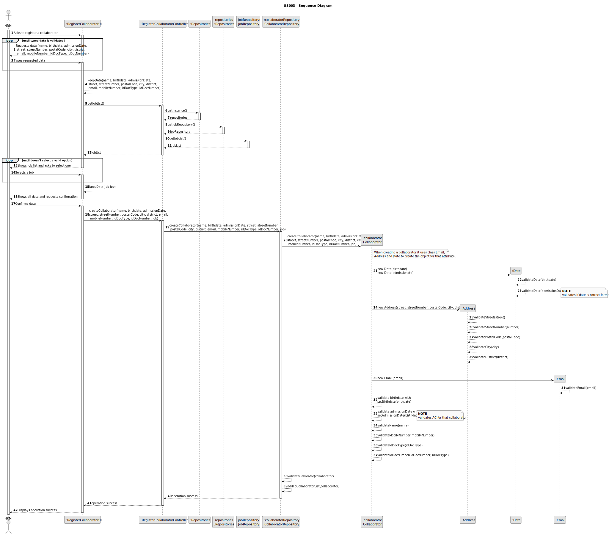
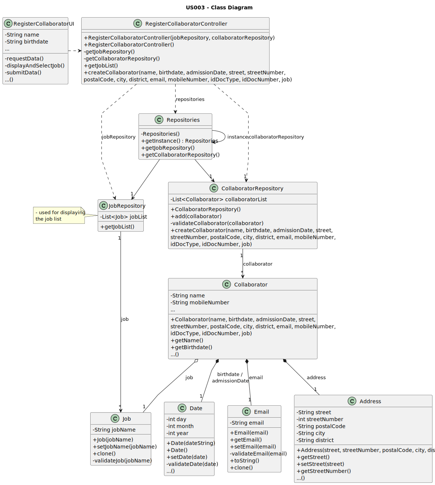
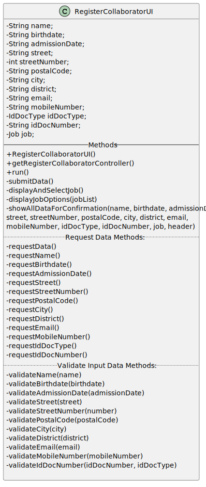
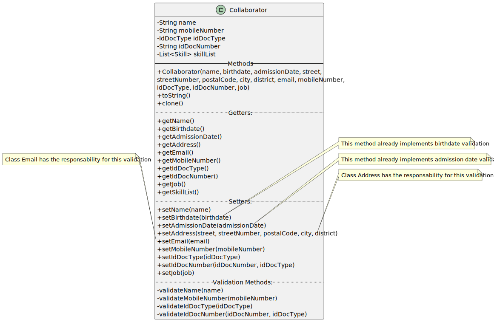
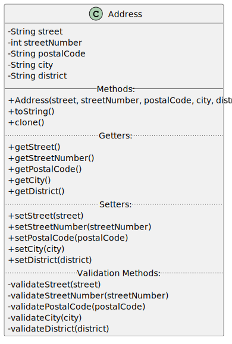
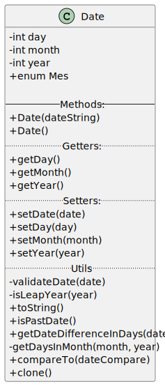

# US003 - Register a Collaborator

## 3. Design - User Story Realization

### 3.1. Rationale

_**Note that SSD - Alternative One is adopted.**_

| Interaction ID                                                                                                                                            | Question: Which class is responsible for...                           | Answer                         | Justification (with patterns)                                                                                              |
|:----------------------------------------------------------------------------------------------------------------------------------------------------------|:----------------------------------------------------------------------|:-------------------------------|:---------------------------------------------------------------------------------------------------------------------------|
| Step 1: Asks to register a collaborator 		                                                                                                                | 	... interacting with the actor?                                      | RegisterCollaboratorUI         | Pure Fabrication: there is no reason to assign this responsibility to any existing class in the Domain Model.              |
| 			  		                                                                                                                                                   | 	... coordinating the US?                                             | RegisterCollaboratorController | Controller                                                                                                                 |
| Step 2: Requests data (name, birthdate, admissionDate, street, streetNumber, postalCode, city, district, email, mobileNumber, idDocType, idDocNumber)  		 | 	... displaying the form for the actor to input data?						           | RegisterCollaboratorUI         | Pure Fabrication: User will insert data on the User Interface.                                                             |
| Step 3: Types requested data  		                                                                                                                          | 	... validating input data?                                           | RegisterCollaboratorUI         | Pure Fabrication                                                                                                           |
|                                                                                                                                                           | ... temporarily keeping input data?                                   | RegisterCollaboratorUI         | Pure Fabrication                                                                                                           |
| Step 4: Shows job list and asks to select one  		                                                                                                         | 	... obtaining the list of jobs?                                      | JobRepository                  | Information Expert - JobRepository knows all the jobs and contains all job instances                                       |
|                                                                                                                                                           | ... displaying the list of jobs?                                      | RegisterCollaboratorUI         | Pure Fabrication                                                                                                           |
| Step 5: Selects a job  		                                                                                                                                 | 	... validating the selected data?                                    | RegisterCollaboratorUI         | Pure Fabrication                                                                                                           |
|                                                                                                                                                           | ... temporarily keeping the selected job?                             | RegisterCollaboratorUI         | Pure Fabrication                                                                                                           |
| Step 6: Shows all data and requests confirmation  		                                                                                                      | ... displaying all the information before confirmation?							        | RegisterCollaboratorUI         | PureFabrication                                                                                                            |              
| Step 7: Confirms data  		                                                                                                                                 | 	... creating the Collaborator object?                                | CollaboratorRepository         | Information Expert/Pure Fabrication - CollaboratorRepository contains all instances of Collaborator                        | 
| 			  		                                                                                                                                                   | 	... validating the data locally (mandatory data)?                    | Collaborator                   | Information Expert: Collaborator has its own data and collaborator constructor validates data                              |                                                                                    | 
|                                                                                                                                                           | ... adding to a collection and globally validating duplicate records? | CollaboratorRepository         | Pure Creation/Information Expert: CollaboratorRepository aggregates Collaborator instances and validates duplicate records |
| Step 8: Displays operation success  		                                                                                                                    | 	... informing operation success?                                     | RegisterCollaboratorUI         | Pure Fabrication                                                                                                           | 

### Systematization ##

According to the taken rationale, the conceptual classes promoted to software classes are:

* Collaborator

Other software classes (i.e. Pure Fabrication) identified:

* RegisterCollaboratorUI
* RegisterCollaboratorController
* CollaboratorRepository
* JobRepository

## 3.2. Sequence Diagram (SD)

### Full Diagram

This diagram shows the full sequence of interactions between the classes involved in the realization of this user story.

## 3.3. Class Diagram (CD)

### Full Class Diagram

The following diagram shows the same sequence of interactions between the classes involved in the realization of this
user story, but it is split in partial diagrams to better illustrate the interactions between the classes.

### RegisterCollaboratorUI Class Diagram

### Collaborator Class Diagram

### Address Class Diagram

### Date Class Diagram

