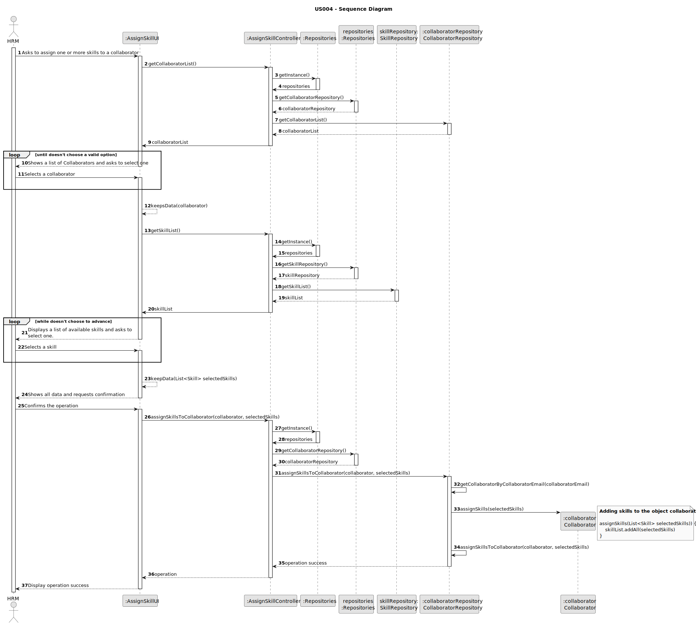
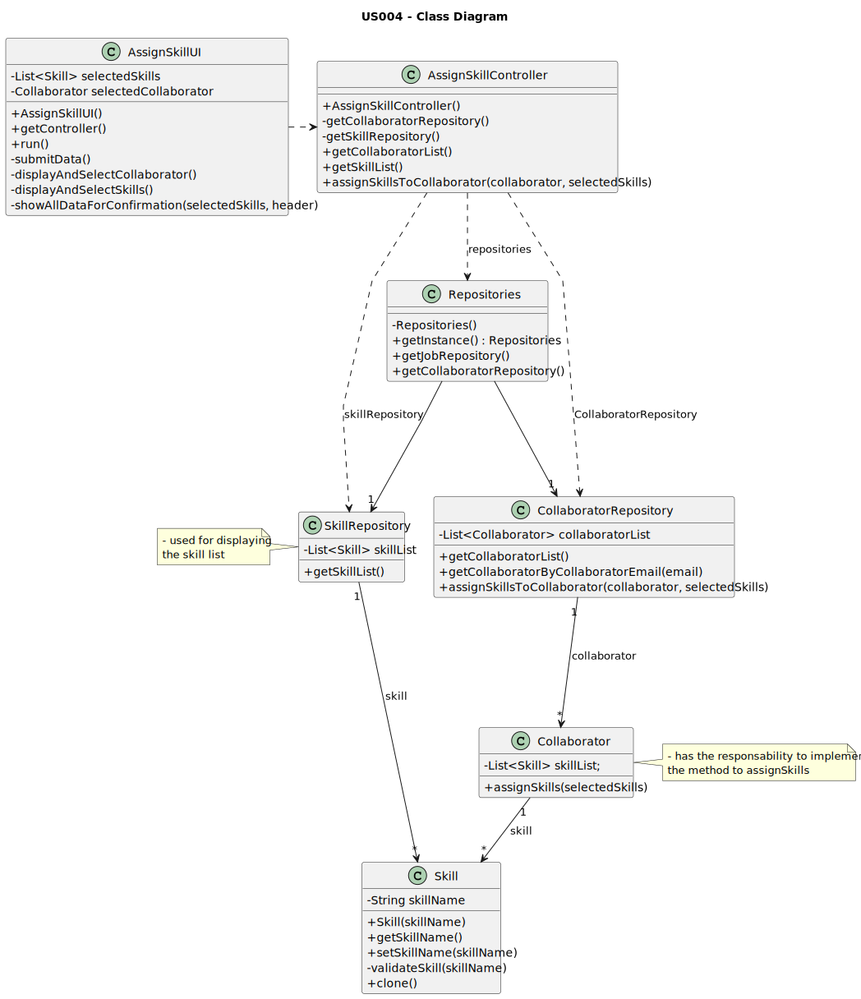

# US004 - Assign skills to collaborator

## 3. Design - User Story Realization

### 3.1. Rationale

_**Note that SSD - Alternative One is adopted.**_

| Interaction ID                                                          | Question: Which class is responsible for...                           | Answer                 | Justification (with patterns)                                                                                 |
|:------------------------------------------------------------------------|:----------------------------------------------------------------------|:-----------------------|:--------------------------------------------------------------------------------------------------------------|
| Step 1: Asks to assign one or more skills to a collaborator  		         | 	... interacting with the actor?                                      | AssignSkillUI          | Pure Fabrication: there is no reason to assign this responsibility to any existing class in the Domain Model. |
| 			  		                                                                 | 	... coordinating the US?                                             | AssignSkillController  | Controller                                                                                                    |
| Step 2: Shows a list of Collaborators and asks to select one	  		       | 	... obtaining the list of collaborators?                             | CollaboratorRepository | Information Expert: CollaboratorRepository aggregates all Collaborator instances                              |                                                                                    | ... obtaining the list of skills?                            | Organization           | Information Expert: Organization knows/has its own skills.                                                    |
| 		                                                                      | ... displaying the list of collaborators?							                      | AssignSkillUI          | Pure Fabrication                                                                                              |
| Step 3: Selects a collaborator  		                                      | 	... validating selected data?                                        | AssignSkillUI          | Pure Fabrication                                                                                              |
|                                                                         | ... temporarily keeping the selected collaborator?                    | AssignSkillUI          | Pure Fabrication                                                                                              |
| Step 4: Displays a list of available skills and asks to select one.  		 | 	... obtaining the list of skills?                                    | SkillRepository        | Information Expert: SkillRepository aggregates all Skill instances                                            |
|                                                                         | ... displaying the list of skills?                                    | AssignSkillUI          | Pure Fabrication                                                                                              |                                                                                                            
| Step 5: Selects a skill  		                                             | 	... validating selected data?                                        | AssignSkillUI          | Pure Fabrication                                                                                              |
|                                                                         | ... temporarily keeping the selected skill?                           | AssignSkillUI          | Pure Fabrication                                                                                              |                                                                                              
| Step 6: Shows all data and requests confirmation  		                    | 	... displaying all the information before submitting?						          | AssignSkillUI          | Pure Fabrication                                                                                              |              
| Step 7: Confirms the operation  		                                      | 	... saving changes (the selected skills to the chosen collaborator)? | CollaboratorRepository | Information Expert: Is CollaboratorRepository that contains the list of all Collaborators                     |
|                                                                         | ... assign the selected skills to the collaborator?                   | Collaborator           | Information Expert: Is Class Collaborator that has the necessary information/responsability                   |
|                                                                         | ... validating duplicate record of skills on that collaborator        | CollaboratorRepository | Information Expert: Is CollaboratorRepository that contains the list of all Collaborators                     |
| Step 8: Displays operation success  		                                  | 	... informing operation success?                                     | AssignSkillUI          | Pure Fabrication                                                                                              | 

### Systematization ##

According to the taken rationale, the conceptual classes promoted to software classes are:

* Collaborator

Other software classes (i.e. Pure Fabrication) identified:

* AssignSkillUI
* AssignSkillController
* SkillRepository
* CollaboratorRepository

## 3.2. Sequence Diagram (SD)

### Full Diagram

This diagram shows the full sequence of interactions between the classes involved in the realization of this user story.

## 3.3. Class Diagram (CD)

