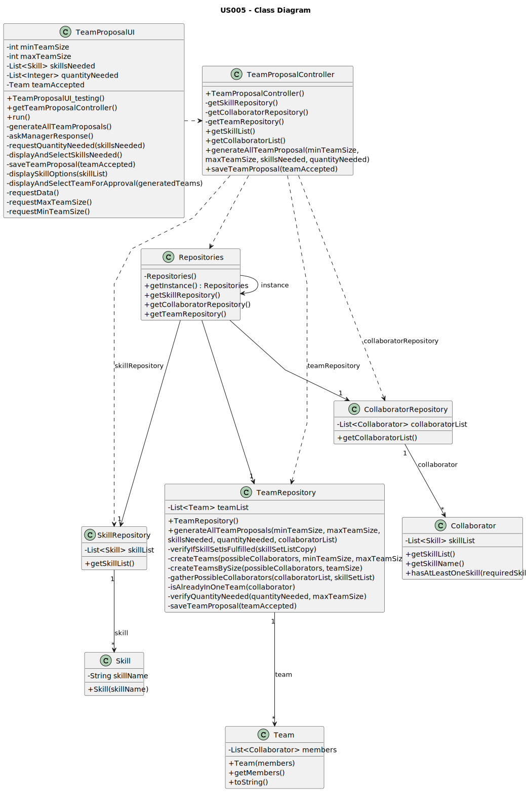

# US005 - Generate team proposal

## 3. Design - User Story Realization

### 3.1. Rationale

_**Note that SSD - Alternative One is adopted.**_

| Interaction ID                                                      | Question: Which class is responsible for...                                      | Answer                 | Justification (with patterns)                                                                                                          |
|:--------------------------------------------------------------------|:---------------------------------------------------------------------------------|:-----------------------|:---------------------------------------------------------------------------------------------------------------------------------------|
| Step 1: Asks to generate a new team proposal  		                    | 	... interacting with the actor?                                                 | TeamProposalUI         | Pure Fabrication: there is no reason to assign this responsibility to any existing class in the Domain Model.                          |
| 			  		                                                             | 	... coordinating the US?                                                        | TeamProposalController | Controller                                                                                                                             |
| Step 2: Request data(maxteamsize, minteamsize) 		                   | 		... displaying the form for the actor to input data?					                      | TeamProposalUI         | Pure Fabrication: User will insert data on the User Interface.                                                                         |
| Step 3: Type requested data  		                                     | 	...validating input data?                                                       | TeamProposalUI         | Pure Fabrication                                                                                                                       |
|                                                                     | ...temporarily keeping input data?                                               | TeamProposalUI         | Pure Fabrication                                                                                                                       |
| Step 4: Shows list of skills and asks to select the skills needed		 | 	...obtaining the list of skills                                                 | SkillRepository        | Information Expert: Skill repository contains all skill instances and knows all skills                                                 |
|                                                                     | ...displaying the list of skills?                                                | TeamProposalUI         | Pure Fabrication                                                                                                                       |
| Step 5: Select skills from the list		                               | 	... validating the selected data?                                               | TeamProposalUI         | Pure Fabrication                                                                                                                       |
|                                                                     | ... temporarily keeping the selected skill?                                      | TeamProposalUI         | Pure Fabrication                                                                                                                       | 
| Step 6: Asks to specify the quantity needed of the selected skill   | ... displaying the form for the actor to specify data?                           | TeamProposalUI         | Pure Fabrication                                                                                                                       | 
| Step 7: Types the quantity needed for that skill                    | ... validating the typed data?                                                   | TeamProposalUI         | Pure Fabrication                                                                                                                       |
|                                                                     | ... temporarily keeping input data?                                              | TeamProposalUI         | Pure Fabrication                                                                                                                       | 
| Step 8: Shows team generated and asks for confirmation  		          | 	... obtaining the list of collaborators to be used in team proposal generation? | CollaboratorRepository | Information Expert/Pure Fabrication - CollaboratorRepository contains all instances of Collaborator                                    |
|                                                                     | ... creating the Team object?                                                    | TeamRepository         | Information Expert/Pure Fabrication - TeamRepository contains all instances of Team                                                    |
|                                                                     | ... generating all team proposals?                                               | TeamRepository         | Information Expert - TeamRepository is responsible for controlling and coordinating activities on Team objects and knows all its Teams |
|                                                                     | ... displaying the team generated?                                               | TeamProposalUI         | Pure Fabrication                                                                                                                       |
| Step 9: Accepts or rejects the proposal  		                         | 	... validating the input option?                                                | TeamProposalUI         | Pure Fabrication                                                                                                                       |
|                                                                     | ... showing next team generated in case of rejection?                            | TeamProposalUI         | Pure Fabrication                                                                                                                       |
|                                                                     | ...saving the accepted team proposal?                                            | TeamRepository         | Information Expert/Pure Fabrication: TeamRepository contains all instances of Team and saves the accepted team                         |
| Step 10: Displays operation success                                 | ... informing operation success?                                                 | TeamProposalUI         | Pure Fabrication                                                                                                                       |

### Systematization ##

According to the taken rationale, the conceptual classes promoted to software classes are:

* Team

Other software classes (i.e. Pure Fabrication) identified:

* TeamProposalUI
* TeamProposalController
* TeamRepository
* SkillRepository
* CollaboratorRepository

## 3.2. Sequence Diagram (SD)

_**Note that SSD - Alternative Two is adopted.**_

### Full Diagram

This diagram shows the full sequence of interactions between the classes involved in the realization of this user story.

## 3.3. Class Diagram (CD)

