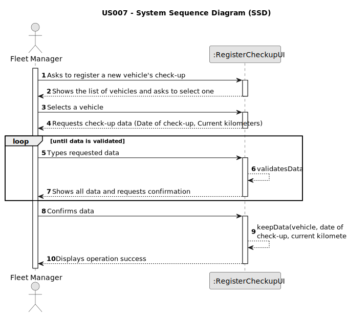

# US007 - Register a vehicle’s check-up

## 1. Requirements Engineering

### 1.1. User Story Description

As an FM, I wish to register a vehicle’s check-up.

### 1.2. Customer Specifications and Clarifications

**From the specifications document:**

>Vehicles are needed to carry out the tasks assigned to the teams as well as to transport
machines and equipment. This type of vehicle can be only for passengers or mixed,
light or heavy, open box or closed vans or trucks.

> Vehicle and Equipment Fleet Manager (VFM) – a person who manages the fleet park, the machines, equipment and vehicles, ensuring their good condition and assigning them to the tasks to be carried out.

**From the client clarifications:**

> **Question:** What information is needed when registering a vehicle for check up?
>
> **Answer:** Vehicle ID, Date, Current Kms.

> **Question:** What is the unit of measurement used to estimate the check-up frequency (Kms, months, etc.)?
>
> **Answer:** In real context all could be considered, in the scope of this project just kms will be considered.

> **Question:** Can a vehicle not have a check-up?
> 
> **Answer:** Yes.

> **Question:** After registering a vehicle, should the vehicle info appear or only the (in)success of the operation.
> 
> **Answer:** The UX/UI is up to dev team.

> **Question:** What´s the supposed vehicle check up supposed to look like?
> 
> **Answer:** While registering a checkup, the vehicle id, date and current kms, shoud be considered.

> **Question:** Does a vehicle need to be registered in US06 before being able to go for a check-up in US07?
> 
> **Answer:** Yes.

> **Question:** Can a vehicle have more than one check-up?
> 
> **Answer:** Yes.

> **Question:** Which attributes will you need for the vehicle's check-up?
> 
> **Answer:** Plate number, date, kms at checkup

### 1.3. Acceptance Criteria

* **AC1:** All required fields must be filled in.
* **AC2:** Date must not be in the future. 
* **AC3:** The vehicle of the check-up must be a vehicle of the organization.
* **AC4:** User must select a vehicle from the list before filling in the check-up data.
* **AC5:** The current kilometers entered should be a numeric value higher than zero.
* **AC6:** After successful registration, the system should provide feedback indicating the completion of the operation.

### 1.4. Found out Dependencies

* There is a dependency on "US006 - Register a vehicle" since it's necessary to have a vehicle registered first.

### 1.5 Input and Output Data

**Input Data:**

* Typed data:
    * Date of check-up
    * Current kilometers

* Selected data:
    * A vehicle from the list

**Output Data:**

* Vehicle and Check-up data for confirmation
* Success of the operation

### 1.6. System Sequence Diagram (SSD)

### 1.7 Other Relevant Remarks