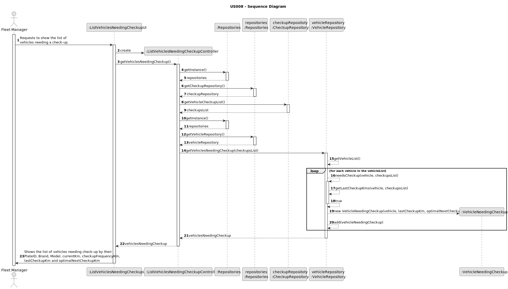
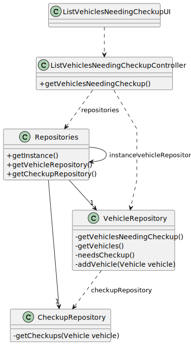

# US008 - List of vehicles needing the check-up

## 3. Design - User Story Realization

### 3.1. Rationale

_**Note that SSD - Alternative One is adopted.**_

| Interaction ID                                                                              | Question: Which class is responsible for...                                                                | Answer                              | Justification (with patterns)                                           |
|:--------------------------------------------------------------------------------------------|:-----------------------------------------------------------------------------------------------------------|:------------------------------------|:------------------------------------------------------------------------|
| Step 1: Requests to show the list of vehicles needing inspection                            | ...interacting with the actor ?                                                                            | ListVehiclesNeedingCheckupUI        | Pure Fabrication                                                        |
|                                                                                             | ... Coordinating the US ?                                                                                  | ListVehicleNeedingCheckupController | Controller                                                              |
|                                                                                             | ... ensuring the vehicle needs checkup?                                                                    | Vehicle Repository                  | Information Expert                                                      |
|                                                                                             | ... saving all the data needed to show the user the vehicle, last checkup km and optimal next checkup km ? | VehiclesNeedingCheckup              | Creator                                                                 |
|                                                                                             | .. creating a list of all the objects of VehicleNeedingCheckup                                             | ListVehicleNeedingCheckupController | Information Expert (creates the list of all vehicles that need checkup) 
| Step 2: Shows the list of vehicles needing check-up with vehicle details and the data used. | ... displaying the vehicles that need checkup?                                                             | ListVehiclesNeedingCheckupUI        | Pure Fabrication                                                        |

### Systematization ##

According to the taken rationale, the conceptual classes promoted to software classes are:

* VehiclesNeedingCheckup
* VehicleRepository

Other software classes (i.e. Pure Fabrication) identified:

* ListVehiclesNeedingCheckupUI
* ListVehicleNeedingCheckupController

## 3.2. Sequence Diagram (SD)

_**Note that SSD - Alternative Two is adopted.**_

### Full Diagram

This diagram shows the full sequence of interactions between the classes involved in the realization of this user story.

## 3.3. Class Diagram (CD)

