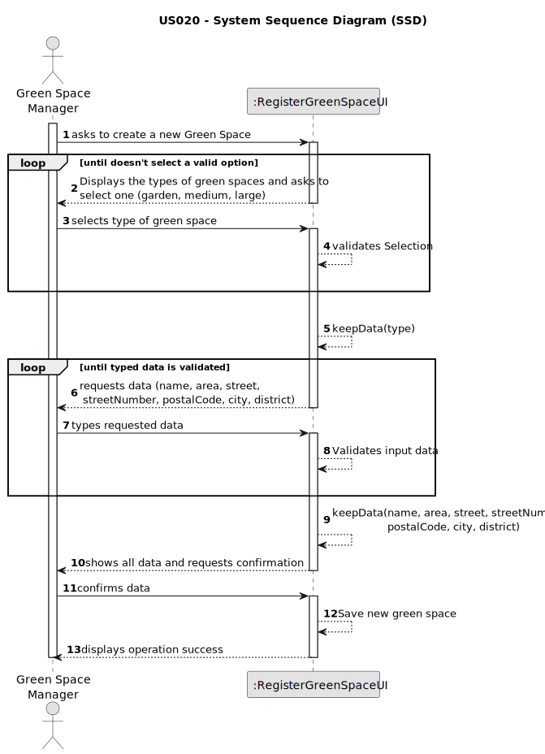

# US020 - Register a greenspace

## 1. Requirements Engineering

### 1.1. User Story Description

As a Green Space Manager (GSM), I want to register a green
space (garden, medium-sized park or large-sized park) and its respective
area.

### 1.2. Customer Specifications and Clarifications 

**From the specifications document:**

> Green spaces for collective use can vary significantly in dimensions and
available amenities. They may range from small landscaped areas, parks
with trees and some amenities like benches or playgrounds, to parks with
multiple hectares (e.g., in Porto, there are the Parque da Cidade - City 
 Park the Parque Oriental - the Oriental Park), wooded areas, lakes, and various
 facilities and installations.

>MusgoSublime (MS) is an organization dedicated to the planning, construction and maintenance of green spaces for collective use in their multiple
  dimensions, namely: plant material (e.g. flowers, shrubs, trees); urban furniture (e.g. benches, tables, gymnastics equipment); irrigation systems and
  drinking fountains; lighting systems and the respective power supply; rainwater conduction and drainage systems.

> The green spaces for collective use managed by MS can significantly vary in
size and installed equipment:  
• Garden - garden space with or without trees with little or no equipment
(may have a basic irrigation system or/and benches); 
• Medium-sized park - green space with a few hundred or thousands of
square meters with a wooded garden area, it includes some infrastructures such as toilets, drinking fountains, irrigation system, lighting,
children’s playground (for example, Quinta do Covelo, Jardim d’Arca
de Agua ´ ); 
• Large-sized park - multi-function space with diverse garden spaces, and
woods, including varied equipment and services (for example, Parque
da Cidade).

**From the client clarifications:**

> **Question:** What are the required fields for registering a green space?
>
> **Answer:**  The required fields are the name of the park, the address of the park, the area of the park in square meters, and the park type.

> **Question:** In which unit should the area be measured in?
>
> **Answer:** Usually, areas are measured in hectares.

> **Question:** In the registration of a green space, should a green space's name be allowed to contain digits and special characters, or just letters and whitespaces?
> 
> **Answer:** Same rules for other names in the business, letters, spaces and dashes.

> **Question:** In view of the description of GreenSpaces does it make sense to ask for optional mind for the different types this data?
>
> **Answer:** In the current version, it is sufficient to define a park using name, size classification, area (hectare) and address.

> **Question:** I would like to know between what ranges of hectares a green space is classified as garden, medium or large, or if it is possible to register 2 green spaces with the same area but in different typology, depending on the GSM it registers
>
> **Answer:** The classification is not automatic, it's up to GSM decide about it.

> **Question:** Can two green spaces have the same name?
>
> **Answer:** No.

> **Question:** We understand that type (garden, medium-size, large-size), area, name, and address are required inputs for a Green Space (and if we are wrong in this, please correct us), but are there any other inputs that we are unaware of?
>
> **Answer:** Seems enough.

> **Question:** Can two different green spaces have the same address?
> 
> **Answer:** No.

### 1.3. Acceptance Criteria

* **AC1:** All required fields must be filled in.
* **AC2:** Total Area must be a positive number.
* **AC3:** Green Space types are:
  * Garden
  * Medium-sized
  * Large-sized
* **AC4:** Green space name must not contain special characters or numbers.
* **AC5:** Two different green spaces cannot have the same name.

### 1.4. Found out Dependencies

* There's no found out dependencies for this user story.

### 1.5 Input and Output Data

**Input Data:**

* Typed data:
    * name of the park
    * address of the park
    * area of the park in square meters
	
* Selected data:
    * the park type

**Output Data:**

* All information for confirmation
* Success of the operation

### 1.6. System Sequence Diagram (SSD)

### 1.7 Other Relevant Remarks

* no other relevant remarks for this user story found yet.