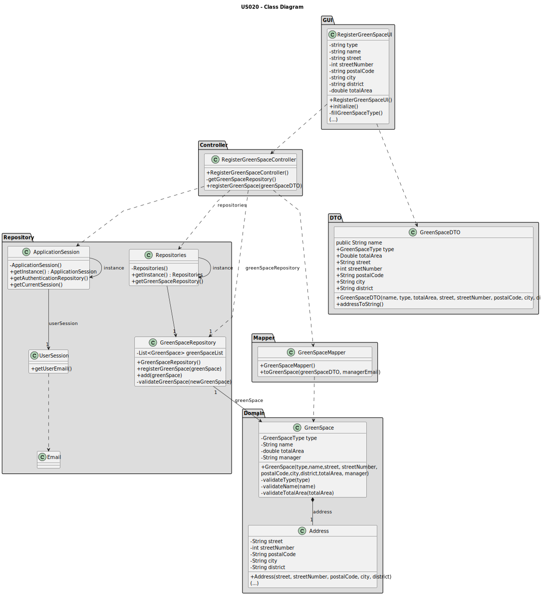

# US020 - Register a greenspace

## 3. Design - User Story Realization

### 3.1. Rationale

_**Note that SSD - Alternative One is adopted.**_

| Interaction ID                                                                                | Question: Which class is responsible for...                           | Answer                       | Justification (with patterns)                                                                                            |
|:----------------------------------------------------------------------------------------------|:----------------------------------------------------------------------|:-----------------------------|:-------------------------------------------------------------------------------------------------------------------------|
| Step 1: Asks to create a new Green Space 		                                                   | 	... interacting with the actor?                                      | RegisterGreenSpaceUI         | Pure Fabrication: there is no reason to assign this responsibility to any existing class in the Domain Model.            |
| 			  		                                                                                       | 	... coordinating the US?                                             | RegisterGreenSpaceController | Controller                                                                                                               |
| Step 2: Displays the types of green spaces and asks to select one (garden, medium, large)  		 | 	... displaying the options so the user can choose?                   | RegisterGreenSpaceUI         | Pure Fabrication                                                                                                         |
| Step 3: selects type of green space  		                                                       | 	... validating the selected data?                                    | RegisterGreenSpaceUI         | Pure Fabrication                                                                                                         |
|                                                                                               | ... temporarily keeping the selected type?                            | RegisterGreenSpaceUI         | Pure Fabrication                                                                                                         |
| Step 4: requests data (name, streetNumber,\npostalCode, city, district, totalArea)  		        | 	... displaying the form for the actor to input data?						           | RegisterGreenSpaceUI         | Pure Fabrication: User will insert data on the User Interface.                                                           |
| Step 5: Types requested data  		                                                              | 	... validating input data?                                           | RegisterGreenSpaceUI         | Pure Fabrication                                                                                                         |
|                                                                                               | ... temporarily keeping input data?                                   | RegisterGreenSpaceUI         | Pure Fabrication                                                                                                         |
| Step 6: Shows all data and requests confirmation  		                                          | ... displaying all the information before confirmation?							        | RegisterGreenSpaceUI         | PureFabrication                                                                                                          |              
| Step 7: Confirms data  		                                                                     | 	... creating the Green Space object?                                 | GreenSpaceRepository         | Information Expert/Pure Fabrication - GreenSpaceRepository contains all instances of GreenSpace                          | 
| 			  		                                                                                       | 	... validating the data locally (mandatory data)?                    | GreenSpace                   | Information Expert: GreenSpace has its own data and GreenSpace constructor validates data                                |                                                                                    | 
|                                                                                               | ... adding to a collection and globally validating duplicate records? | GreenSpaceRepository         | Pure Creation/Information Expert: GreenSpaceRepository aggregates GreenSpace instances and validates duplicate records |
| Step 8: Displays operation success  		                                                        | 	... informing operation success?                                     | RegisterGreenSpaceUI         | Pure Fabrication                                                                                                         | 

### Systematization ##

According to the taken rationale, the conceptual classes promoted to software classes are:

* GreenSpace

Other software classes (i.e. Pure Fabrication) identified:

* RegisterGreenSpaceUI
* RegisterGreenSpaceController
* GreenSpaceRepository

## 3.2. Sequence Diagram (SD)

_**Note that SSD - Alternative Two is adopted.**_

### Full Diagram

This diagram shows the full sequence of interactions between the classes involved in the realization of this user story.

## 3.3. Class Diagram (CD)

