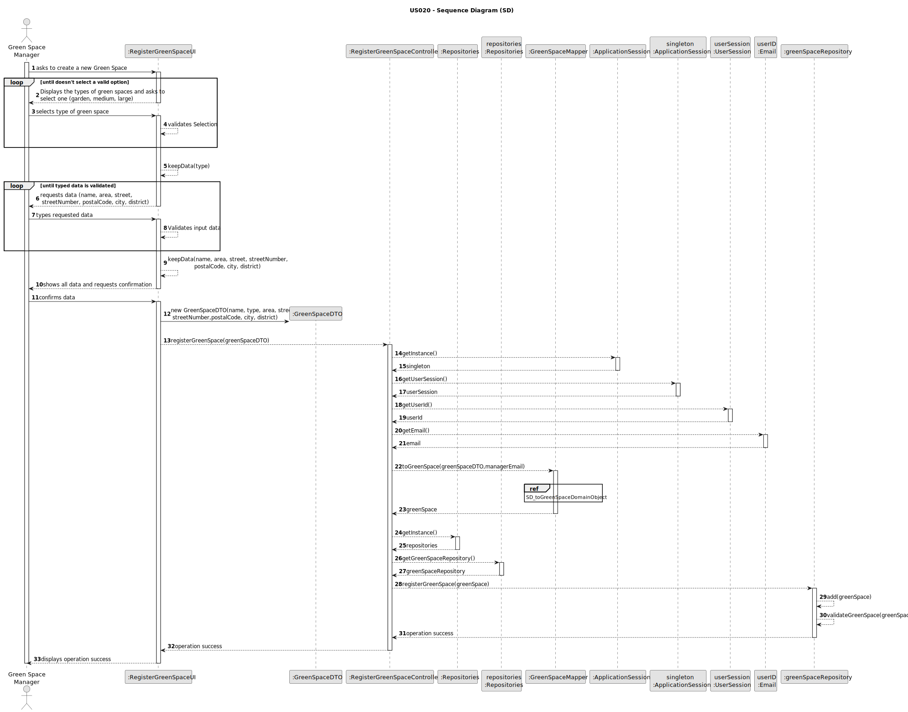

# US020 - Register a greenspace

## 3. Design - User Story Realization

### 3.1. Rationale

_**Note that SSD - Alternative One is adopted.**_

| Interaction ID                                                                                | Question: Which class is responsible for...                           | Answer                       | Justification (with patterns)                                                                                          |
|:----------------------------------------------------------------------------------------------|:----------------------------------------------------------------------|:-----------------------------|:-----------------------------------------------------------------------------------------------------------------------|
| Step 1: Asks to create a new Green Space 		                                                   | 	... interacting with the actor?                                      | RegisterGreenSpaceUI         | Pure Fabrication: there is no reason to assign this responsibility to any existing class in the Domain Model.          |
| 			  		                                                                                       | 	... coordinating the US?                                             | RegisterGreenSpaceController | Controller                                                                                                             |
| 			  		                                                                                       | ... knowing the user using the system?                                | UserSession                  | IE: cf. A&A component documentation.                                                                                   |
| Step 2: requests data (name, type, area, street, streetNumber, postalCode, city, district) 		 | 	... displaying the form for the actor to input data?						           | RegisterGreenSpaceUI         | Pure Fabrication: User will insert data on the User Interface.                                                         |
| Step 3: Types requested data  		                                                              | 	... validating input data?                                           | RegisterGreenSpaceUI         | Pure Fabrication                                                                                                       |
|                                                                                               | ... temporarily keeping input data?                                   | RegisterGreenSpaceUI         | Pure Fabrication                                                                                                       |
| Step 4: Shows all data and requests confirmation  		                                          | ... displaying all the information before confirmation?							        | RegisterGreenSpaceUI         | PureFabrication                                                                                                        |              
| Step 5: Confirms data  		                                                                     | 	... creating the Green Space DTO object?                             | RegisterGreenSpaceUI         | Pure Fabrication: All input data will be sent to the Domain in a DTO (transferring data only)                          | 
|                                                                                               | ... mapping a DTO to a domain green space object?                     | GreenSpaceMapper             | Pure Fabrication: GreenSpaceMapper has the responsibility of converting a DTO object into a domain object.             |
| 			  		                                                                                       | 	... validating the data locally (mandatory data)?                    | GreenSpace                   | Information Expert: GreenSpace constructor validates data                                                              |                                                                                    | 
|                                                                                               | ... adding to a collection and globally validating duplicate records? | GreenSpaceRepository         | Pure Creation/Information Expert: GreenSpaceRepository aggregates GreenSpace instances and validates duplicate records |
| Step 6: Displays operation success  		                                                        | 	... informing operation success?                                     | RegisterGreenSpaceUI         | Pure Fabrication                                                                                                       | 

### Systematization ##

According to the taken rationale, the conceptual classes promoted to software classes are:

* GreenSpace

Other software classes (i.e. Pure Fabrication) identified:

* RegisterGreenSpaceUI
* RegisterGreenSpaceController
* GreenSpaceRepository
* GreenSpaceMapper
* GreenSpaceDTO
* UserSession

## 3.2. Sequence Diagram (SD)

### Full Diagram

This diagram shows the full sequence of interactions between the classes involved in the realization of this user story.

### Ref: SD_toGreenSpaceDomainObject

## 3.3. Class Diagram (CD)

### Address Class Diagram

