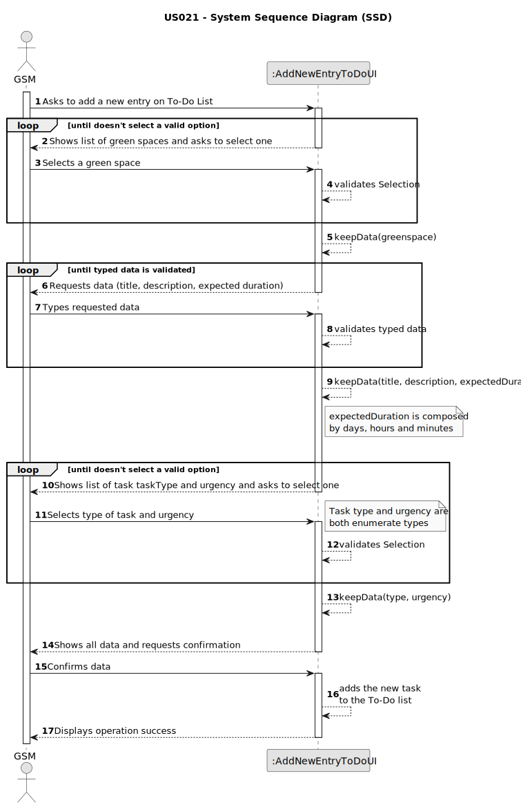

# US021 - Add new entry to the To-Do List

## 1. Requirements Engineering

### 1.1. User Story Description

As a GSM, I want to add a new entry to the To-Do List.

### 1.2. Customer Specifications and Clarifications 

**From the specifications document:**

>	The To-Do List comprises all the tasks required to
be done in order to assure the proper functioning of the parks. These tasks
can be regular (e.g. pruning trees) or occasional (e.g. repairing a broken
equipment). They may also require a multi-disciplinary team and the length
of the task can vary from a few minutes (e.g. replacing a light bulb) to weeks
(e.g. installing an irrigation system).

>	The To-Do List comprises all pending tasks for all parks

**From the client clarifications:**

> **Question:** If there are multiple GSM in the system, can a GSM create an entry for a Green Space managed by another GSM?
>
> **Answer:** No

> **Question:** Should the to-do entries be unique or can a GSM repeat the same to-do entry, for the same Green Space, multiple times
>
> **Answer:** Yes; Assuming the previous task with same description was previously processed and is not open anymore.

> **Question:** If the To-Do entry is assigned to the Agenda, should it be removed for the To-Do entry, if it only occasional?
> 
> **Answer:** Should change the status to processed.

> **Question:** What are the details the GSM needs to input, other than the Green Space, frequency, estimated duration?Title and description are required?
> 
> **Answer:** Title and description could be useful.

> **Question:** Should the GSM define the skills needed for a To-Do entry?
> 
> **Answer:** No but maybe it should be done for type of task (or similar)

> **Question:** When a new entry is added to the ToDo list, the default status of that task will be "pending" or no status at all is considered on ToDo list?
Similarly, when a new entry is added to the Agenda, the status of that task will be, by default, set to "planned", right?
> 
> **Answer:** "Pending" as default for to-do list entries and "Planned" as default for Agenda entries, sounds good.

> **Question:** Can different tasks have the same title?
>
> **Answer:** Concrete Task at To-Do List: name(Prunning Trees); park(Arca De Agua); urgency(low); estimated duration(2 working days)

> **Question:** For a regular task, should the GSM define the frequency in which the tasks need to be performed?
>
> **Answer:** No.

> **Question:** Is it mandatory for the program to have multiple GSM?
>
> **Answer:** The program can have multiple GSM.

> **Question:** Can only the GSM assigned to a specific green space register a new entry for the to-do list?
>
> **Answer:** Yes.

> **Question:** What time unit should be used for the duration of the task?
>
> **Answer:** Hour and/or days.

### 1.3. Acceptance Criteria

* **AC1:** All required fields must be filled in.
* **AC2:** The new entry must be associated with a green space managed by the GSM.
* **AC3:** The green space for the new entry should be chosen from a list presented to the GSM.
* **AC4:** The urgency must be one of the 3 options: High, Medium and Low
* **AC5:** The Green Space list must be the green spaces managed by the user logged in.
* **AC6:** Default Status for an entry on To-Do list is "PENDING"
* **AC7:** Expected duration of the task can be days and/or hours
* **AC8:** Task type may be "regular" or "occasional"
* **AC9:** Task name cannot contain special character or numbers.
* **AC10:** At least one of the following must be filled for the duration of the task:
  * Amount of days
  * Amount of hours
  * Amount of Minutes

### 1.4. Found out Dependencies

* There is a dependency on "US020 - Register a greenspace" as there must be at least one green space registered by the GSM logged in to be selected by him.

### 1.5 Input and Output Data

**Input Data:**

* Typed data:
    * Title
    * Description
    * Task duration
	
* Selected data:
    * a green space
    * Type
    * Urgency

**Output Data:**

* All information for confirmation
* Success of the operation

### 1.6. System Sequence Diagram (SSD)

### 1.7 Other Relevant Remarks

* The created task stays in "PENDING" status until it's processed into the Agenda.