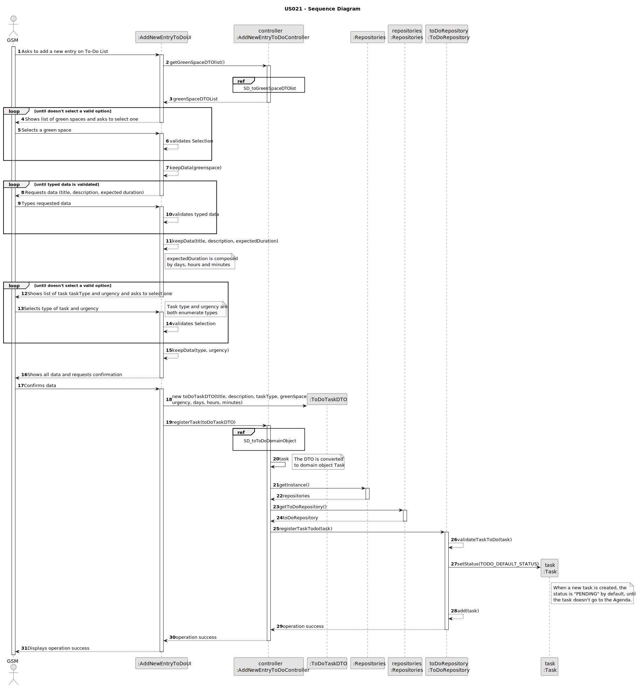

# US021 - Add new entry to the To-Do List

## 3. Design - User Story Realization

### 3.1. Rationale

| Interaction ID                                                         | Question: Which class is responsible for...                           | Answer                    | Justification (with patterns)                                                                                 |
|:-----------------------------------------------------------------------|:----------------------------------------------------------------------|:--------------------------|:--------------------------------------------------------------------------------------------------------------|
| Step 1: Asks to add a new entry on To-Do List  	                       | 	... interacting with the actor?                                      | AddNewEntryToDoUI         | Pure Fabrication: there is no reason to assign this responsibility to any existing class in the Domain Model. |
| 			  		                                                                | 	... coordinating the US?                                             | AddNewEntryToDoController | Controller                                                                                                    |
| 			  		                                                                | ... knowing the user using the system?                                | UserSession               | IE: cf. A&A component documentation.                                                                          |
| Step 2: Shows list of green spaces and asks to select one  		          | 	... obtaining the manager green space list?			                       | GreenSpaceRepository      | Information Expert - GreenSpaceRepository knows all the GreenSpaces and contains all greenSpace instances     |
|                                                                        | ... mapping greenSpace list into greenSpace DTO list?                 | GreenSpaceMapper          | Pure Fabrication: GreenSpaceMapper has the responsibility of converting a domain object into a DTO object.    |
|                                                                        | ... displaying the list of GreenSpaces DTO                            | AddNewEntryToDoUI         | Pure Fabrication                                                                                              |
| Step 3: Selects a green space                                          | ... validating the selected data?                                     | AddNewEntryToDoUI         | Pure Fabrication                                                                                              |
|                                                                        | ... temporarily keeping the selected greenSpace?                      | AddNewEntryToDoUI         | Pure Fabrication                                                                                              |
| Step 4: Requests data (title, description, expected duration)          | ... displaying the form for the actor to input data?                  | AddNewEntryToDoUI         | Pure Fabrication                                                                                              |
| Step 5: Types requested data                                           | ... validating input data?                                            | AddNewEntryToDoUI         | Pure Fabrication                                                                                              |
|                                                                        | ... temporarily keeping input data?                                   | AddNewEntryToDoUI         | Pure Fabrication                                                                                              |
| Step 6: Shows list of task taskType and urgency and asks to select one | ... displaying the list of taskType and urgency                       | AddNewEntryToDoUI         | Pure Fabrication                                                                                              |              
| Step 7: Selects type of task and urgency                               | ... validating the selected data?                                     | AddNewEntryToDoUI         | Pure Fabrication                                                                                              |
|                                                                        | ... temporarily keeping the selected greenSpace?                      | AddNewEntryToDoUI         | Pure Fabrication                                                                                              |
| Step 8: Shows all data and requests confirmation                       | ... displaying all the information for confirmation?                  | AddNewEntryToDoUI         | Pure Fabrication                                                                                              |
| Step 9: Confirms data                                                  | ... creating the ToDo Task DTO object?                                | AddNewEntryToDoUI         | Pure Fabrication: All input data will be sent to the Domain in a DTO (transferring data only)                 |
|                                                                        | ... mapping the DTO to a domain task object?                          | ToDoListMapper            | Pure Fabrication: ToDoListMapper has the responsibility of converting a DTO into a domain object.             |
|                                                                        | ... validating the data locally (mandatory data)?                     | Task                      | Information Expert: Task constructor validates data                                                           |
|                                                                        | ... adding to a collection and globally validating duplicate records? | ToDoRepository            | Information Expert: ToDoRepository aggregates Task instances and validates duplicate records                  |
| Step 10: Displays operation success                                    | ... informing operation success?                                      | AddNewEntryToDoUI         | Pure Fabrication                                                                                              |

### Systematization ##

According to the taken rationale, the conceptual classes promoted to software classes are:

* Task

Other software classes (i.e. Pure Fabrication) identified:

* AddNewEntryToDoUI
* AddNewEntryToDoController
* UserSession
* GreenSpaceRepository
* ToDoRepository
* GreenSpaceMapper
* ToDoListMapper

## 3.2. Sequence Diagram (SD)

### Full Diagram

### Ref: SD_toGreenSpaceDTOlist

### Ref: SD_toToDoDomainObject

## 3.3. Class Diagram (CD)

### AddNewEntryToDoUI Class Diagram

### Task Class Diagram

