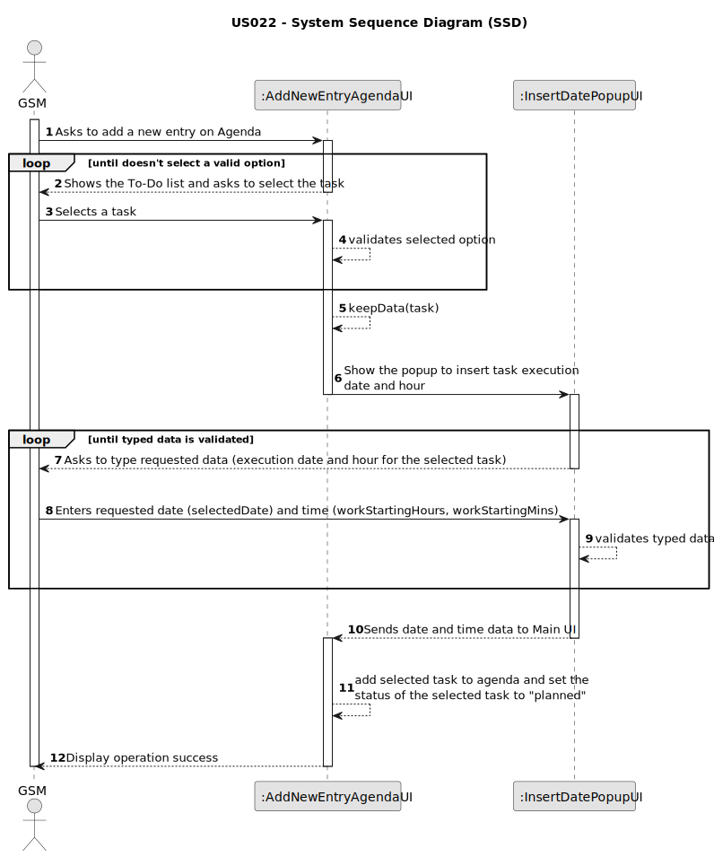

# US022 - Add new entry in the Agenda

## 1. Requirements Engineering

### 1.1. User Story Description

As a GSM, I want to add a new entry in the Agenda.

### 1.2. Customer Specifications and Clarifications 

**From the specifications document:**

>	In the daily management, the GSM uses two essential tools: the Agenda and the Task
List (aka To-Do List). 

>	The Agenda is a crucial mechanism for planning the week’s work. Each entry
in the Agenda defines a task (that was previously included in the to-do list).
> 
**From the client clarifications:**

> **Question:** When the GSM plans a task (that was previously in To-Do) into the Agenda, what aditional data/information does he need to input when planning?
>
> **Answer:** The starting date for the task. Later the GSM will be able to add the Team and vehicles (if required)

> **Question:** When a new entry is added to the ToDo list, the default status of that task will be "pending" or no status at all is considered on ToDo list?
Similarly, when a new entry is added to the Agenda, the status of that task will be, by default, set to "planned", right?
>
> **Answer:** "Pending" as default for to-do list entries and "Planned" as default for Agenda entries, sounds good;

> **Question:** Can I add an entry that has a time period that already have an existing entry in the Agenda?
>
> **Answer:** Yes, because:
a) there are many parks to manage
b) different tasks can be executed at same time in the same park. 

> **Question:** When registering an entry to the agenda, are the three inputs (selecting an existing task from the to-do list, starting date, and finishing date) sufficient?
>
> **Answer:** The starting date will be enough because the task already has the predicted duration.

### 1.3. Acceptance Criteria

* **AC1:** All required fields must be filled in.
* **AC2:** The new entry must be associated with a green space managed by the GSM.
* **AC3:** The new entry must exist in the To-Do list.
* **AC4:** When the task enters agenda its default status must be "PLANNED"
* **AC5:** Execution date and time must be introduced and not empty.
* **AC6:** The task to add to the Agenda must be with status "PENDING", meaning that it was not planned/processed yet.
* **AC7:** At least one valid task must be selected before typing execution date and time.
* **AC8:** When a task is successfully planned, the new task on agenda status will be "PLANNED" and the selected task status from To-Do list will be "PROCESSED" 
* **AC9:** The To-Do list that the GSM logged in the system will see only have the entries created by him.
* **AC10:** If a task is already "PROCESSED" it cannot be added again to the Agenda.

### 1.4. Found out Dependencies

* There is a dependency on "US021 - Add new entry to the To-Do List" as there must be at least one entry on To-Do list created by the GSM logged in the system in order to be planned into the Agenda.

### 1.5 Input and Output Data

**Input Data:**

* Typed data:
    * Execution date
    * Execution time
      * hours
      * minutes
	
* Selected data:
    * a task from manager To-Do list

**Output Data:**

* Success of the operation

### 1.6. System Sequence Diagram (SSD)

### 1.7 Other Relevant Remarks

* After adding the new entry to Agenda, the selected task will have the status "planned" on Agenda and "processed" on To-Do list.