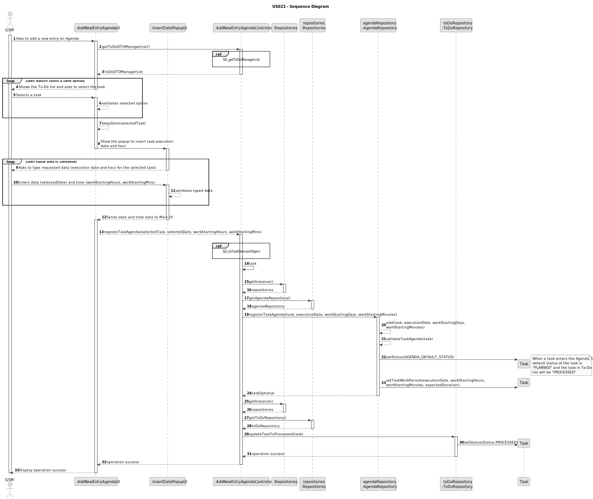

# US022 - Add new entry in the Agenda

## 3. Design - User Story Realization

### 3.1. Rationale

| Interaction ID                                                                                 | Question: Which class is responsible for...                                  | Answer                      | Justification (with patterns)                                                                                 |
|:-----------------------------------------------------------------------------------------------|:-----------------------------------------------------------------------------|:----------------------------|:--------------------------------------------------------------------------------------------------------------|
| Step 1: Asks to add a new entry on Agenda  		                                                  | 	... interacting with the actor?                                             | AddNewEntryAgendaUI         | Pure Fabrication: there is no reason to assign this responsibility to any existing class in the Domain Model. |
| 			  		                                                                                        | 	... coordinating the US?                                                    | AddNewEntryAgendaController | Controller                                                                                                    |
| 			  		                                                                                        | ... knowing the user using the system?                                       | UserSession                 | IE: cf. A&A component documentation.                                                                          |
| Step 2: Shows the To-Do list and asks to select the task  		                                   | 	... obtaining the manager to-do list?						                                 | ToDoRepository              | Information Expert: ToDoRepository knows all the To-Do tasks and contains all task To-Do instances            |
|                                                                                                | ... mapping toDo list into toDo DTO list?                                    | ToDoListMapper              | Pure Fabrication: ToDoListMapper has the responsibility of converting a domain object into a DTO object.      |
|                                                                                                | ... displaying the list of ToDoTask DTO                                      | AddNewEntryAgendaUI         | Pure Fabrication                                                                                              |
| Step 3: Selects a task  		                                                                     | 	... validating the selected data?                                           | AddNewEntryAgendaUI         | Pure Fabrication                                                                                              |
|                                                                                                | ... temporarily keeping the selected task?                                   | AddNewEntryAgendaUI         | Pure Fabrication                                                                                              |
| Step 4: Show the popup to insert task execution date and hour  		                              | 	...opening the popup scene?                                                 | AddNewEntryAgendaUI         | Pure Fabrication                                                                                              |
| Step 5: Asks to type requested data (execution date and hour for the selected task)  		        | 	.... displaying the form for the actor to input data?                       | InsertDatePopupUI           | Pure Fabrication                                                                                              |
| Step 6: Types requested date (selectedDate) and time (workStartingHours, workStartingMins)  		 | 		... validating input data?					                                            | InsertDatePopupUI           | Pure Fabrication                                                                                              |              
|                                                                                                | ... temporarily keeping input data?                                          | InsertDatePopupUI           | Pure Fabrication                                                                                              |
| Step 7: Sends date and time data to Main UI  		                                                | 	... sending the input data back to main UI?                                 | InsertDatePopupUI           | Pure Fabrication                                                                                              | 
| Step 8: Add selected task to agenda after introducing necessary fields?		  		                  | 	... mapping the DTO to a domain task object?                                | ToDoListMapper              | Pure Fabrication: ToDoListMapper has the responsibility of converting a DTO into a domain object.             | 
| 			  		                                                                                        | 	... adding to a collection and globally validating duplicate records?       | AgendaRepository            | Information Expert: AgendaRepository aggregates Task instances and validates duplicate records                | 
|                                                                                                | ... setting the agenda task status to PLANNED (agenda default status)?       | Task                        | Information Expert: Task has the necessary methods required to update its own status                          |
|                                                                                                | ... setting the agenda task work period?                                     | Task                        | Information Expert: Task has the necessary methods required to update its own work periods                    |
|                                                                                                | ... know which To-Do task should have its status changed?                    | ToDoRepository              | Information Expert: ToDoRepository knows all the To-Do tasks and contains all task To-Do instances            |
|                                                                                                | ... setting the To-Do task status to PROCESSED (as the task is planned now)? | Task                        | Information Expert: Task has the necessary methods required to update its own status                          |
| Step 9: Display operation success  		                                                          | 	... informing operation success?                                            | AddNewEntryAgendaUI         | Pure Fabrication                                                                                              | 

### Systematization ##

According to the taken rationale, the conceptual classes promoted to software classes are:

* Task

Other software classes (i.e. Pure Fabrication) identified:

* AddNewEntryAgendaUI
* InsertDatePopupUI
* AddNewEntryAgendaController
* ToDoRepository
* AgendaRepository
* UserSession
* ToDoListMapper

## 3.2. Sequence Diagram (SD)

### Full Diagram

This diagram shows the full sequence of interactions between the classes involved in the realization of this user story.

### Ref: SD_getToDoManagerList

### Ref: SD_toTaskDomainObject

## 3.3. Class Diagram (CD)

### Task Class Diagram

