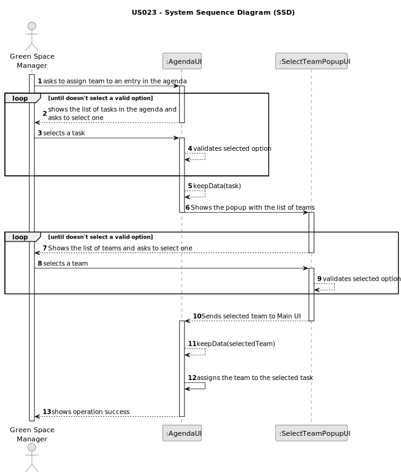

  # US023 - Assign team to an entry in agenda

## 1. Requirements Engineering

### 1.1. User Story Description

As a GSM, I want to assign a Team to an entry in the Agenda.

### 1.2. Customer Specifications and Clarifications 

**From the specifications document:**

>  The Agenda is made up of entries that relate to a task (which was previously in the To-Do List),
the team that will carry out the task, the vehicles/equipment assigned to
the task, expected duration, and the status (Planned, Postponed, Canceled,
Done).

**From the client clarifications:**

> **Question:** Can a Team be assigned to multiple entries?
>
> **Answer:** Yes.

> **Question:** Can an Agenda entry have more than one team assigned to it?
>
> **Answer:** No.

### 1.3. Acceptance Criteria

* **AC1:** A task from agenda must be selected before assign the Team.
* **AC2:** A message must be sent to all team members informing them about the assignment.
* **AC3:** Different email services can send the message. These services must be defined through a configuration file to allow the use of different platforms (e.g. Gmail, DEI’s email service, etc.).
* **AC4:** The same team cannot be in two tasks that occur in the same time period.
* **AC5:** One task can only have one team assign at maximum.
* **AC6:** The tasks showing in the Agenda, are task that have been created by the GSM logged in the system.
* **AC7:** The same team can be assigned to multiple entries as long as the work periods does not overlap.

### 1.4. Found out Dependencies

* There is a dependency on "US005 - Generate team proposal" as there must be at least one team created in the system for it to be assigned to a task in the agenda.
* There is a dependency on "US021 - Add new entry in the To-Do List" as the task must have first been created in the To-Do List before it can be added to the agenda. 
* There is a dependency on "US022 - Add new entry in the Agenda" as the task must have already been added to the agenda before it can be assigned to a team.

### 1.5 Input and Output Data

**Input Data:**

* Typed data:
  * n/a
  
* Selected data: 
  * A task from the agenda
  * A team to be assigned to the task

**Output Data:**

* Success of the operation

### 1.6. System Sequence Diagram (SSD)

### 1.7 Other Relevant Remarks

* When a team is successfully assigned to a task in the Agenda, on task it will show Team Assigned: "Yes"
* After selecting the task and clicking on the button to Assign Team, a popup will appear with the list of teams.