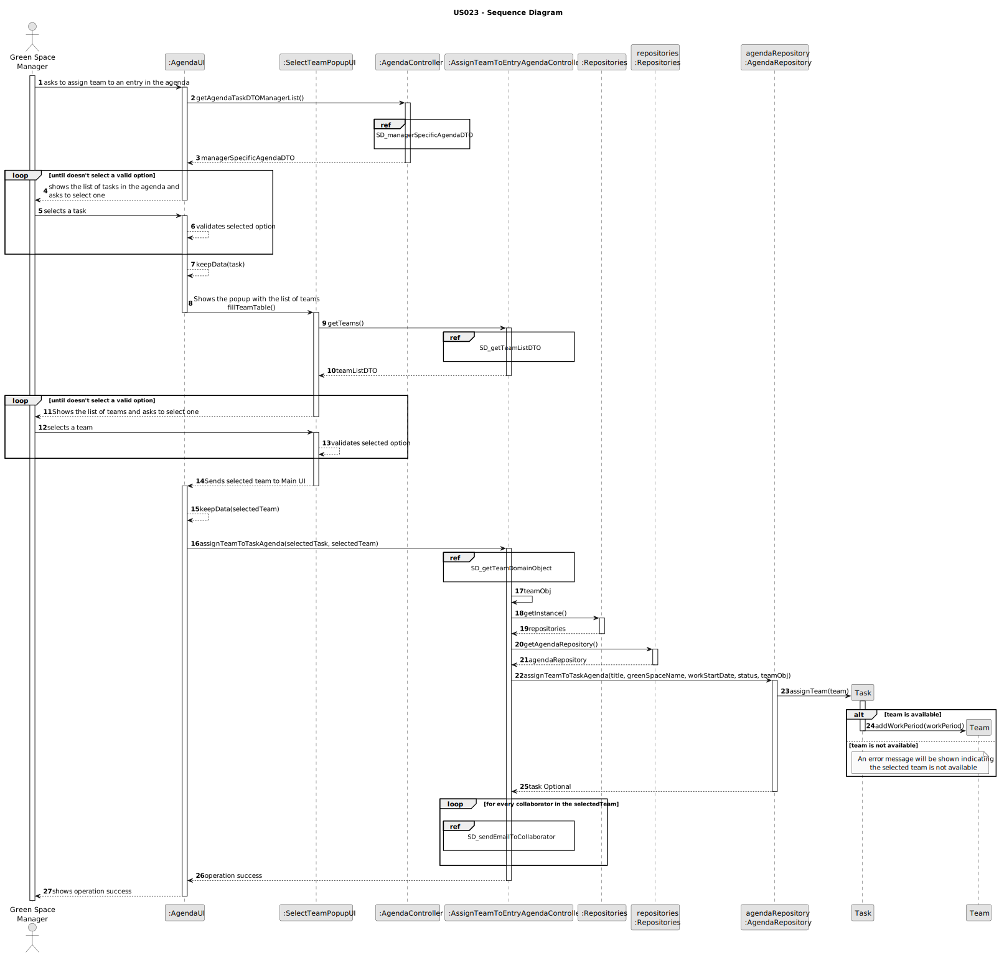
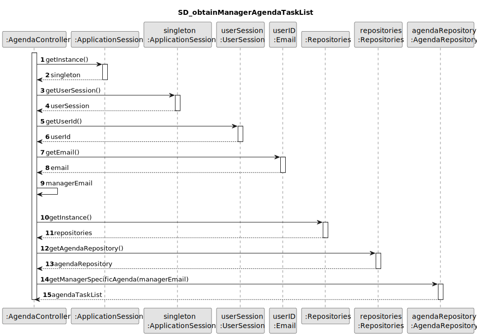
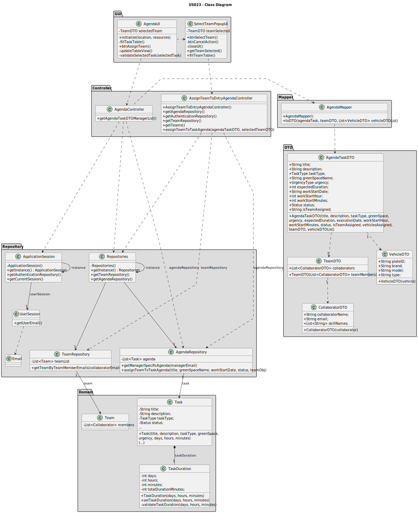

# US023 - Assign team to an entry in agenda

## 3. Design - User Story Realization

### 3.1. Rationale

| Interaction ID                                                           | Question: Which class is responsible for...              | Answer                            | Justification (with patterns)                                                                                 |
|:-------------------------------------------------------------------------|:---------------------------------------------------------|:----------------------------------|:--------------------------------------------------------------------------------------------------------------|
| Step 1: Asks to assign team to an entry in the agenda		                  | 	... interacting with the actor?                         | AgendaUI                          | Pure Fabrication: there is no reason to assign this responsibility to any existing class in the Domain Model. |
| 			  		                                                                  | 	... coordinating the US on showing agenda to the actor? | AgendaController                  | Controller                                                                                                    |
|                                                                          | ... coordinating the completion of the US?               | AssignTeamToEntryAgendaController | Controller                                                                                                    |
| 			  		                                                                  | ... knowing the user using the system?                   | UserSession                       | IE: cf. A&A component documentation.                                                                          |
| Step 2: Shows the list of tasks in the agenda and asks to select one  		 | 	... obtaining the manager agenda list?						            | AgendaRepository                  | Information Expert: AgendaRepository knows all the Agenda tasks and contains all task Agenda instances        |
|                                                                          | ... mapping Agenda list into Agenda DTO list?            | AgendaMapper                      | Pure Fabrication: AgendaMapper has the responsibility of converting a domain object into a DTO object.        |
|                                                                          | ... displaying the Agenda DTO list                       | AgendaUI                          | Pure Fabrication                                                                                              |
| Step 3: Selects a task  		                                               | 	... validating the selected data?                       | AgendaUI                          | Pure Fabrication                                                                                              |
|                                                                          | ... temporarily keeping the selected task?               | AgendaUI                          | Pure Fabrication                                                                                              |
| Step 4: Shows the popup with the list of teams  		                       | 	...opening the popup scene?                             | AgendaUI                          | Pure Fabrication                                                                                              |
| Step 5: Shows the list of teams and asks to select one  		               | 	.... obtaining the list of teams?                       | TeamRepository                    | Information Expert: TeamRepository knows all Teams and contains all team instances                            |
|                                                                          | ... mapping list of teams into Team DTO list?            | TeamMapper                        | Pure Fabrication: TeamMapper has the responsibility of converting a domain object into a DTO object.          |
| 		                                                                       | 	.... displaying the Team DTO list to the actor?         | SelectTeamPopupUI                 | Pure Fabrication                                                                                              |
| Step 6: Selects a team  		                                               | 		... validating the selected data?					                 | SelectTeamPopupUI                 | Pure Fabrication                                                                                              |              
|                                                                          | ... temporarily keeping input data?                      | SelectTeamPopupUI                 | Pure Fabrication                                                                                              |
| Step 7: Sends selected team to Main UI  		                               | 	... sending the selected team back to main UI?          | SelectTeamPopupUI                 | Pure Fabrication                                                                                              | 
| Step 8: Assigns the team to the selected task		  		                      | 	... obtaining the domain team object?                   | TeamRepository                    | Information Expert: TeamRepository knows all Teams and contains all team instances                            | 
| 			  		                                                                  | 	... assign the team to the task?                        | Task                              | Information Expert: Task has the necessary methods required to assign its own team                            | 
|                                                                          | ... know which Agenda task should have its team assigned | AgendaRepository                  | Information Expert: AgendaRepository aggregates Task instances and validates duplicate records                |
|                                                                          | ... add the work period to the assigned team?            | Team                              | Information Expert: Team has the necessary methods required to add work periods                               |
| Step 9: Display operation success  		                                    | 	... informing operation success?                        | AgendaUI                          | Pure Fabrication                                                                                              | 

### Systematization ##

According to the taken rationale, the conceptual classes promoted to software classes are:

* Task
* Team

Other software classes (i.e. Pure Fabrication) identified:

* AgendaUI
* SelectTeamPopupUI
* AgendaController
* AssignTeamToEntryAgendaController
* AgendaMapper
* TeamMapper
* UserSession
* AgendaRepository
* TeamRepository
* WorkPeriod

## 3.2. Sequence Diagram (SD)

### Full Diagram

This diagram shows the full sequence of interactions between the classes involved in the realization of this user story.

### Ref: SD_managerSpecificAgendaDTO

### Ref: SD_obtainManagerAgendaTaskList

### Ref: SD_getTeamListDTO

### Ref: SD_getTeamDomainObject

## 3.3. Class Diagram (CD)

