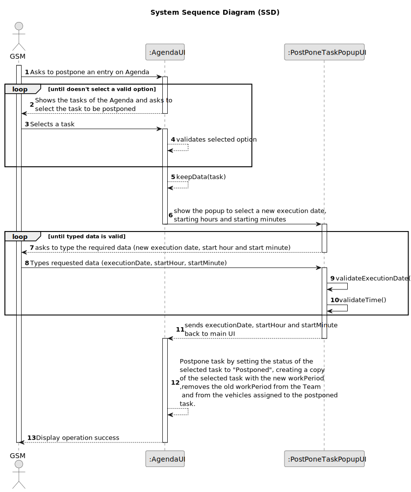

# US024 - Postpone an entry in the Agenda to a specific future date

## 1. Requirements Engineering

### 1.1. User Story Description

As a GSM, I want to Postpone an entry in the Agenda to a specific future date.

### 1.2. Customer Specifications and Clarifications 

**From the specifications document:**

> The Agenda is made up of entries that relate to a task (which was previously in the To-Do List), 
> the team that will carry out the task, the vehicles/equipment assigned to the task, 
> expected duration, and the status (Planned, Postponed, Canceled, Done).

**From the client clarifications:**

> **Question:** The date you want to postpone in this US24 is the date referring to the "approximate expected duration" field when we registered the task?
>
> **Answer:** No; sometimes, for various reasons (e.g. insufficient staff, faulty equipment or adverse weather conditions) a task has to be postponed to a new date; task duration is not directly related to this.

> **Question:** What are the input to postpone an entry? From my perspective the Green Spaces Manager only needs to select the entry and introduce the new date.
>
> **Answer:** Yes, you are correct!

> **Question:** When entry is postponed should it be deleted from the Agenda and moved to the To-Do list?
>
> **Answer:** No.

> **Question:** The selected task(s) will be postponed by one interval defined by the user or for the next day?
> 
> **Answer:** When postponing a task, the new predicated date for execution should be inserted.

### 1.3. Acceptance Criteria

* **AC1:** A task must be selected before choosing the new date.
* **AC2:** The tasks showing in the Agenda, are task that have been created by the GSM logged in the system.
* **AC3:** When a task is postponed, the task will change its status to "POSTPONED" and a new entry will join the Agenda as "PLANNED" in the specified date.
* **AC4:** The task can only be postponed if the current status is "PLANNED".
* **AC5:** The new execution date and time must be typed by the manager.
* **AC6:** The new date must not be before the actual date of the task.

### 1.4. Found out Dependencies

* There is a dependency on "US021 - Add new entry in the To-Do List" as the task must have first been created in the To-Do List before it can be added to the agenda.
* There is a dependency on "US022 - Add new entry in the Agenda" as the task must have already been added to the agenda before it can be assigned to a team.

### 1.5 Input and Output Data

**Input Data:**

* Typed data:
    * New Execution date
    * New Execution time (hh:mm)
	
* Selected data:
    * a task from the Agenda

**Output Data:**

* Success of the operation

### 1.6. System Sequence Diagram (SSD)

### 1.7 Other Relevant Remarks

* After selecting the task and clicking on the button to postpone, a popup will appear to select the future execution date and time (hh:mm)