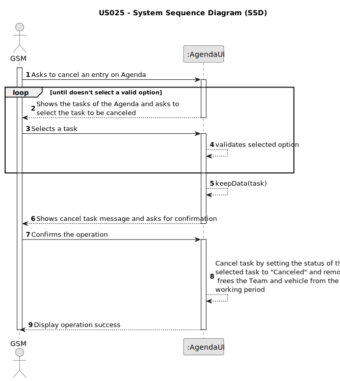

# US025 - Cancel an entry in the Agenda

## 1. Requirements Engineering

### 1.1. User Story Description

As a GSM, I want to Cancel an entry in the Agenda.

### 1.2. Customer Specifications and Clarifications 

**From the specifications document:**

>	The Agenda is made
up of entries that relate to a task (which was previously in the To-Do List),
the team that will carry out the task, the vehicles/equipment assigned to
the task, expected duration, and the status (Planned, Postponed, Canceled,
Done).

> 
**From the client clarifications:**

> **Question:** 
>
> **Answer:** 

> **Question:** 
>
> **Answer:** 
 
### 1.3. Acceptance Criteria

* **AC1:** A canceled task should not be deleted but rather change its state.
* **AC2:** One task/entry from Agenda must be selected before proceeding to the cancellation process.
* **AC3:** The tasks showing in the Agenda, are task that have been created by the GSM logged in the system.
* **AC4:** When a task is canceled, it will still show on agenda, but the status will be "CANCELED".
* **AC5:** If a canceled task had a team and/or vehicles assigned, both will be released from that work period upon cancellation.
* **AC6:** The task to be canceled must have status as "PLANNED".

### 1.4. Found out Dependencies

* There is a dependency on "US022 - Add new entry in the Agenda" as there must be at least one entry on Agenda in order to be canceled.

### 1.5 Input and Output Data

**Input Data:**

* Typed data:
    * There is no typed data
	
* Selected data:
    * a task from Agenda

**Output Data:**

* Shows data for confirmation
* Success of the operation

### 1.6. System Sequence Diagram (SSD)

### 1.7 Other Relevant Remarks

* Instead of deleting the entry, the status is changed to "Canceled".