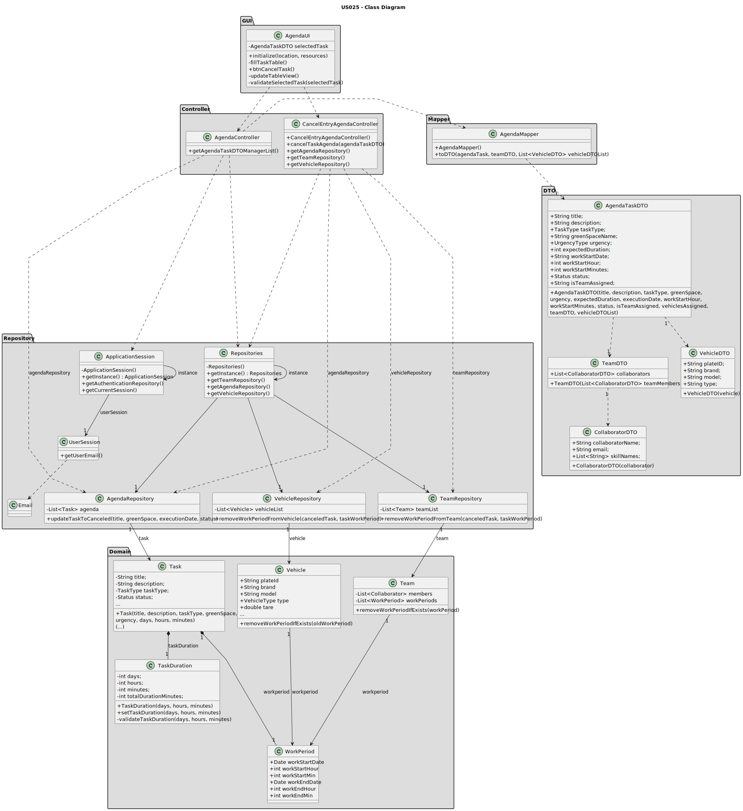

# US025 - Cancel an entry in the Agenda

## 3. Design - User Story Realization

### 3.1. Rationale

| Interaction ID                                                                       | Question: Which class is responsible for...              | Answer                      | Justification (with patterns)                                                                                 |
|:-------------------------------------------------------------------------------------|:---------------------------------------------------------|:----------------------------|:--------------------------------------------------------------------------------------------------------------|
| Step 1: Asks to cancel an entry on Agenda		                                          | 	... interacting with the actor?                         | AgendaUI                    | Pure Fabrication: there is no reason to assign this responsibility to any existing class in the Domain Model. |
| 			  		                                                                              | 	... coordinating the US on showing agenda to the actor? | AgendaController            | Controller                                                                                                    |
|                                                                                      | ... coordinating the completion of the US?               | CancelEntryAgendaController | Controller                                                                                                    |
| 			  		                                                                              | ... knowing the user using the system?                   | UserSession                 | IE: cf. A&A component documentation.                                                                          |
| Step 2: Shows the tasks of the Agenda and asks to select the task to be canceled  		 | 	... obtaining the manager agenda list?						            | AgendaRepository            | Information Expert: AgendaRepository knows all the Agenda tasks and contains all task Agenda instances        |
|                                                                                      | ... mapping Agenda list into Agenda DTO list?            | AgendaMapper                | Pure Fabrication: AgendaMapper has the responsibility of converting a domain object into a DTO object.        |
|                                                                                      | ... displaying the Agenda DTO list?                      | AgendaUI                    | Pure Fabrication                                                                                              |
| Step 3: Selects a task  		                                                           | 	... validating the selected data?                       | AgendaUI                    | Pure Fabrication                                                                                              |
|                                                                                      | ... temporarily keeping the selected task?               | AgendaUI                    | Pure Fabrication                                                                                              |
| Step 4: Shows cancel task message and asks for confirmation  		                      | 	...displaying the cancel task message?                  | AgendaUI                    | Pure Fabrication                                                                                              |
| Step 8: Confirms the operation		  		                                                 | 	... knowing the task object to be canceled?             | AgendaRepository            | Information Expert: AgendaRepository knows all agenda entries and contains all agenda task instances          | 
| 			  		                                                                              | 	... set the task status to canceled?                    | Task                        | Information Expert: Task has the necessary methods required to assign its own team                            | 
|                                                                                      | ... knowing which team needs to be updated?              | TeamRepository              | Information Expert: TeamRepository aggregates Team instances and knows all teams                              |
|                                                                                      | ... removing the work period of the assigned team?       | Team                        | Information Expert: Team has the necessary methods required to remove work periods from team assigned         |
|                                                                                      | ... knowing which vehicles needs to be updated?          | VehicleRepository           | Information Expert: VehicleRepository aggregates Vehicles instances and knows all vehicles information        |
|                                                                                      | ... removing the work period of the assigned vehicles?   | Vehicle                     | Information Expert: Vehicle has the necessary methods required to remove work periods from vehicles           |
| Step 9: Display operation success                                                    | ... informing operation success?                         | AgendaUI                    | Pure Fabrication                                                                                              |

### Systematization ##

According to the taken rationale, the conceptual classes promoted to software classes are:

* Task
* Team
* Vehicle

Other software classes (i.e. Pure Fabrication) identified:

* AgendaUI
* AgendaController
* CancelEntryAgendaController
* UserSession
* AgendaRepository
* VehicleRepository
* TeamRepository
* AgendaMapper
* AgendaTaskDTO

## 3.2. Sequence Diagram (SD)

### Full Diagram

### Ref: SD_managerSpecificAgendaDTO

### Ref: SD_obtainManagerAgendaTaskList

## 3.3. Class Diagram (CD)

