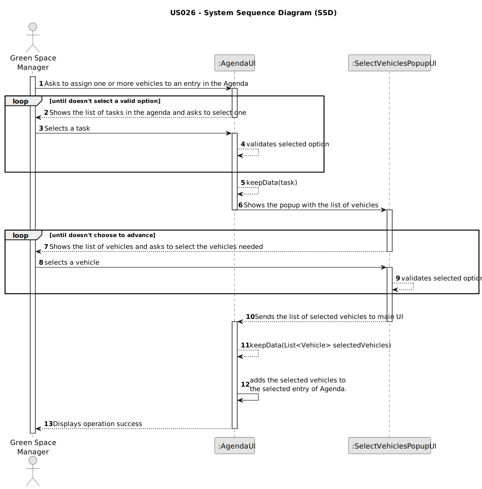

# US026 - Assign one or more vehicles to an entry in the Agenda

## 1. Requirements Engineering

### 1.1. User Story Description

As a GSM, I want to assign one or more vehicles to an entry in the Agenda.

### 1.2. Customer Specifications and Clarifications 

**From the specifications document:**

>	Vehicles are needed to carry out the tasks assigned to the teams and to
transport machines and equipment.

> The Agenda is made
up of entries that relate to a task (which was previously in the To-Do List),
the team that will carry out the task, the vehicles/equipment assigned to
the task ...

**From the client clarifications:**

> **Question:** Should each GSM only be able to assign vehicles to its own entries or every GSM can assign vehicles to every entry, even if the green space associated with the task is not registered with their email?
>
> **Answer:** For the sake of simplicity, you can assume that GSM will only manage its Agenda Entries.

> **Question:** How will the Green Spaces Manager choose the vehicle to assign? By its plate?
>
> **Answer:** The data related with vehicle should be provided in order to ease the selection.

> **Question:** Is the number of vehicles to be assigned provided by the Green Spaces Manager?
> 
> **Answer:** There is no specification concerning the number of vehicles, is upt to GSM decide what vehicles the task needs.

> **Question:** It is possible to add any kind of vehicles?
> 
> **Answer:** Yes, any can of vehicles can be assigned.

> **Question:** Only Vehicle with no Entry's can be assigned ?
> 
> **Answer:** The vehicle needs to be available in the period.

### 1.3. Acceptance Criteria

* **AC1:** The entry of Agenda must be selected.
* **AC2:** At least one vehicle must be selected in order to show operation success.
* **AC3:** The same vehicle cannot be in two tasks that occur in the same time period.
* **AC4:** The tasks showing in the Agenda, are task that have been created by the GSM logged in the system.
* **AC5:** The same vehicle can be assigned to multiple entries as long as the work periods does not overlap.
* **AC6:** Can't assign vehicles to tasks with status:
  * POSTPONED
  * CANCELED
  * DONE

### 1.4. Found out Dependencies

* There is a dependency on "US006 - Register Vehicle" as there must be at least one vehicle in order to be assigned to a task.
* There is a dependency on "US022 - Add new entry in the Agenda" as there need to be at least one entry to assign a vehicle to.

### 1.5 Input and Output Data

**Input Data:**

* Typed data:
    * There is no typed data
	
* Selected data:
    * an entry from the Agenda 
    * one or more vehicles

**Output Data:**

* Shows data for confirmation
* Success of the operation

### 1.6. System Sequence Diagram (SSD)

### 1.7 Other Relevant Remarks

* After selecting the task and clicking on the button to Assign vehicles, a popup will appear with the list of vehicles.
